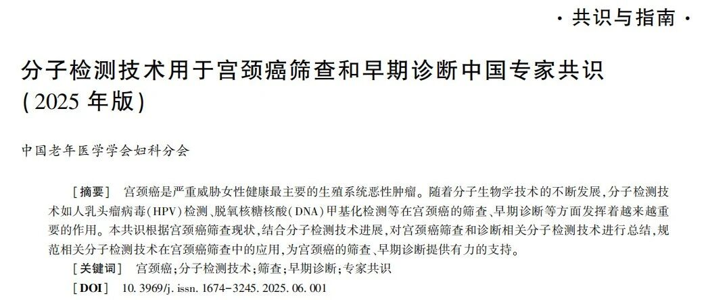
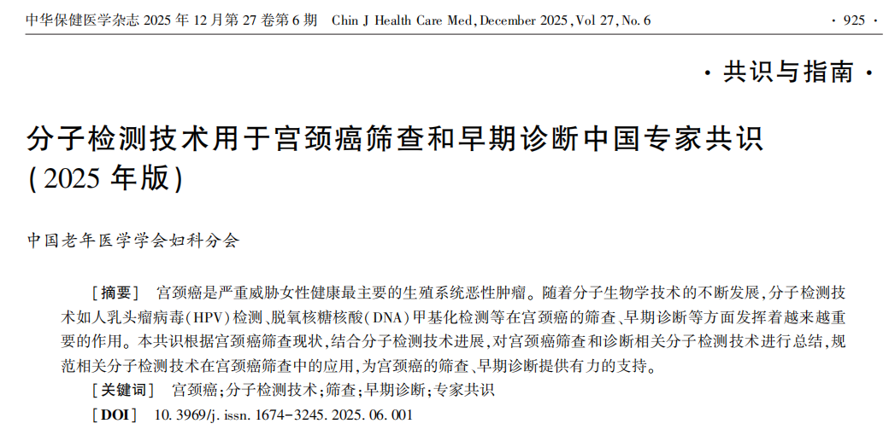

# DNA甲基化检测获中国专家共识强力推荐，禾宫康引领宫颈癌筛查技术革新

_2026年01月27日 16:49_

2025 年 12 月，中国老年医学学会妇科分会正式发布《分子检测技术用于宫颈癌筛查和早期诊断中国专家共识（2025 年版）》，首次系统性地确立了 DNA 甲基化检测在宫颈癌筛查路径中的关键地位，为宫颈癌防治体系注入新的技术动力。

**一、甲基化检测：宫颈癌筛查的精准武器**

共识明确指出,DNA 甲基化是癌细胞中抑癌基因启动子高度甲基化导致基因表达异常的关键机制，属于宫颈癌发生过程中的早期分子事件。该技术能够实现宫颈高级别病变的早期识别，为临床干预提供宝贵时间窗口，已成为宫颈癌防治的新一代重要手段。

**二、解决临床痛点：从过度诊疗到精准管理**

传统 HPV 检测虽灵敏度高，但特异性不足，导致大量一过性感染人群面临不必要的阴道镜转诊和心理负担。甲基化检测技术的出现，有效弥补了这一临床缺陷。

**共识推荐：宫颈脱落细胞甲基化检测在宫颈癌筛查中的应用越来越重要 , 可以用于 TCT 和 HPV 联合筛查 , 也可以用于 HR-HPV 阳性患者或 ASCUS ∕ LSIL 患者的分流检测 ( 推荐级别 2A 类 )。**

**三、禾宫康技术优越性凸显，多场景应用价值获证实**

聚禾生物深耕妇科肿瘤甲基化检测领域，其产品管线覆盖宫颈癌、子宫内膜癌、卵巢癌等重点癌种，且相关检测产品均已获得国家药品监督管理局（NMPA）三类医疗器械注册证。其中，禾宫康（PAX1/JAM3）作为先获批的宫颈癌甲基化检测产品，已在多个临床场景中展现出显着的应用价值：

- · 高危人群精准分流：对于 HR-HPV 初筛阳性人群，禾宫康可有效区分一过性感染与持续高危感染，预计降低约 67% 的不必要阴道镜转诊，减轻医疗负担与受检者心理压力。

- · 疑难病例辅助管理：在细胞学异常结果 ( 例如 ASCUS/LSIL 等 ) 或阴道镜检查结果存疑的病例中，禾宫康可作为客观的分子指标，辅助判断病变进展风险，实现个体化的精准随访与管理。

- · 治疗效果与复发监测：尤其在宫颈高级别病变接受局部切除或消融等微创治疗后，禾宫康能通过”动态监测”甲基化水平变化，为疗效评估和复发风险监测提供分子依据，助力实现全病程管理。

随着分子检测技术的不断发展，甲基化检测有望在宫颈癌防治领域发挥更大价值。禾宫康等创新产品的推广应用，将助力实现世界卫生组织提出的 " 消除宫颈癌 " 战略目标，为女性健康保驾护航。

**参考文献**

中国老年医学学会妇科分会 , 何玥 , 吴玉梅 , 等 . 分子检测技术用于宫颈癌筛查和早期诊断中国专家共识 (2025 年版 )[J]. 中华保健医学杂志 ,2025,27(6):925-932. DOI:10.3969/j.issn.1674-3245.2025.06.001 .

**关于聚禾生物**

北京起源聚禾生物科技有限公司是以创新科技为驱动、以关注健康为宗旨的科技企业。聚禾生物是妇科肿瘤早诊领域的开拓者，以独家技术和专利保护的标志物为核心，开发了宫颈癌、子宫内膜癌、卵巢癌等妇科肿瘤早诊产品，填补了该领域的空白。

随着女性对自身健康的关注越来越密切，女性健康市场将大有可为，除妇科肿瘤早筛早诊产品线外，未来聚禾生物还将建立更多女性健康相关的产品管线，打造女性健康市场的技术创新型领先企业。
