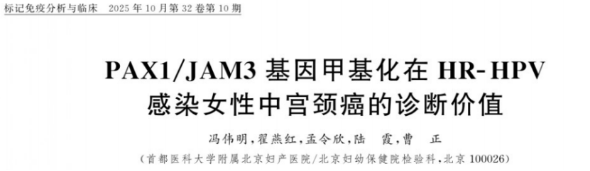

Recently, a significant study published in *Labeled Immunoassays and Clinical Medicine* by a team from Beijing Obstetrics and Gynecology Hospital, Capital Medical University, explored a new method based on PAX1 and JAM3 dual-gene methylation detection (brand name: CISCER®).

This study found that CISCER® detection demonstrated significantly superior diagnostic performance for cervical cancer in HR-HPV-infected women compared to traditional HPV16/18 and TCT testing, improving the precision of cervical cancer screening and reducing unnecessary invasive procedures, making it a promising new molecular biomarker for cervical cancer screening in China.

**I. Background and Methods**

Cervical cancer is one of the major malignancies threatening women's health worldwide, with high-risk HPV (HR-HPV) infection being its primary cause. Currently, the widely used clinical cytology and HR-HPV testing methods may lead to high colposcopy referral rates and complex triage management. To address this issue, experts recommend optimizing screening methods.

This study enrolled 808 women with high-risk HPV infection, simultaneously performing HPV genotyping, TCT, and PAX1/JAM3 methylation detection, with histopathological results as the gold standard, systematically evaluating the diagnostic performance of the three methods.

**II. Key Results**

The study found that PAX1/JAM3 dual-gene methylation detection performed outstandingly in identifying cervical precancerous lesions (especially CIN3 and above):

- High diagnostic accuracy: Sensitivity of 86.3% and specificity of 91.0% for cervical cancer, with comprehensive diagnostic capability significantly outperforming traditional methods.

- Significant reduction in referral rates: The colposcopy referral rate was only 43.94%, 6.78% lower than HPV16/18 testing and 36.76% lower than TCT.

Strong risk warning capability: PAX1/JAM3-positive patients had a 51.41-fold higher risk of developing cervical cancer compared to negative patients, demonstrating powerful risk stratification ability.

**III. Clinical Significance**

The promotion of this detection method will bring the following clinical benefits:

- Precision triage: More accurately identifies high-risk populations truly requiring colposcopy, avoiding overtreatment of low-risk populations.

- Conserving medical resources: Reduces unnecessary colposcopy examinations and biopsies, alleviating healthcare system pressure.

- Improving screening experience: Reduces the psychological burden and unnecessary invasive procedures caused by abnormal screening results.

**IV. Research Significance**

This study provides a new strategy for cervical cancer screening based on epigenetic biomarkers, marking the transition of screening paradigms from "pathogen detection" to "host gene status detection." This detection method has already been adopted by some Chinese hospitals, providing important evidence for future incorporation into domestic and international cervical cancer screening guidelines.

**V. Conclusion**

PAX1/JAM3 dual-gene methylation detection demonstrates outstanding diagnostic performance and triage value in high-risk HPV-infected women, and is poised to become a new tool for precision cervical cancer screening and stratified management. In the future, further multicenter, large-sample studies are needed to promote the clinical application of this technology globally.

**Reference:**

Feng W, Zhai Y, Meng L, Lu X, Cao Z. Diagnostic value of PAX1/JAM3 gene methylation for cervical cancer in HR-HPV-infected women [J]. Labeled Immunoassays and Clinical Medicine, 2025, 32(10): 2027–2032,2133. DOI: 10.11748/bjmy.issn.1006-1703.2025.10.008

**About CISPOLY**

Beijing Origin-Poly Co., Ltd. is a technology enterprise driven by innovation and committed to health. As a pioneer in the field of early diagnosis of gynecologic tumors, CISPOLY has developed early detection products for cervical cancer, endometrial cancer, ovarian cancer and other gynecologic malignancies based on proprietary technologies and patent-protected biomarkers, filling gaps in this field.

As women's awareness of their own health continues to grow, the women's health market holds tremendous potential. Beyond the gynecologic tumor early screening and diagnosis product line, CISPOLY will continue to establish additional women's health-related product pipelines, striving to become a technology innovation leader in the women's health market.