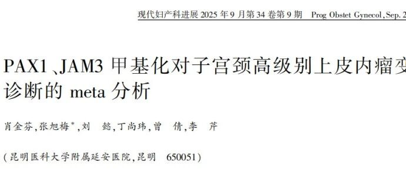
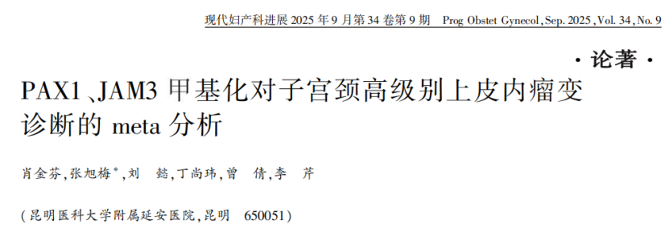

Recently, a meta-analysis study published in *Modern Obstetrics and Gynecology* by a team from the Affiliated Yan'an Hospital of Kunming Medical University indicated that PAX1/JAM3 gene methylation detection (brand name: CISCER®) on cervical exfoliated cells can significantly improve diagnostic accuracy for high-grade precancerous lesions (HSIL), providing a new direction for cervical cancer screening and stratified management.

**I. Study Overview**

Cervical cancer is one of the major malignancies threatening women's health worldwide. Early detection of precancerous lesions and precise intervention are key to reducing its incidence and mortality. Currently used cervical cancer screening methods, such as HPV testing and cytology, while widely applied, often fail to provide reliable diagnostic results as standalone methods, with ongoing issues of "over-referral" and "missed diagnoses."

**II. Methods**

This diagnostic meta-analysis was conducted by the team from the Affiliated Yan'an Hospital of Kunming Medical University, systematically searching Chinese and English databases (such as CNKI, PubMed, Embase, etc.) and integrating data from 7 clinical studies through February 2024. The QUADAS-2 tool was used for literature quality assessment. Meta-Disc 1.4 and Stata software were used for heterogeneity testing, effect size pooling (sensitivity, specificity, AUC, etc.), sensitivity analysis, and publication bias testing, evaluating the diagnostic performance of PAX1 and JAM3 dual-gene methylation detection for diagnosing high-grade cervical squamous intraepithelial neoplasia (HSIL, including CIN2+ and CIN3+), providing evidence for its clinical application in cervical cancer screening and triage management.

**III. Main Results**

The study showed that PAX1 and JAM3 dual-gene methylation detection demonstrated excellent diagnostic performance:

For moderate-to-severe lesions (CIN2+), the test achieved a sensitivity of 78% and specificity as high as 95%, with a comprehensive diagnostic accuracy AUC of 0.969—representing an extremely high level of accuracy.

For more severe lesions (CIN3+), sensitivity increased to 84% with specificity of 87% and AUC of 0.925, similarly demonstrating powerful discriminatory ability.

These data indicate that this detection method can effectively distinguish high-risk lesions from normal or low-risk states, with particularly outstanding performance in reducing "false positives," making it suitable for triage of high-risk populations in cervical cancer screening and helping avoid unnecessary further examinations.

**IV. Clinical Significance**

The promotion of this detection method is expected to improve the existing cervical cancer screening system in the following aspects:

Precision triage: For HPV-positive populations, methylation detection can screen out truly high-risk individuals, reducing unnecessary colposcopy examinations and alleviating medical pressure.

Improving screening efficiency: High specificity means fewer false positives, helping concentrate medical resources on populations truly needing intervention.

Supporting self-sampling screening: Some studies suggest this detection can also be used with self-collected samples, helping improve screening coverage and accessibility, particularly in areas with insufficient medical resources.

**V. Research Significance**

This study not only provides the most comprehensive evidence to date for PAX1/JAM3 dual-gene methylation detection but also serves as an important reference for advancing cervical cancer screening from "pathogen detection" to "host gene status detection." The technology has been adopted by some Chinese hospitals for clinical auxiliary diagnosis, but its incorporation into international guidelines still requires more cross-ethnic, large-sample prospective research validation.

In the future, with further optimization and popularization of this detection technology, cervical cancer screening is expected to achieve more individualized and precise management models, advancing global cervical cancer prevention toward the goal of "early detection, early intervention, precision treatment."

**Reference:**

Xiao J, Zhang X, Liu Y, Ding S, Zeng Q, Li Q. Meta-analysis of PAX1 and JAM3 methylation for diagnosis of high-grade cervical intraepithelial neoplasia [J]. Modern Obstetrics and Gynecology, 2025, 34(9): 680–684,690. DOI: 10.13283/j.cnki.xdfckjz.2025.09.004

**About CISPOLY**

Beijing Origin-Poly Co., Ltd. is a technology enterprise driven by innovation and committed to health. As a pioneer in the field of early diagnosis of gynecologic tumors, CISPOLY has developed early detection products for cervical cancer, endometrial cancer, ovarian cancer and other gynecologic malignancies based on proprietary technologies and patent-protected biomarkers, filling gaps in this field.

As women's awareness of their own health continues to grow, the women's health market holds tremendous potential. Beyond the gynecologic tumor early screening and diagnosis product line, CISPOLY will continue to establish additional women's health-related product pipelines, striving to become a technology innovation leader in the women's health market.