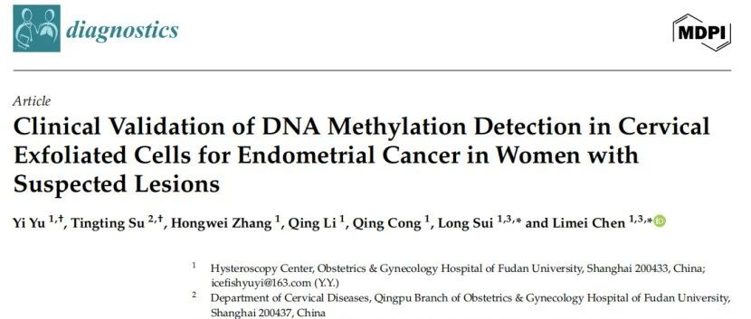
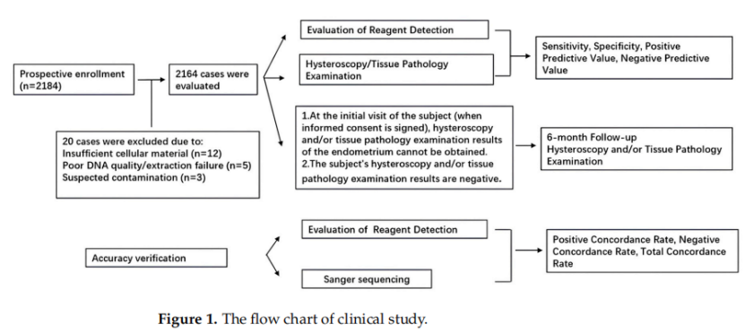
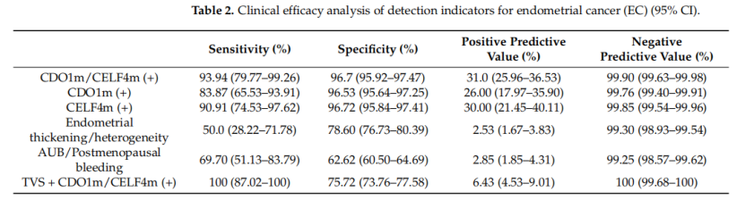
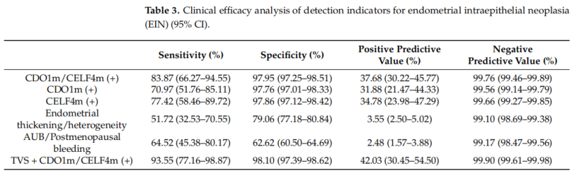
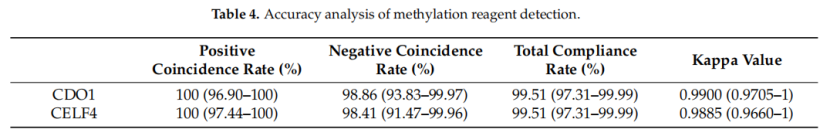

A large-scale prospective study from the Obstetrics and Gynecology Hospital of Fudan University, published in the international journal *Diagnostics*, showed that detecting the methylation status of CDO1 and CELF4 genes in cervical exfoliated cells can identify endometrial cancer (EC) and its precursor lesion (EIN) with high sensitivity and specificity. This non-invasive test demonstrated >93% sensitivity and ~96.7% specificity in 2,164 suspected cases scheduled for hysteroscopy or intrauterine surgery. When combined with transvaginal ultrasound (TVS), sensitivity and negative predictive value improved further, suggesting it can serve as a clinically valuable triage tool to reduce unnecessary invasive procedures.

**I. Background and Methods**

Endometrial cancer incidence is rising globally year by year, and early diagnosis directly impacts prognosis and treatment scope. However, definitive diagnosis still typically relies on invasive procedures such as hysteroscopy and D&C, lacking simple yet reliable non-invasive screening methods.

Based on epigenetic principles, the research team selected the tumor suppressor genes CDO1 and CELF4—which are found to be frequently methylated and potentially silenced in EC—and collected cervical exfoliated cell samples preoperatively from 2,164 patients scheduled for hysteroscopic surgery. CISENDO® (CDO1/CELF4) kit was used to detect methylation status, with hysteroscopy + pathology results as the gold standard for evaluating test performance. Positive TVS results were defined as endometrial thickness >11 mm in premenopausal women and >5 mm in postmenopausal women, or the presence of an intracavitary mass or irregular endometrial ultrasound. All testing was performed under blinded conditions, and some samples were sent to third-party Sanger sequencing for methodological verification.

**II. Key Results**

Overall performance: CDO1/CELF4 combined positivity achieved 93.94% sensitivity and 96.7% specificity for EC detection, with NPV as high as 99.90%—meaning that when the test is negative, the possibility of EC can be virtually ruled out (within this study population).

Combined with TVS: In this cohort, if TVS and methylation testing were considered positive when either indicator was positive, the combined indicator achieved 100% sensitivity and NPV for EC—valuable for clinical exclusion of high-risk cases.

EIN detection: Combined detection sensitivity for EIN was also high (~83.9%) with specificity approaching 98%, indicating good recognition ability for early lesions.

Methodological reliability: The assay and workflow showed extremely high concordance with third-party Sanger sequencing (Kappa ≈0.99), demonstrating accuracy and reproducibility of the detection method.

**III. Clinical Significance**

Non-invasive triage tool: For patients presenting with abnormal uterine bleeding or suspected endometrial lesions on TVS, using cervical exfoliated cell methylation detection can more accurately identify high-risk individuals preoperatively, prioritizing them for further hysteroscopy/pathological diagnosis, or avoiding direct invasive procedures for low-risk individuals.

Improving detection of early (including Type II) lesions: The study showed high detection sensitivity even for Type II EC (with atypical clinical presentation), suggesting methylation biomarkers have significant value for subtypes where ultrasound findings are unremarkable but molecular changes are pronounced.

Application potential in resource-limited settings: The stratified strategy combined with TVS helps optimize medical resource allocation, particularly in high-volume or grassroots institutions, where it can determine which patients need priority referral or further invasive examination.

**IV. Research Implications and Methodological Insights**

This study demonstrated the feasibility of cervical exfoliated cells as a source for detecting epigenetic signals of endometrial lesions, supporting the application of "uterus–cervix microenvironment liquid biopsy" in gynecologic tumor early screening.

Compared to previously proposed multi-gene methylation panels, this study's dual-gene strategy achieved higher specificity in a large-sample population, suggesting that "fewer but finer" gene combinations have practical advantages in clinical translation.

**V. Conclusion**

This prospective study based on 2,164 patients scheduled for hysteroscopy demonstrated that CDO1/CELF4 dual-gene methylation detection in cervical exfoliated cells has high sensitivity and specificity, and when combined with transvaginal ultrasound, achieves even higher detection rates and exclusion capability. This provides a safe, convenient non-invasive triage method for patients with suspected endometrial lesions. Through multicenter and broader-population external validation, combined with research progress on PAX1/JAM3 and other methylation biomarkers performing well in cervical screening, epigenetic detection is poised to advance clinical translation in gynecologic tumor early screening and precision stratification.

**Reference:**

Yu Y, Su T, Zhang H, Li Q, Cong Q, Sui L, Chen L. Clinical Validation of DNA Methylation Detection in Cervical Exfoliated Cells for Endometrial Cancer in Women with Suspected Lesions. Diagnostics (Basel). 2026 Jan 6;16(2):174. doi: 10.3390/diagnostics16020174. PMID: 41594150; PMCID: PMC12840197.

**About CISPOLY**

Beijing Origin-Poly Co., Ltd. is a technology enterprise driven by innovation and committed to health. As a pioneer in the field of early diagnosis of gynecologic tumors, CISPOLY has developed early detection products for cervical cancer, endometrial cancer, ovarian cancer and other gynecologic malignancies based on proprietary technologies and patent-protected biomarkers, filling gaps in this field.

As women's awareness of their own health continues to grow, the women's health market holds tremendous potential. Beyond the gynecologic tumor early screening and diagnosis product line, CISPOLY will continue to establish additional women's health-related product pipelines, striving to become a technology innovation leader in the women's health market.