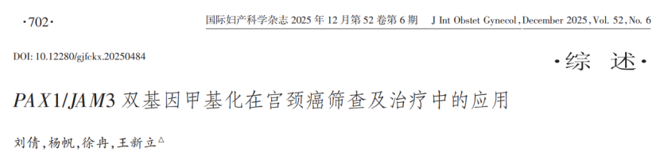

Addressing the bottlenecks in cervical cancer screening, a review article published in the *International Journal of Obstetrics and Gynecology* (2025) by a team from Shandong First Medical University, titled *"Application of PAX1/JAM3 Dual-Gene Methylation in Cervical Cancer Screening and Treatment,"* systematically reviewed and integrated recent clinical and mechanistic research on this dual-gene methylation detection. The researchers proposed and summarized the application value and challenges of PAX1 and JAM3 dual-gene methylation as objective molecular biomarkers in screening, triage, and potential therapy, providing important references for clinical practice and future research.

**I. Key Highlights**

- Promoter region methylation levels of PAX1 and JAM3 are positively correlated with the severity of cervical epithelial lesions. Whether tested individually or in combination, they show superior diagnostic performance for identifying CIN2+/CIN3+ compared to traditional cytology (TCT) or HPV testing alone.

- In multicenter studies, PAX1/JAM3 combined detection for CIN2+ achieved sensitivity and specificity of approximately 74.1% and 95.9%, respectively; for CIN3+, approximately 87.6% and 86.8%, with an overall AUC of 0.872—significantly outperforming standalone TCT or HPV testing.

- PAX1 has tumor suppressor functions; its methylation-mediated silencing is associated with tumor progression and chemo-/radiotherapy response. In vitro studies show that reversing PAX1 methylation through epigenetic editing can significantly enhance cisplatin sensitivity. JAM3 demonstrates high specificity in screening, while its mechanistic role in tumor metastasis (e.g., through the HIF-1α/VEGFA pathway) has also been elucidated.

**II. Background and Clinical Significance**

Although HPV DNA testing and cytology (TCT) are currently the main screening methods, the former has limited specificity leading to overtreatment, while the latter is subject to interpretive subjectivity and low sensitivity. With the maturation of DNA methylation detection technology, epigenetic biomarkers have become a feasible "second-line triage" strategy: in HPV-positive or cytology-abnormal cohorts, methylation results can more rationally determine whether to refer for colposcopy or proceed directly to treatment, thereby reducing unnecessary invasive procedures and medical resource waste. PAX1/JAM3 combined detection demonstrates the potential to balance high sensitivity with high specificity in this regard.

**III. Mechanism and Evidence Highlights**

- PAX1: As a paired box transcription factor, PAX1 commonly presents in a hypermethylated/low-expression state in cervical cancer, leading to loss of its tumor suppressor function. Functional studies suggest PAX1 affects WNT/TIMELESS and other signaling pathways, and demethylation or overexpression can restore chemosensitivity.

- JAM3: A member of the junctional adhesion molecule family with important functions in immune cell transendothelial migration and cell adhesion. Clinical data show that JAM3 methylation or expression levels in certain cervical cancer molecular subtypes (particularly adenocarcinoma-related samples) correlate with disease stage and lymph node metastasis, potentially promoting metastasis through the HIF-1α/VEGFA pathway.

**IV. Application Scenarios and Advantages**

- Clinical triage: For HPV16/18-positive or HPV-positive women with equivocal cytology, PAX1/JAM3 combined detection can more accurately identify high-risk patients, reducing colposcopy referral rates in low-risk populations.

- Self-sampling feasibility: Some studies show good concordance of PAX1/JAM3 testing with self-collected samples for CIN2+/CIN3+ identification, suggesting potential for expanding screening coverage and improving accessibility (particularly suitable for remote or resource-limited areas).

- Treatment guidance: PAX1 methylation status may provide molecular evidence for predicting chemo-/radiotherapy sensitivity and could be used for individualized treatment decisions in the future.

**V. Research Outlook and Recommendations**

- Initiate large-scale, multicenter, prospective clinical validation trials covering different regions and populations to evaluate the universality and long-term outcome efficacy of the PAX1/JAM3 strategy.

- Evaluate cost-effectiveness and clinical pathway optimization under different screening algorithms (HPV alone, HPV + methylation, TCT + methylation, etc.), with particular focus on feasibility in low-/middle-resource settings.

- Elucidate the different biological roles of JAM3 in cervical adenocarcinoma versus squamous cell carcinoma and its interaction with the immune microenvironment, exploring its feasibility as a therapeutic target.

**VI. Conclusion**

As a molecular biomarker combining both sensitivity and specificity, PAX1/JAM3 dual-gene methylation is showing promise on the path from research to clinical translation. This review provides theoretical foundations for optimizing clinical screening strategies, triage decisions, and molecular individualized treatment design. However, to achieve widespread clinical application, higher-quality and broader-coverage evidence-based research and unified technical standards are still needed.

**Reference:**

Liu Q, Yang F, Xu R, Wang X. Application of PAX1/JAM3 dual-gene methylation in cervical cancer screening and treatment [J]. International Journal of Obstetrics and Gynecology, 2025, 52(6): 702–707. DOI:10.12280/gjfckx.20250484.

**About CISPOLY**

Beijing Origin-Poly Co., Ltd. is a technology enterprise driven by innovation and committed to health. As a pioneer in the field of early diagnosis of gynecologic tumors, CISPOLY has developed early detection products for cervical cancer, endometrial cancer, ovarian cancer and other gynecologic malignancies based on proprietary technologies and patent-protected biomarkers, filling gaps in this field.

As women's awareness of their own health continues to grow, the women's health market holds tremendous potential. Beyond the gynecologic tumor early screening and diagnosis product line, CISPOLY will continue to establish additional women's health-related product pipelines, striving to become a technology innovation leader in the women's health market.