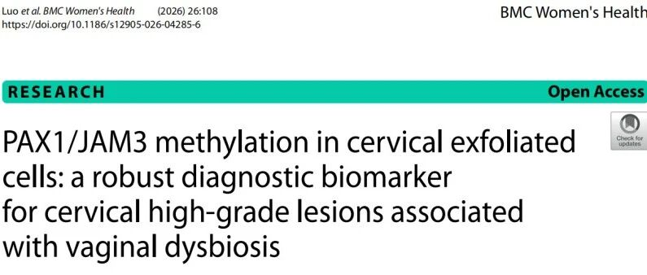
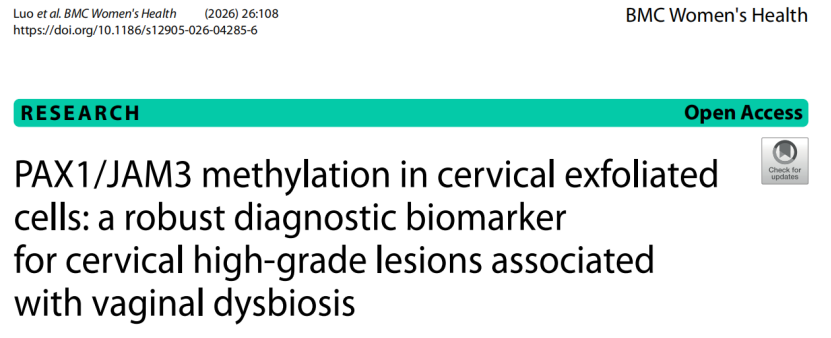
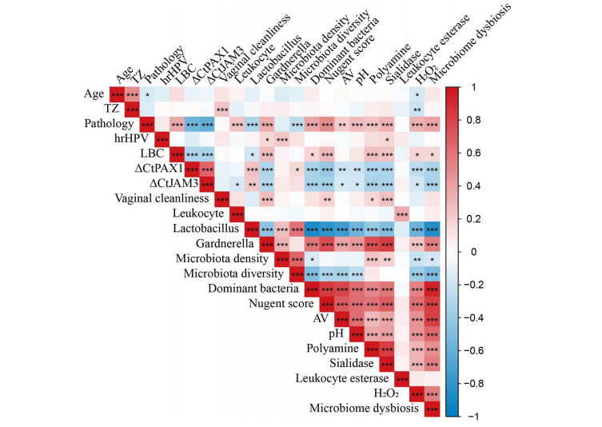
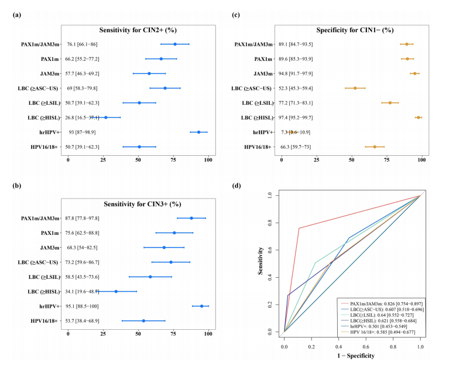

Recently, a prospective study published in *BMC Women's Health* by Beijing Anzhen Hospital showed that PAX1 and JAM3 dual-gene methylation detection (CISCER®) based on cervical exfoliated cells can not only precisely identify high-grade cervical lesions but is also significantly correlated with vaginal microbiota dysbiosis. This study established for the first time an evidence chain linking "microbiota dysbiosis—methylation elevation—lesion progression," providing a **new direction for cervical cancer risk warning in populations with recurrent vaginal infections.**

**I. Background: Microbiota Dysbiosis May Be a Precursor to Lesions**

Studies have found that vaginal microbiota dysbiosis (e.g., decreased Lactobacillus, increased Gardnerella) is closely associated with persistent HPV infection and cervical lesion progression. Particularly for populations with recurrent vaginal inflammation or microbiota dysbiosis (decreased Lactobacillus, increased anaerobic bacteria such as Gardnerella, elevated pH, persistent HPV infection), local microenvironment changes may accelerate epigenetic variation.

**II. Methods: Real-World, Pathological Gold Standard, Dual-Dimension Testing**

Study design and population: Prospective, single-center study enrolling women referred for colposcopy due to hrHPV positivity, abnormal cytology, or clinically suspicious symptoms.

Vaginal microbiota assessment: Clinical evaluation of morphological and functional indicators through Gram stain microscopy.

**III. Key Findings**

1. **Methylation levels rise in parallel with microbiota dysbiosis**

The study showed that cervical lesion severity is positively correlated with high PAX1/JAM3 methylation levels and negatively correlated with Lactobacillus abundance. For populations with recurrent vaginal infections and microbiota dysbiosis, this can indicate the risk of epigenetic changes associated with cervical lesions.

2. **Methylation detection shows significant triage advantages in high-risk populations**

CISCER® detection specificity for CIN2+ reached 89.1%, far exceeding hrHPV testing (7.3%), effectively avoiding the burden of repeated colposcopy on patients.

**IV. Application of Stratified Testing Strategy—From Microbiota Assessment to Methylation Precision Triage**

1. Target population identification

· High-risk group: Long-term hrHPV positivity, recurrent vaginal inflammation or microbiota dysbiosis.

· Auxiliary indicators: Elevated Nugent score, pH >4.5, decreased Lactobacillus grading in microbiota assessment.

2. Detection value highlights

· Avoiding missed diagnoses: Single HPV or cytology testing has low specificity for high-grade lesions (only 7.3%), while methylation detection specificity reaches 89.1%, potentially reducing 70% of over-referrals for colposcopy.

· Window advancement: Microbiota dysbiosis appears earlier than morphological lesions. Combined testing for populations with recurrent vaginitis or cervical lesion symptoms/risk factors can enable earlier risk intervention.

**V. Editorial Reflection: Recommended Clinical Implementation Pathway**

1. Initial screening phase: For hrHPV-positive or cytology-abnormal populations, simultaneous vaginal microbiota assessment.

2. Stratified warning: If repeated and long-term microbiota shows dysbiosis (e.g., elevated pH, increased Gardnerella proportion, decreased Lactobacillus), CISCER® testing should be added at an appropriate time.

3. Decision point: Methalogy-positive patients are prioritized for colposcopy referral; negative patients can strengthen microbiota management and undergo regular follow-up.

**VI. Study Limitations and Outlook**

Current evidence is from a single-center prospective study; larger samples are needed to validate the universality of combined indicators. Future exploration of a "methylation-microbiota scoring system" may further quantify risk thresholds.

Editor's reflection: This study combines microbiomics with epigenetics, breaking through the virus-centric paradigm of traditional cervical cancer screening and providing a new dimension for individualized prevention—particularly for anxious populations with microbiota dysbiosis, methylation detection can provide objective, precise risk anchoring.

**Reference**

Luo L, et al. PAX1/JAM3 methylation in cervical exfoliated cells: a robust diagnostic biomarker for cervical high-grade lesions associated with vaginal dysbiosis. BMC Womens Health. 2026;26:108.

**About CISPOLY**

Beijing Origin-Poly Co., Ltd. is a technology enterprise driven by innovation and committed to health. As a pioneer in the field of early diagnosis of gynecologic tumors, CISPOLY has developed early detection products for cervical cancer, endometrial cancer, ovarian cancer and other gynecologic malignancies based on proprietary technologies and patent-protected biomarkers, filling gaps in this field.

As women's awareness of their own health continues to grow, the women's health market holds tremendous potential. Beyond the gynecologic tumor early screening and diagnosis product line, CISPOLY will continue to establish additional women's health-related product pipelines, striving to become a technology innovation leader in the women's health market.