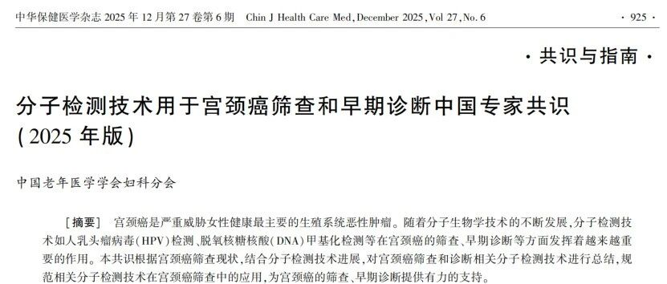
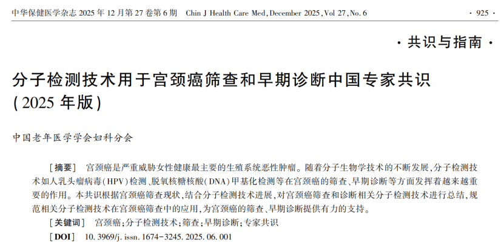

# 专家共识 | 2025分子检测技术用于宫颈癌筛查和早期诊断突显甲基化检测重要性

_2026年03月13日 15:42_

中国老年医学学会妇科分会组织国内相关领域专家，通过文献检索提取循证证据并集体讨论，制定发布《分子检测技术用于宫颈癌筛查和早期诊断中国专家共识（2025 年版）》。该共识立足我国宫颈癌筛查现状与分子检测技术进展，旨在总结并规范 HPV 检测、DNA 甲基化检测等分子技术在宫颈癌筛查与早期诊断中的应用，为临床提供更有力的技术支持与路径参考。

**共识推荐：宫颈脱落细胞甲基化检测在宫颈癌筛查中的应用越来越重要，可以用于 TCT 和 HPV 联合筛查 , 也可以用于 HR-HPV 阳性患者或 ASCUS/LSIL 患者的分流检测（推荐级别 2A 类）**。

**以下为摘录本共识在甲基化检测相关说明**

**一、DNA甲基化检测纳入子宫颈癌分子筛查**

共识明确推荐 HPV 检测和 DNA 甲基化检测作为宫颈癌及癌前病变的分子筛查技术，并着重甲基化检测在筛查与分流管理中的应用价值。还给出明确推荐：宫颈脱落细胞甲基化检测在宫颈癌筛查中的应用。

**二、DNA 甲基化技术亮点**

**DNA 甲基化检测识别快速进展的高级别病变：**

共识指出，而宫颈癌相关甲基化改变可在乃至更早阶段出现，有助于尽早识别高风险人群并指导临床早期干预，因而被视为未来宫颈癌防治的重要新手段。

**临床价值降低不必要的阴道镜转诊**：

在 HR-HPV 阳性人群中，甲基化检测可用于风险分层，帮助减少不必要的阴道镜转诊；在 ASCUS/LSIL 等边界人群中，也可作为进一步分流、预测进展 / 转归的工具。

**三、共识突显PAX1/JAM3 双基因甲基化检测的临床特色与价值**

1\. 当前已有多种甲基化标志物进入临床应用阶段，其中基于 PAX1 和 JAM3 双基因甲基化检测的试剂盒（CISCER）被列为产品化代表之一。

2\. 共识在“NMPA 获批的 HPV 甲基化检测试剂盒中详载 PAX1 和 JAM3 基因甲基化检测试剂盒（PCR-荧光探针法）检测样本类型预期用途（临床定位）。

**本文来源：**

何玥 , 吴玉梅 , 张师前 , 王建东 , 孟元光 & 赵辉 .(2025).分子检测技术用于宫颈癌筛查和早期诊断中国专家共识 (2025 年版 ). 中华保健医学杂志 ,27(06),925-932. [DOI] 10.3969 ∕ j.issn. 1674-3245. 2025. 06. 001

**关于聚禾生物**

北京起源聚禾生物科技有限公司是以创新科技为驱动、以关注健康为宗旨的科技企业。聚禾生物是妇科肿瘤早诊领域的开拓者，以独家技术和专利保护的标志物为核心，开发了宫颈癌、子宫内膜癌、卵巢癌等妇科肿瘤早诊产品，填补了该领域的空白。

随着女性对自身健康的关注越来越密切，女性健康市场将大有可为，除妇科肿瘤早筛早诊产品线外，未来聚禾生物还将建立更多女性健康相关的产品管线，打造女性健康市场的技术创新型领先企业。
