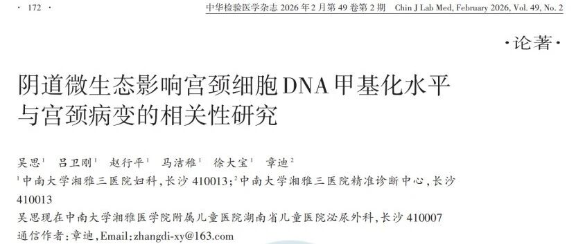
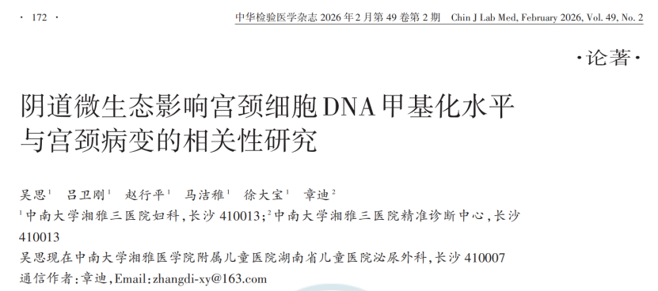
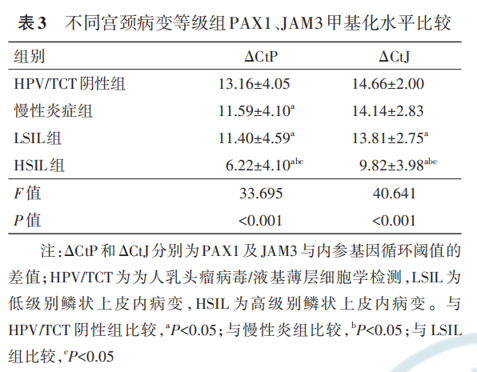
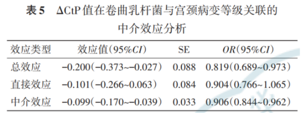

# 新文刊发 | 阴道有益菌可通过调降基因甲基化水平预防宫颈病变

_2026年03月19日 15:00_

中南大学湘雅三医院妇科与精准诊断中心团队在《中华检验医学杂志》发表论著《阴道微生态影响宫颈细胞 DNA 甲基化水平与宫颈病变的相关性研究》。首次研究阴道微生态失衡﹑ PAX1/JAM3 甲基化变化与宫颈病变进展，其中卷曲乳杆菌可能通过抑制抑癌基因高甲基化形成，间接影响宫颈病变发生发展，为宫颈病变风险分层和早期防治提供了新线索。

**一、核心发现**

1\. 宫颈病变进展伴随阴道微生态明显改变

研究发现，随着宫颈病变加重，阴道微生态发生明显变化，表现为菌群密集度、菌群多样性、Nugent 评分、pH 值、优势菌和白细胞酯酶等指标均存在显著差异；整体趋势为优势乳杆菌减少、菌群多样性增加、pH 升高，炎症反应更加明显。

2\. 多因素 Logistic 回归显示,PAX1、JAM3 甲基化水平与宫颈病变等级升高相关

3\. 卷曲乳杆菌可能是关键保护因素

在多因素分析中，卷曲乳杆菌阳性与宫颈病变等级升高呈负相关，提示其可能具有保护作用。

4\. 阴道微生态可能通过“甲基化通路”影响病变

**二、临床意义**

这项研究将《阴道微生态异常》－《DNA 甲基化改变》－《宫颈病变进展》联系起来。特别是卷曲乳杆菌与甲基化之间的关联，为理解某些 HR-HPV 感染者为何更容易发生持续感染和病变进展，提供了新的机制线索。

**三、应用前景**

研究结果支持未来探索《HPV 检测 \+ 阴道微生态评估 \+ 甲基化检测》的综合筛查策略，尤其有望帮助识别真正具有进展风险的高危人群。维持阴道微生态平衡，尤其丰富卷曲乳杆菌还有望成为宫颈病变干预或预防策略。

**参考文献：**

吴思 , 吕卫刚 , 赵行平 , 等 . 阴道微生态影响宫颈细胞 DNA 甲基化水平与宫颈病变的相关性研究 [J].中华检验医学杂志 , 2026, 49(2): 172-180. DOI: 10.3760/cma.j.cn114452-20250807-00449 .

**关于聚禾生物**

北京起源聚禾生物科技有限公司是以创新科技为驱动、以关注健康为宗旨的科技企业。聚禾生物是妇科肿瘤早诊领域的开拓者，以独家技术和专利保护的标志物为核心，开发了宫颈癌、子宫内膜癌、卵巢癌等妇科肿瘤早诊产品，填补了该领域的空白。

随着女性对自身健康的关注越来越密切，女性健康市场将大有可为，除妇科肿瘤早筛早诊产品线外，未来聚禾生物还将建立更多女性健康相关的产品管线，打造女性健康市场的技术创新型领先企业。
