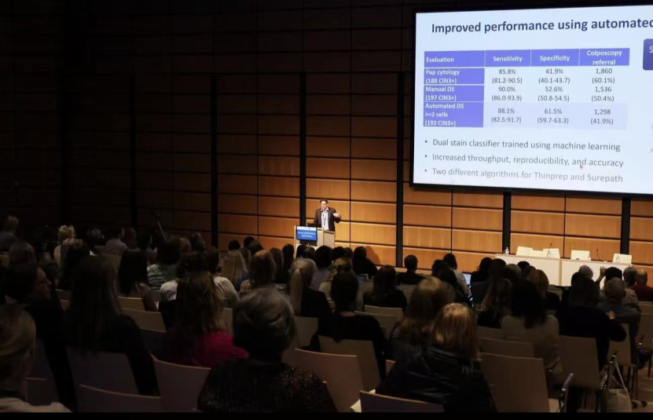

At the 33rd Eurogin International Congress held March 18–21 in Vienna, Austria, multiple experts presented breakthrough advances in DNA methylation technology for cutting-edge screening and risk stratification, heralding this non-invasive tool's potential to reshape clinical practice for cervical cancer and other gynecologic cancers.

**I. China Leads Globally in Methylation Detection**

Chinese teams have achieved global leadership in cervical cancer methylation screening technology, with the independently developed PAX1/JAM3 gene methylation detection approach providing an innovative pathway for addressing global cervical cancer prevention and treatment challenges. This breakthrough PAX1/JAM3 technology has been validated through large-scale multicenter clinical trials, demonstrating significant advantages: 89.2% sensitivity and 92.7% specificity for detecting high-grade cervical lesions (CIN2+), significantly outperforming existing screening methods. The technology's greatest innovation lies in its ability to precisely identify HPV persistent infections with true carcinogenic risk, reducing unnecessary colposcopy referrals by over 40% and dramatically optimizing medical resource allocation.

The core breakthroughs of this **"Chinese solution"** are reflected in three innovations: First, biomarker innovation—PAX1/JAM3 methylation was first identified as a key early molecular event in cervical lesions, enabling earlier identification of carcinogenic risk than traditional methods. Second, detection dimension innovation—detection rates for cervical adenocarcinoma and squamous cell carcinoma reached 91.5% and 93.2% respectively, successfully addressing the clinical pain point of inadequate adenocarcinoma detection by existing methods. Third, service model innovation—combining self-sampling technology to overcome geographical barriers, enabling women in remote areas to access high-quality screening services. This solution not only provides technical support for China's cervical cancer prevention efforts but also explores a replicable and scalable new prevention model for developing countries.

**II. European Union Develops Cervical Cancer Methylation Guidelines**

A presentation by French researcher Ramirez Pineda Arianis Tatiana revealed that the European Cancer Board is currently working to systematically advance updates to cervical cancer screening guidelines based on evidence-based medicine, officially incorporating methylation detection into the clinical pathway for HPV-positive triage management. The aim is to reduce cervical cancer burden through optimized screening strategies.

The core objective of this guideline update is to address the clinical challenges posed by the current HPV primary screening method's high sensitivity but low specificity, thereby achieving precision management of HPV-positive women and reducing unnecessary colposcopy examinations and overtreatment. This marks a key step forward for Europe in advancing cervical cancer screening toward standardization and precision. As a new-generation molecular biomarker detection technology, methylation detection is being incorporated into the new norms of the European screening system, reflecting the modernization of screening guidelines and standardization of clinical pathways.

**III. Precision Risk Stratification: Key to Guiding Clinical Decisions**

Slovenian expert Dovnik Andraz, in the session on "Application of Methylation Detection in CIN, Vulvar, or Anal Lesion Management," noted that methylation analysis can effectively distinguish the progression risk of cervical intraepithelial neoplasia (CIN). Through methylation typing of high-risk HPV-positive patients, high-risk individuals requiring immediate intervention (such as CIN3+) can be precisely identified, avoiding overtreatment of those with transient infections. Data show that CIN3+ risk in methylation-negative patients is below 1%, supporting its use as a basis for conservative management and reducing unnecessary surgeries.

**IV. Methylation Technology Leads a New Era of Non-invasive Screening**

In the session on "Development and Standardization of Methylation Detection in Cervical, Anal, and Urine Samples," Belgian researcher Van Keer Severien reported on using urine samples for methylation-based gynecologic cancer screening. This study confirmed that detecting methylation biomarkers in urine can efficiently identify early lesions of cervical cancer, endometrial cancer, and ovarian cancer. This non-invasive method is particularly suitable for women in resource-limited settings or those unwilling to undergo invasive examinations, potentially dramatically improving screening coverage. The researcher emphasized: "Urine methylation detection results are highly concordant with cervical sample results, providing the possibility for popularizing home self-testing."

**V. Methylation Detection Expands to HPV-Related Cancer Diagnosis**

The Italian team led by Njoku Ruth Chinar extended methylation application to HPV-related oropharyngeal cancer. By detecting methylation biomarkers in plasma and saliva, this technology not only aids diagnosis but can also predict treatment response and recurrence risk. Multicenter trials showed that methylation liquid biopsy sensitivity for oropharyngeal cancer exceeded 90%, providing a novel non-invasive monitoring tool for this cancer with rising incidence.

**VI. Outlook: Methylation Technology to Be Integrated into Global Cervical Cancer Elimination Strategy**

Experts at the congress unanimously agreed that methylation technology is expected to be integrated into global cervical cancer screening guidelines within the next five years. Its high specificity, scalability, and non-invasive advantages are particularly suited to the needs of low- and middle-income countries. WHO representatives stated: methylation biomarkers are key tools for accelerating the achievement of the 2030 cervical cancer elimination goal, with standardization and accessibility as the next priorities.

This Eurogin congress demonstrated the translational potential of methylation from laboratory to clinic, and it may become a core pillar of HPV-related cancer management in the future.

**About CISPOLY**

Beijing Origin-Poly Co., Ltd. is a technology enterprise driven by innovation and committed to health. As a pioneer in the field of early diagnosis of gynecologic tumors, CISPOLY has developed early detection products for cervical cancer, endometrial cancer, ovarian cancer and other gynecologic malignancies based on proprietary technologies and patent-protected biomarkers, filling gaps in this field.

As women's awareness of their own health continues to grow, the women's health market holds tremendous potential. Beyond the gynecologic tumor early screening and diagnosis product line, CISPOLY will continue to establish additional women's health-related product pipelines, striving to become a technology innovation leader in the women's health market.