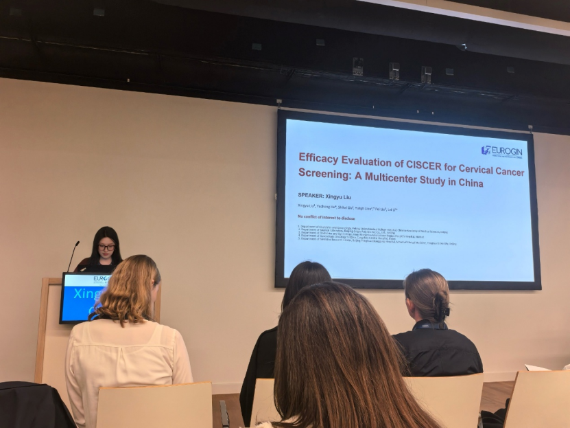
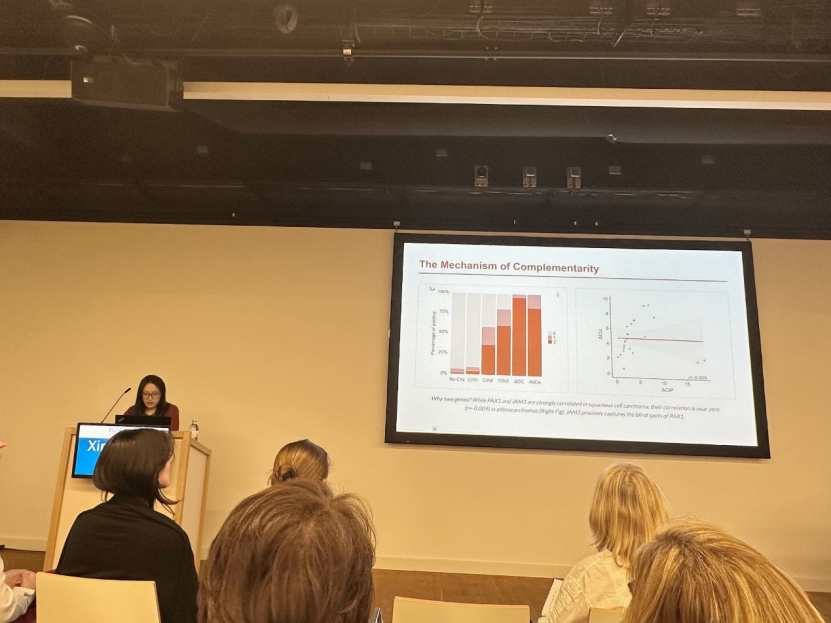
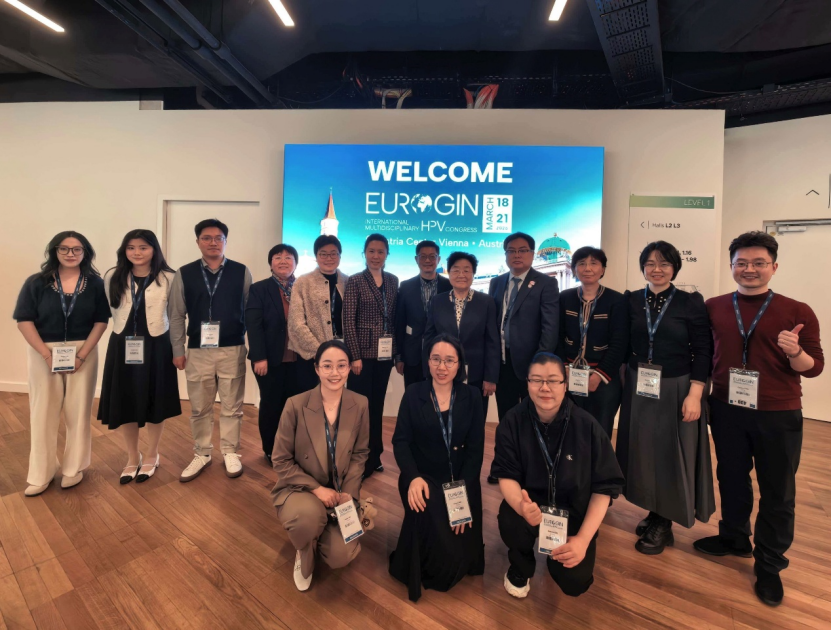

Recently, at the EUROGIN (European Research Organization on Genital Infections and Neoplasia) 2026 international congress held in Vienna, Austria, CISPOLY researcher Dr. Liu Xingyu delivered an important academic presentation as a featured speaker, titled *"Performance Evaluation of CISCER for Cervical Cancer Screening."* This study systematically demonstrated, on an international top-tier academic stage, the real-world performance of CISCER detection technology based on PAX1/JAM3 gene methylation in a large-scale clinical cohort, providing a highly innovative "Chinese solution" for addressing global cervical cancer screening challenges.

**I. Breaking Through Screening Challenges: CISCER Demonstrates Outstanding Performance**

Currently, global cervical cancer screening faces a dilemma. In the real world, women and clinicians frequently encounter the following four major challenges:

● Risk of cytology missed diagnoses: Traditional cytology (LBC), while highly specific, heavily relies on visual inspection and subjective judgment, with miss rates reaching 20%–40%. Many women who have already developed lesions miss the golden window for early intervention due to "false negatives."

● The immense anxiety of "HPV positivity": High-risk HPV testing is extremely sensitive but severely lacks specificity—it cannot precisely distinguish between "transient infection" and "true carcinogenesis." Countless women, upon seeing the word "positive" on their report, fall into prolonged anxiety and psychological distress.

● The torment of repeated colposcopy: Due to the high false-positive rate of HPV testing, large numbers of women who only need routine follow-up are over-referred. They are forced to make frequent hospital visits, enduring the physical pain and physical and psychological suffering of repeated colposcopy examinations.

● Overtreatment and cervical damage: Accompanying ineffective referrals are often unnecessary biopsies and even conization surgeries. This overtreatment not only wastes precious medical resources but may also cause irreversible cervical damage, seriously threatening the future fertility of many young women.

Facing these urgent pain points, CISPOLY delivered an impressive answer:

- **Major breakthrough in diagnostic performance**: For detection of CIN3+ (high-grade cervical squamous intraepithelial lesions and above), CISCER demonstrated outstanding diagnostic performance. Its **sensitivity reached 86.5%** (comparable to high-risk HPV testing), while specificity rose to 93.5%, significantly outperforming traditional screening methods.
- **Mechanistic innovation: JAM3 precisely covers the "adenocarcinoma blind spot"**: Why can just two genes achieve such high precision? The presentation provided an in-depth analysis of CISCER's underlying bioinformatics logic and mechanistic innovation.

The study found a perfect "non-linear synergistic complementarity" between PAX1 and JAM3 methylation markers. As is well known, cervical adenocarcinoma, due to its hidden location and special pathological features, has long been a "blind spot" highly susceptible to missed diagnosis in traditional screening. In CISCER's design, **the JAM3 gene effectively compensates for PAX1's shortcomings in adenocarcinoma detection**, enabling the detection panel to maintain extremely high detection rates for highly occult adenocarcinoma lesions as well—truly achieving "1+1>2" pathological comprehensive coverage.

**"Cliff-like" reduction in colposcopy referral rates**: Compared to the nearly 74% referral rate with HPV primary screening, CISCER detection technology **reduced colposcopy referral rates to just 17.4%**! This means that among every 100 HPV-positive women, CISCER can help reduce over 50 unnecessary colposcopy referrals, substantially optimizing clinical medical resource allocation while ensuring no missed invasive cancers.

**II. Clinical Practice: Precisely Solving Management Challenges for "Three Special Populations"**

● **Postmenopausal women ≥50 years**: Effectively overcomes false-positive cytology issues caused by declining hormone levels and atrophic changes, maintaining specificity above 91.1% (compared to only 32% for HPV).

● **Young women <25 years**: Addressing this group's high rate of transient HPV infections, CISCER's specificity exceeds **90%**, strongly preventing overtreatment—a significant benefit for protecting young women's fertility.

● **ASC-US (atypical squamous cells) triage**: For the troublesome cytology "gray zone," CISCER maintained 83% sensitivity while reducing ASC-US colposcopy referral rates to just **14%**, providing extremely clear clinical guidance.

**III. Contributing to WHO 2030 with a "Chinese Solution"**

The substantial data presented by CISPOLY at this EUROGIN congress not only earned wide attention and high recognition from international peers but also demonstrated three core values of CISCER technology in addressing current cervical cancer screening pain points: **reducing medical and patient burden, drastically reducing missed diagnosis rates, and optimizing tiered diagnosis and treatment resource allocation.**

Moving forward, CISPOLY will continue to deepen its expertise in tumor early screening and molecular diagnostics, promoting the application of CISCER and other cutting-edge technologies in broader grassroots healthcare and home self-testing scenarios, contributing hard "Chinese strength" to the early realization of the WHO 2030 goal of global cervical cancer elimination.

**About CISPOLY**

Beijing Origin-Poly Co., Ltd. is a technology enterprise driven by innovation and committed to health. As a pioneer in the field of early diagnosis of gynecologic tumors, CISPOLY has developed early detection products for cervical cancer, endometrial cancer, ovarian cancer and other gynecologic malignancies based on proprietary technologies and patent-protected biomarkers, filling gaps in this field.

As women's awareness of their own health continues to grow, the women's health market holds tremendous potential. Beyond the gynecologic tumor early screening and diagnosis product line, CISPOLY will continue to establish additional women's health-related product pipelines, striving to become a technology innovation leader in the women's health market.