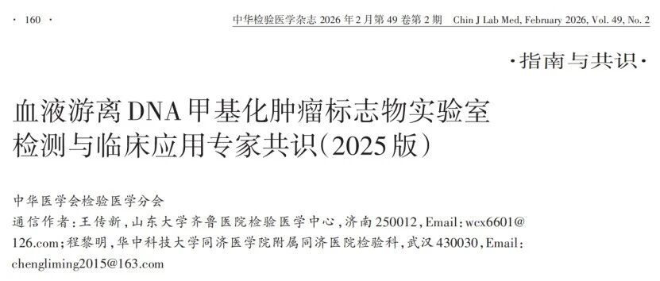
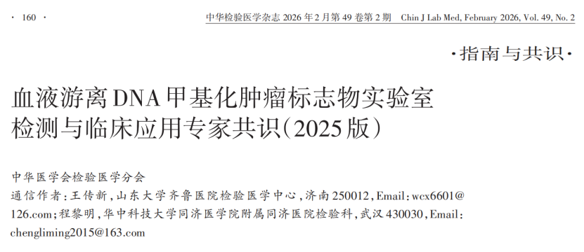

The Laboratory Medicine Branch of the Chinese Medical Association published the *Expert Consensus on Laboratory Detection and Clinical Application of Cell-Free DNA Methylation Tumor Biomarkers (2025 Edition)* in the *Chinese Journal of Laboratory Medicine*, systematically reviewing the basic theory, laboratory testing, quality management, and clinical application of DNA methylation tumor biomarkers. The consensus notes that DNA methylation, as an important epigenetic marker, has broad prospects in cancer screening, auxiliary diagnosis, prognostic monitoring, and tracing, and is driving related detection technologies toward standardization, regulation, and clinical translation.

The release of this consensus sends a clear signal: **DNA methylation detection is becoming one of the important directions for tumor biomarker development.**

**I. Standardization of Cell-Free DNA Methylation Detection Is the Foundation for Clinical Application**

This consensus provides a comprehensive review of laboratory construction, detection workflows, personnel requirements, sample processing, nucleic acid extraction, conversion methods, detection technologies, result interpretation, and clinical application scenarios, indicating that the field of cell-free DNA methylation tumor biomarkers is gradually transitioning from "researchable" to "standardizable for application." For the increasing number of NMPA-approved cell-free DNA methylation detection products entering the market, particularly in gastrointestinal cancer detection, this provides standardized laboratory testing workflows and considerations.

**II. Key Consensus Points on Laboratory Operations: Specimens—Conversion—Detection—Standards**

**Consensus 4**: Plasma specimens are recommended for blood cfDNA methylation biomarker detection. Special cfDNA collection tubes containing cell protectants are recommended for blood collection, and samples should be transported to the testing laboratory per requirements; blood samples must not be frozen. Two-step centrifugation is recommended for plasma separation, and separated plasma samples may be stored short-term or long-term according to experimental plans (intermediate-level evidence, strong recommendation).

**Consensus 6**: cfDNA requires conversion and pretreatment to adapt to downstream methylation analysis technologies. Bisulfite conversion offers high accuracy and good reproducibility, and is recommended for clinical blood cfDNA methylation detection. New developments in conversion analysis methods should also be closely monitored (intermediate-level evidence, strong recommendation).

**Consensus 7**: cfDNA methylation detection methods include methylation PCR, sequencing technologies, and nucleic acid mass spectrometry. PCR-based cfDNA methylation detection (including digital PCR) is the most widely used clinically, offering operational convenience, high accuracy, and low cost, and is recommended for low-throughput clinical detection of blood cfDNA methylation tumor biomarkers. Sequencing platform-based detection can meet high-throughput needs and is primarily used for preclinical research such as methylation biomarker screening. Nucleic acid mass spectrometry platforms offer throughput and cost between the two, suitable for medium-throughput blood cfDNA methylation analysis (high-level evidence, strong recommendation).

**Consensus 8**: Blood cfDNA methylation tumor biomarker detection results must be analyzed and interpreted under quality control compliance. Testing laboratories should properly conduct result interpretation and clinical consultation to ensure the effectiveness of clinical application (intermediate-level evidence, strong recommendation).

**III. Expert Consensus Guides Practice, Standardized Processes Accelerate Innovative Product Implementation**

Notably, this consensus provides authoritative laboratory testing and clinical application guidance for the rapidly developing tumor early screening and diagnosis products. The standardized operational workflows it emphasizes have become key references for industry product development and registration. Recently, the *Human CDO1 and HOXA9 Gene Methylation Detection Kit (PCR-Fluorescent Probe Method)* from CISPOLY for ovarian cancer auxiliary diagnosis was officially granted the NMPA Class III Medical Device Registration Certificate (No. 20253402443) in 2025. As the first domestically approved ovarian cancer DNA methylation detection kit, its entire process—from sample collection, nucleic acid extraction and bisulfite conversion, to PCR-based methylation detection and result analysis—strictly follows the standardized pathway advocated by the expert consensus, ensuring the stability and clinical reliability of test results.

Ovarian cancer, due to its insidious early symptoms and lack of typical pain, is often detected at intermediate to advanced stages, presenting enormous clinical diagnostic challenges. Blood cfDNA detection technology represented by methylation of genes such as CDO1 and HOXA9, with its high sensitivity and specificity, provides a new pathway for breaking through this dilemma. This technology demonstrates important potential in risk stratification of benign versus malignant ovarian masses and in screening of high-risk populations, contributing to earlier intervention.

With more detection products developed in accordance with this consensus entering the market, early cancer detection and precision management will become more standardized and accessible.

**Reference**

Laboratory Medicine Branch of the Chinese Medical Association. Expert consensus on laboratory detection and clinical application of cell-free DNA methylation tumor biomarkers (2025 edition) [J]. Chinese Journal of Laboratory Medicine, 2026, 49(2): 160–171. DOI: 10.3760/cma.j.cn114452-20251023-00595.

**About CISPOLY**

Beijing Origin-Poly Co., Ltd. is a technology enterprise driven by innovation and committed to health. As a pioneer in the field of early diagnosis of gynecologic tumors, CISPOLY has developed early detection products for cervical cancer, endometrial cancer, ovarian cancer and other gynecologic malignancies based on proprietary technologies and patent-protected biomarkers, filling gaps in this field.

As women's awareness of their own health continues to grow, the women's health market holds tremendous potential. Beyond the gynecologic tumor early screening and diagnosis product line, CISPOLY will continue to establish additional women's health-related product pipelines, striving to become a technology innovation leader in the women's health market.