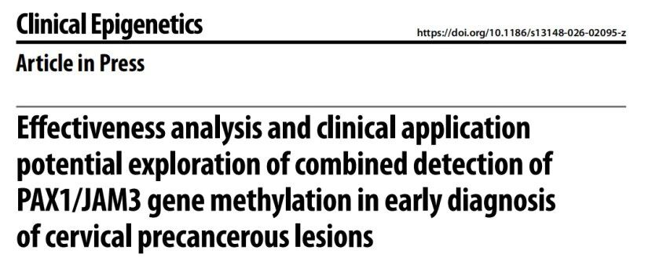
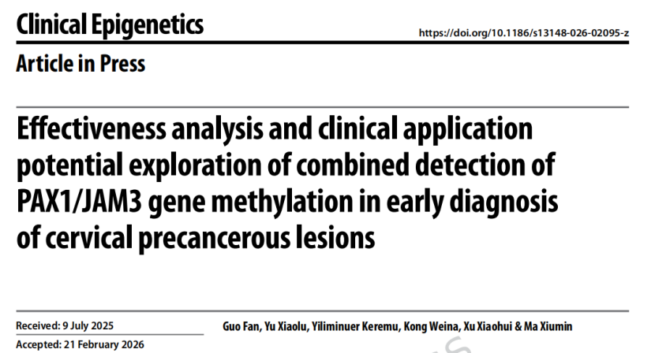
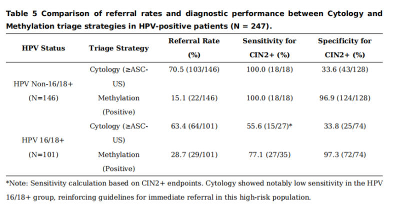

Recently, a team from the Affiliated Cancer Hospital of Xinjiang Medical University published a study in *Clinical Epigenetics* systematically evaluating the application value of combined PAX1/JAM3 gene methylation detection in early diagnosis of cervical precancerous lesions. The study showed that this detection achieves high diagnostic performance for CIN2+ and CIN3+, and particularly in triage of HPV non-16/18 positive populations, it can substantially reduce unnecessary colposcopy referrals while maintaining high-grade lesion detection rates, demonstrating excellent clinical translation potential and promotion prospects.

**I. Background and Methods**

In cervical cancer screening, cytology has subjectivity issues, and while HPV testing is sensitive, it lacks specificity, leading to unnecessary colposcopy referrals. To identify more efficient triage tools, the study enrolled 431 cervical exfoliated cell samples from normal, CIN1, CIN2, CIN3, and cervical cancer patients, detecting PAX1/JAM3 methylation levels using quantitative methylation-specific PCR, and evaluating diagnostic performance for CIN2+ and CIN3+ using ROC curves, with comparison to HPV testing and cytology.

**II. Key Results**

1. **PAX1/JAM3 combined detection shows high diagnostic performance for high-grade lesions**

In diagnosing **CIN2+**, PAX1/JAM3 combined detection achieved an AUC of **0.89**, sensitivity **83.1%**, specificity **88.8%**; for **CIN3+**, AUC of **0.93**, sensitivity **85.7%**, specificity **87.8%**. This demonstrates the test's strong discriminatory ability for high-grade cervical precancerous lesions.

2. **Methylation positivity rates increase significantly with lesion severity**

Methylation positivity rates for normal, CIN1, CIN2, CIN3, and cervical cancer groups were **8.6%, 1.9%, 77.9%, 95.8%, and 100%**, respectively, indicating that PAX1/JAM3 methylation levels are closely correlated with cervical lesion progression and can serve as molecular biomarkers reflecting disease severity.

3. **In non-HPV16/18 positive populations, methylation detection outperforms cytology for triage**

For the clinically most important **non-16/18 hrHPV-positive** women requiring refined management, while cytology has high sensitivity, its specificity is low; PAX1/JAM3 methylation detection achieved **69.2% sensitivity and 86.4% specificity** for CIN2+ triage, and **80.6% sensitivity and 78.2% specificity** for CIN3+ triage, with better overall balance and significantly higher Youden index than cytology.

**4. Methylation detection as colposcopy referral basis for HPV non-16/18 positive population**

In the HPV non-16/18 positive population, using methylation positivity as the referral basis reduced colposcopy referral rates from 70.5% to 15.1%, while maintaining a 100% CIN2+ detection rate, with specificity improving from 33.6% to 96.9%. This result is one of the most clinically translatable findings in the entire study.

**III. Clinical Value**

The most prominent clinical value of this study lies in demonstrating that **PAX1/JAM3 methylation detection can not only "detect lesions" but also "optimize triage."** For HPV-positive individuals—especially those with non-16/18 high-risk type infections—methylation detection has the potential to serve as an objective molecular triage tool complementary to, or even superior to, cytology. On one hand, it improves high-grade lesion identification efficiency; on the other, it significantly reduces unnecessary colposcopy examinations, over-referrals, and patient anxiety, while conserving medical resources. Its "high specificity + high negative predictive value" characteristics make it particularly suitable for integration into existing "HPV primary screening—triage—referral" pathways.

**IV. Conclusion**

Overall, **PAX1/JAM3 combined gene methylation detection demonstrates excellent diagnostic capability in early identification of high-grade cervical precancerous lesions, with significant application prospects in triage management of HPV-positive populations.** It has the potential to become an important complement to traditional HPV testing and cytology, particularly for precision triage of non-16/18 hrHPV-positive populations, helping clinicians reduce unnecessary interventions while maintaining lesion detection rates. With further multicenter prospective studies and health economics evaluations, PAX1/JAM3 methylation detection is poised to accelerate toward standardized clinical application.

**Reference:**

Fan G, Xiaolu Y, Keremu Y, Weina K, Xiaohui X, Xiumin M. Effectiveness analysis and clinical application potential exploration of combined detection of PAX1/JAM3 gene methylation in early diagnosis of cervical precancerous lesions. Clin Epigenetics. Published online March 17, 2026. doi:10.1186/s13148-026-02095-z

**About CISPOLY**

Beijing Origin-Poly Co., Ltd. is a technology enterprise driven by innovation and committed to health. As a pioneer in the field of early diagnosis of gynecologic tumors, CISPOLY has developed early detection products for cervical cancer, endometrial cancer, ovarian cancer and other gynecologic malignancies based on proprietary technologies and patent-protected biomarkers, filling gaps in this field.

As women's awareness of their own health continues to grow, the women's health market holds tremendous potential. Beyond the gynecologic tumor early screening and diagnosis product line, CISPOLY will continue to establish additional women's health-related product pipelines, striving to become a technology innovation leader in the women's health market.