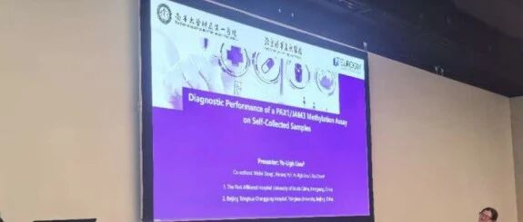
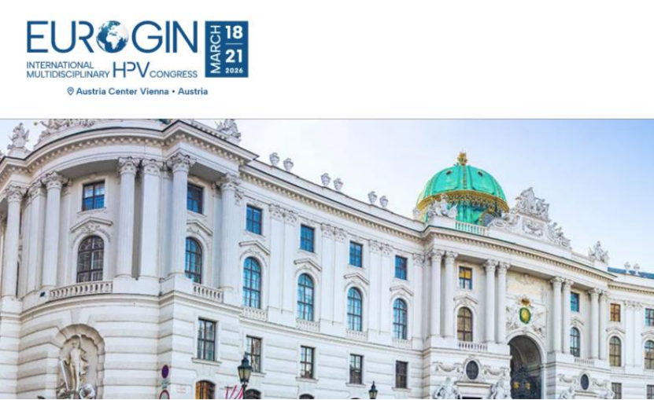
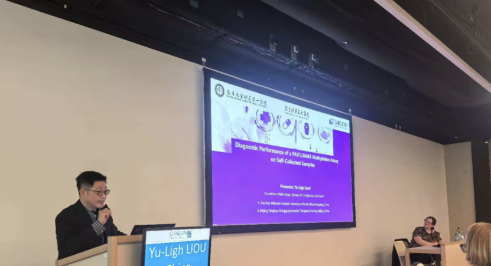
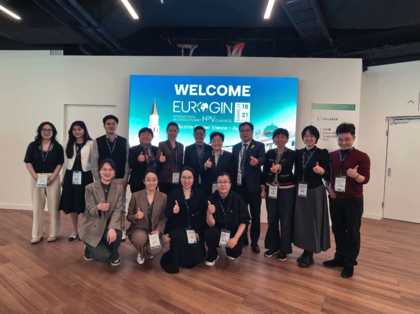

# PAX1/JAM3甲基化检测在EUROGIN大会发布中国宫颈癌自取样筛查新方案

_2026年04月15日 09:59_

近日，在奥地利维也纳举行的 EUROGIN（欧洲生殖器感染与肿瘤研究组织）国际大会上，北京清华长庚医院刘禹利特聘专家作为主讲嘉宾，发表了题为《自取样 PAX1/JAM3 甲基化检测的诊断性能评估》的突破性研究报告。该项研究首次证实，基于自取样技术的 PAX1/JAM3 甲基化检测在宫颈癌筛查中表现出卓越的诊断性能，为解决当前宫颈癌筛查中医疗资源不均、筛查覆盖率低等全球性难题提供了创新性解决方案。

**一、研究背景：突破传统筛查模式局限**

传统的宫颈癌 " 三阶段 " 筛查模式（细胞学 /HPV 初筛 →阴道镜→病理确诊）在实际应用中面临多重挑战：医疗资源分布不均、高度依赖专业设备与人员、患者多次就诊依从性低，以及阴道镜检查结果存在主观性差异。刘禹利教授指出：自取样结合甲基化检测能有效突破地理障碍，利用客观分子标志物大幅减少不必要阴道镜转诊，建立以患者为中心的高效随访流程。

**二、核心发现：自取样甲基化检测表现卓越**

本研究采用前瞻性队列设计，分为一致性研究（自取样和医师取样标本）和诊断性能研究两个队列，分别进行 PAX1/JAM3 甲基化检测，并与 hrHPV 检测、细胞学检查等传统方法进行平行比较。

研究结果显示,PAX1/JAM3 甲基化联合检测的互补性设计确保了检测的敏感性和特异性平衡, 对 CIN2+ 病变的诊断敏感性达 78%，特异性达 88%,显著优于传统筛查方法。尤其值得注意的是，自取样与医师取样的检测结果一致性高，打破了 " 自取样准确性低 " 的传统认知。

研究在亚组分析中发现，甲基化检测在不同人群中均表现稳定：

-  绝经前女性：高特异性效避免生育期女性过度治疗，保护生育功能 ﹔

-  绝经后女性：高敏感性可检测宫颈萎缩掩盖的隐匿病变 ﹔

-  TZ3 型转化区：对 52.6% 的阴道镜检查困难病例仍能有效识别高级别病变｡

**三、临床意义与推广价值**

这一技术特别适合在中国偏远地区和医疗资源不足地区推广，可大幅提升筛查覆盖率，同时保证检测质量的一致性。自取样甲基化检测为实现世界卫生组织 '2030 年消除宫颈癌 ' 目标提供了技术支撑,有望解决筛查 ' 最后一公里 ' 难题。

**关于聚禾生物**

北京起源聚禾生物科技有限公司是以创新科技为驱动、以关注健康为宗旨的科技企业。聚禾生物是妇科肿瘤早诊领域的开拓者，以独家技术和专利保护的标志物为核心，开发了宫颈癌、子宫内膜癌、卵巢癌等妇科肿瘤早诊产品，填补了该领域的空白。

随着女性对自身健康的关注越来越密切，女性健康市场将大有可为，除妇科肿瘤早筛早诊产品线外，未来聚禾生物还将建立更多女性健康相关的产品管线，打造女性健康市场的技术创新型领先企业。
