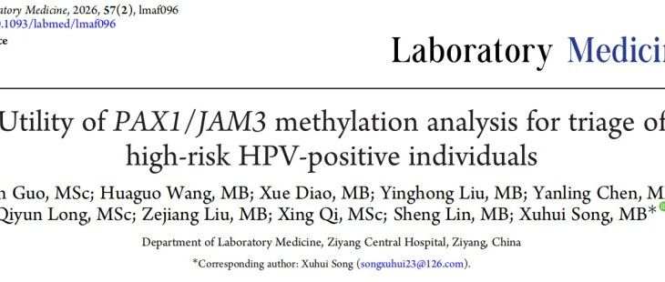
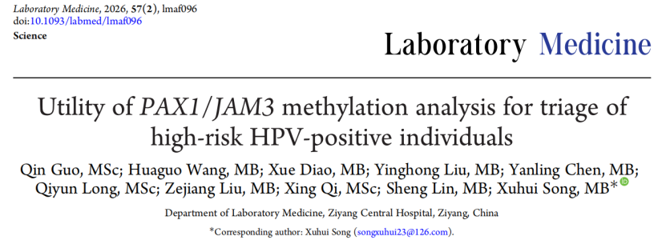
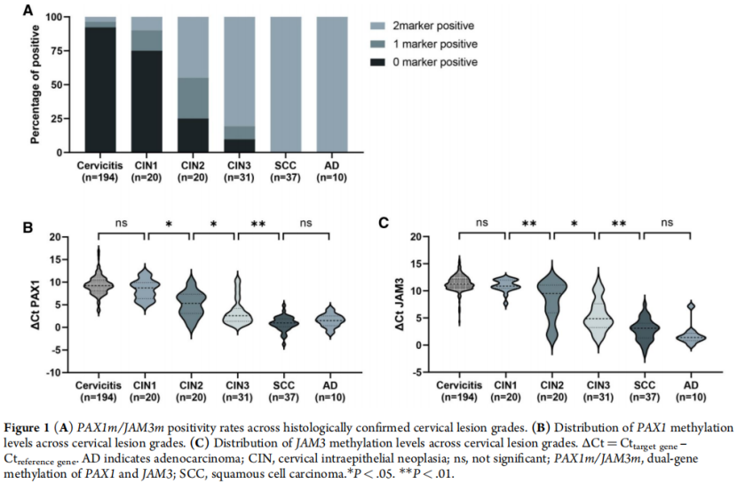
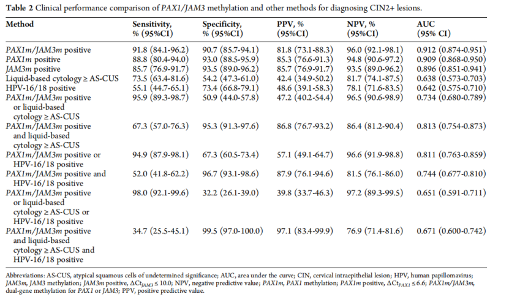
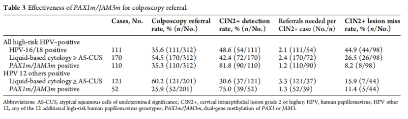

# 新文刊发 | PAX1/JAM3双基因甲基化检测为高危HPV阳性精准管理高级别病变

_2026年04月23日 15:25_

近日，来自资阳市中心医院检验医学科的的研究团队，在 Oxford University Press 旗下期刊 Laboratory Medicine 发表题为《Utility of PAX1/JAM3 methylation analysis for triage of high-risk HPV-positive individuals》的研究论文。该研究聚焦于高危 HPV 阳性人群如何更精准分流这一临床痛点，系统评估了 PAX1/JAM3 双基因甲基化检测在识别高级别宫颈病变、优化阴道镜转诊策略中的应用价值,旨在为宫颈癌筛查后的精准管理提供更客观、高效的新工具。

**一、研究背景与方法**

高危 HPV 作为宫颈癌初筛的高灵敏度，但阳性并不等于存在高级别病变，反而造成患者恐慌乱投医﹔传统细胞学分流又受主观判读、样本质量和人员经验影响，临床上仍存在过度转诊与漏诊并存的问题。

为寻找更客观稳定的分流标志物，相关研究纳入 312 例高危 HPV 阳性者，通过检测宫颈分泌物中的 PAX1/JAM3 双基因甲基化水平，并以组织病理结果为金标准，评估其在识别 CIN2+ 病变及优化阴道镜转诊效率方面的表现。

**二、关键研究结果**

1\.**PAX1/JAM3 甲基化检测具备立分流能力**

研究显示,PAX1 和 JAM3 甲基化阳性率随宫颈病变严重程度增加而显著升高，提示其与病变进展密切相关；在宫颈癌病例中，两者均实现了 100% 检出。

2\. 在 CIN2+ 检测中,PAX1/JAM3 双基因甲基化表现出优异性能：

**敏感度 91.8%、特异度 90.7%、阳性预测值 81.8%、阴性预测值 96.0%，AUC 为 0.912**，整体优于传统细胞学（≥ ASC-US）和 HPV16/18 分型。研究还发现，虽然联合检测可在一定程度上进一步提高敏感度，但往往会显著牺牲特异度和阳性预测值，且 AUC 并未出现临床意义上的明显提升，**这表明 PAX1/JAM3 甲基化检测本身已具备较强的独立分流能力**。

3\.**PAX1/JAM3 甲基检测精准降低阴道镜转诊率**

**PAX1/JAM3 甲基化阳性**作为转诊标准，在全部高危 HPV 阳性人群中，平均**每转诊 1.22 人即可发现 1 例 CIN2+ 病变**。与液基细胞学 ≥ AS-CUS 相比，该策略使**阴道镜转诊率从 54.5% 降至 35.3%**，相当于减少约**19.2% 的不必要转诊，同时将 CIN2+ 检出率从 42.4% 提高至 81.8%**，检测效率提升**39.4%**。

在临床上尤为棘手的“**非 HPV16/18 型的其他 12 种高危 HPV 阳性**”人群中。与液基细胞学相比,PAX1/JAM3 甲基化检测将阴道镜转诊率由60.2% 降至
25.9%**，下降约**34.3%**；同时将 CIN2+ 检出率由**30.6% 提高至75.0%**，提升**44.4%。

这一结果说明,PAX1/JAM3 甲基化检测不仅能用于一般高危 HPV 阳性人群分流，也在传统管理中相对更难判断风险的亚组中具有重要价值。

**三、临床价值**

PAX1/JAM3 双基因甲基化检测的核心优势在于“更客观、更稳定、更高效”。与依赖人工判读的细胞学不同，甲基化检测属于分子层面的客观指标，重复性更好，受操作者经验影响更小,尤其适合在细胞学能力不均衡或资源相对有限的地区推广。

从管理路径看，该检测有望帮助临床更精准地决定“谁需要尽快做阴道镜、谁可以避免不必要转诊”，从而减少过度检查、降低患者焦虑和医疗资源消耗。其应用有望减少过度转诊、降低患者心理负担和医疗成本，并推动宫颈癌筛查后管理从“经验型分流”迈向“分子精准分流”。

特别是在基层或细胞学能力不均衡的地区，这一分子标志物策略更具现实推广意义。

**四、结论**

总体来看，这项研究表明：**PAX1/JAM3 双基因甲基化检测能够有效识别高危 HPV 阳性人群中的高级别宫颈病变，并显著优化阴道镜转诊策略**。其在敏感度、特异度和综合判别效能上的优异表现，显示出其作为**独立分流工具** 的潜力。随着更多循证研究积累,PAX1/JAM3 甲基化检测有望成为宫颈癌筛查后精细化管理的重要组成部分，为临床提供更精准、更高效的决策支持。

**参考文献**

Guo Q, Wang H, Diao X, et al. Utility of PAX1/JAM3 methylation analysis for triage of high-risk HPV-positive individuals. Lab Med. 2026;57(2):lmaf096.doi:10.1093/labmed/lmaf096

**关于聚禾生物**

北京起源聚禾生物科技有限公司是以创新科技为驱动、以关注健康为宗旨的科技企业。聚禾生物是妇科肿瘤早诊领域的开拓者，以独家技术和专利保护的标志物为核心，开发了宫颈癌、子宫内膜癌、卵巢癌等妇科肿瘤早诊产品，填补了该领域的空白。

随着女性对自身健康的关注越来越密切，女性健康市场将大有可为，除妇科肿瘤早筛早诊产品线外，未来聚禾生物还将建立更多女性健康相关的产品管线，打造女性健康市场的技术创新型领先企业。
