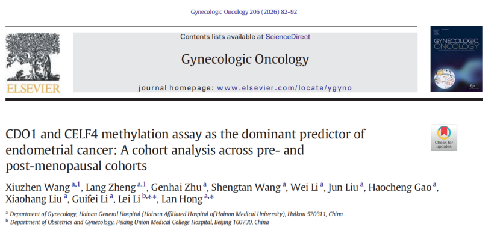

Recently, a study published in *Gynecologic Oncology* and jointly conducted by Hainan Provincial People's Hospital and Peking Union Medical College Hospital revealed that CISENDO® (CDO1/CELF4) methylation detection based on cervical scraped cells demonstrates stable and outstanding screening performance in both premenopausal and postmenopausal at-risk women. As a strong independent predictor of endometrial cancer, its non-invasive nature and overall diagnostic performance surpass traditional ultrasound endometrial thickness measurement and other routine clinical indicators, opening new avenues for screening management of at-risk women.

**I. Background**

Globally, endometrial cancer incidence continues to rise, with patients showing a trend toward younger ages. Early detection is critical: the 5-year survival rate for early-stage patients can exceed 90%, while it drops sharply to approximately 17% for advanced-stage disease.

Currently, the commonly used transvaginal ultrasound relies on endometrial thickness measurement, but lacks unified diagnostic criteria in premenopausal women and may lead to over-investigation in postmenopausal women. Additionally, while diagnostic D&C or hysteroscopic biopsy serve as the diagnostic "gold standard," they are invasive procedures that carry risks of pain, bleeding, and infection, and may even damage the endometrium, affecting fertility—causing some women to hesitate and potentially leading to diagnostic delays.

As a non-invasive endometrial cancer detection tool based on cervical exfoliated cell samples, CISENDO® can achieve high-precision detection through non-invasive sampling, providing a new option for early screening of at-risk populations.

**II. Methods**

This prospective cohort study enrolled premenopausal and postmenopausal women at risk for endometrial cancer, directly comparing the diagnostic performance of cervical cell CDO1/CELF4 methylation detection with traditional ultrasound endometrial thickness measurement.

**III. Key Findings**

- High diagnostic performance: CISENDO® maintained an AUC >0.90 in both premenopausal and postmenopausal populations, significantly outperforming traditional ultrasound endometrial thickness measurement.

- Independent predictive value: After multivariate adjustment, CISENDO® was the strongest predictor of endometrial cancer (premenopausal OR=103.9, postmenopausal OR=118.0), with predictive power surpassing clinical factors such as age and abnormal bleeding.

- Flexible combined screening strategy: Combining CISENDO® with ultrasound can improve screening efficiency. When either test is positive, sensitivity is high (premenopausal 96.6%, postmenopausal 100%); when both are positive, specificity reaches approximately 98%, facilitating precise identification of high-risk individuals.

**IV. Key Screening Populations and Clinical Significance**

- Patients with metabolic diseases: Such as obesity, hypertension, and diabetes—the three commonly referred to as the "endometrial cancer triad."

- Patients with specific medical or family history: Including polycystic ovary syndrome, infertility, family history of endometrial cancer, ovarian cancer, or Lynch syndrome, and women receiving long-term unopposed estrogen therapy or tamoxifen treatment.

- Patients with abnormal symptoms: Such as abnormal uterine bleeding (especially postmenopausal bleeding) and menstrual irregularities.

- Genetic high-risk populations: Women with Lynch syndrome are recommended to begin regular screening from age 30–35 or earlier (based on family age of onset).

- Health-conscious and proactive managers: Women concerned about endometrial health who wish to undergo early risk screening using high-sensitivity, non-invasive technology.

CISENDO® uses a non-invasive sampling method similar to HPV testing—simple to perform and completable in minutes, easily conducted in outpatient settings, significantly improving women's willingness to be screened and screening accessibility. This non-invasive nature helps address diagnostic delays caused by traditional method limitations or fear of invasive procedures.

**V. Summary**

As an effective tool for screening at-risk populations, CISENDO® methylation detection can compensate for the limitations of traditional ultrasound, providing high-risk women with a non-invasive, precise new screening pathway. Its high sensitivity and specificity facilitate early lesion detection, significantly improving patient prognosis, and representing an important new technological tool for early screening and risk stratification of endometrial cancer.

**Reference**

Wang X, Zheng L, Zhu G, Wang S, Li W, Liu J, Gao H, Liu X, Li G, Li L, Hong L. CDO1 and CELF4 methylation assay as the dominant predictor of endometrial cancer: A cohort analysis across pre- and post-menopausal cohorts. Gynecol Oncol. 2026 Feb 14;206:82–92. doi: 10.1016/j.ygyno.2026.01.776

**About CISPOLY**

Beijing Origin-Poly Co., Ltd. is a technology enterprise driven by innovation and committed to health. As a pioneer in the field of early diagnosis of gynecologic tumors, CISPOLY has developed early detection products for cervical cancer, endometrial cancer, ovarian cancer and other gynecologic malignancies based on proprietary technologies and patent-protected biomarkers, filling gaps in this field.

As women's awareness of their own health continues to grow, the women's health market holds tremendous potential. Beyond the gynecologic tumor early screening and diagnosis product line, CISPOLY will continue to establish additional women's health-related product pipelines, striving to become a technology innovation leader in the women's health market.