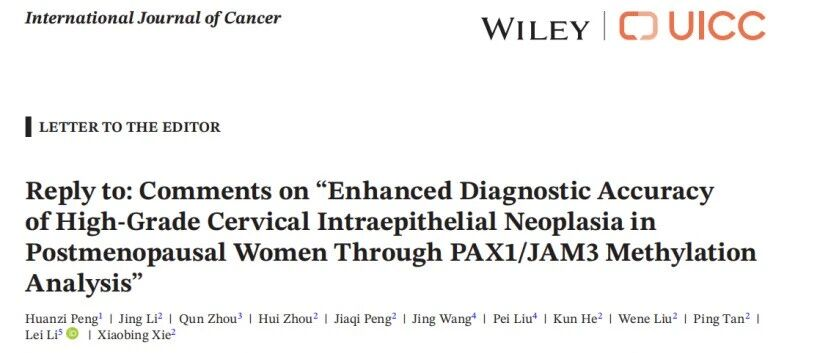
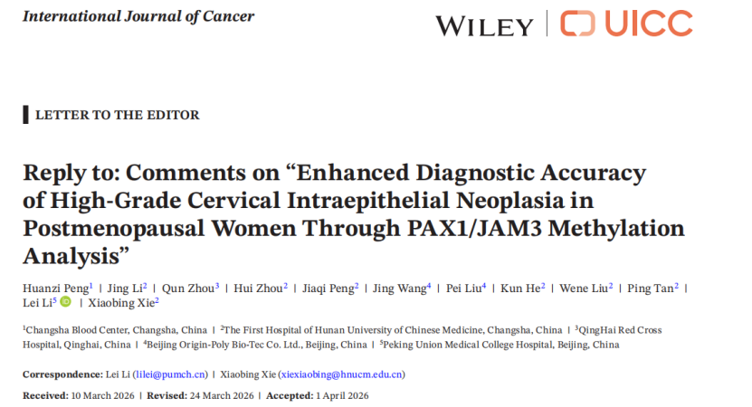

# 新文刊发 | 破解绝经后筛查困境：PAX1/JAM3甲基化检测对宫颈高级别病变的筛查优化的国际同行评议

_2026年05月27日 10:59_

一项关于 PAX1/JAM3 甲基化检测提升绝经后女性高级别宫颈病变诊断准确性的研究在《International Journal of Cancer》发表后，引发国际医学和学术界关注。本研究针对绝经后女性这一宫颈癌筛查难点人群，提供了新的精准诊断思路与方法。

**学术对话推动研究价值升华**

研究发表后,Fariha Shahid Tanveer 及其团队就研究设计、适用场景及推广价值等方面提出了建设性评论。研究团队随后在期刊上进行了正式回应，形成了高质量的“评论 — 回应 — 再发表”学术对话。经过期刊特邀审稿专家重新评审，回应内容获得一致认可，进一步强化了该研究的学术价值与影响力。

这种深入的学术交流不仅提升了原研究的科学严谨性，也为相关技术在临床实践中的应用提供了更为坚实的理论基础。以下为主要重点整理：

**一、解决绝经后女性筛查难题的创新方案**

绝经后女性因雌激素水平下降，会出现宫颈萎缩、转化区内移等生理变化，常表现为 III 型转化区，这使得宫颈细胞学检查（TCT）的取样刷难以有效触及病变好发部位，导致样本取材不满意和假阴性结果风险增高。同时，宫颈萎缩与阴道狭窄也增加了阴道镜检查的难度，导致观察不充分、活检取材困难，进而造成高级别病变的漏诊。国际同行指出，正是这些因素共同使绝经后女性成为宫颈癌筛查中的难点人群。

研究团队对此深表认同，并通过数据分析验证，强调这一临床挑战正是推动 PAX1/JAM3 甲基化检测研究的关键背景。研究表明，基于 RT-PCR 技术平台的 PAX1/JAM3 甲基化检测（禾宫康）不依赖于直接的细胞形态学观察或转化区的可见度。其检测靶标是宫颈脱落细胞中与病变相关的特异性**DNA 甲基化标志物**。因此，即使对于隐藏在宫颈管深处、传统刷取方式难以有效取样的 III 型转化区病变，该方法也能通过检测这些分子标志物来实现更稳定、精准的识别，为传统方法受限的绝经后女性提供了新的解决方案。

**二、以病理终点验证诊断价值**

针对横断面研究的局限性，研究团队澄清本研究结论严格锚定于病理学终点，包括阴道镜下活检、宫颈管搔刮及必要时的切除标本。研究数据显示,PAX1/JAM3 甲基化检测在 50 岁及以上女性中对 CIN2+ 病变表现出较高的敏感性和特异性，且能够提示部分传统 HPV 检测和细胞学可能遗漏的病变，包括 hrHPV 阴性、细胞学阴性的腺癌病例。

这一发现为改进当前绝经后女性宫颈癌筛查策略提供了重要证据支持。

**三、从国际讨论到临床转化**

此次学术对话不仅回应了国际同行的疑问，也进一步明确了 PAX1/JAM3 甲基化检测在绝经后女性宫颈高级别病变诊断流程中的临床定位。

研究团队表示，未来将通过多中心、前瞻性人群筛查队列，以及成本效益和实验室一致性研究，进一步验证该技术在不同医疗体系中的应用价值，为绝经后女性宫颈癌早诊早治提供更可靠的精准方案。

此次国际学术对话的成功，彰显了中国科研在国际肿瘤防治领域的声音与贡献，也为进一步提升女性健康水平提供了新路径。

**参考资料：**

Peng, H., Li, J., Zhou, Q., Zhou, H., Peng, J., Wang, J., Liu, P., He, K., Liu, W., Tan, P., Li, L., & Xie, X. (2026). Reply to: Comments on "Enhanced Diagnostic Accuracy of High-Grade Cervical Intraepithelial Neoplasia in Postmenopausal Women Through PAX1/JAM3 Methylation Analysis". International journal of cancer, 10.1002/ijc.70484. https://doi.org/10.1002/ijc.70484

**关于聚禾生物**

北京起源聚禾生物科技有限公司是以创新科技为驱动、以关注健康为宗旨的科技企业。聚禾生物是妇科肿瘤早诊领域的开拓者，以独家技术和专利保护的标志物为核心，开发了宫颈癌、子宫内膜癌、卵巢癌等妇科肿瘤早诊产品，填补了该领域的空白。

随着女性对自身健康的关注越来越密切，女性健康市场将大有可为，除妇科肿瘤早筛早诊产品线外，未来聚禾生物还将建立更多女性健康相关的产品管线，打造女性健康市场的技术创新型领先企业。
