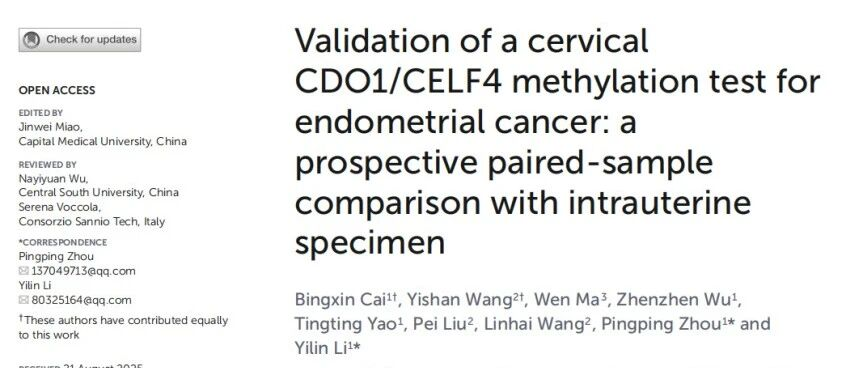
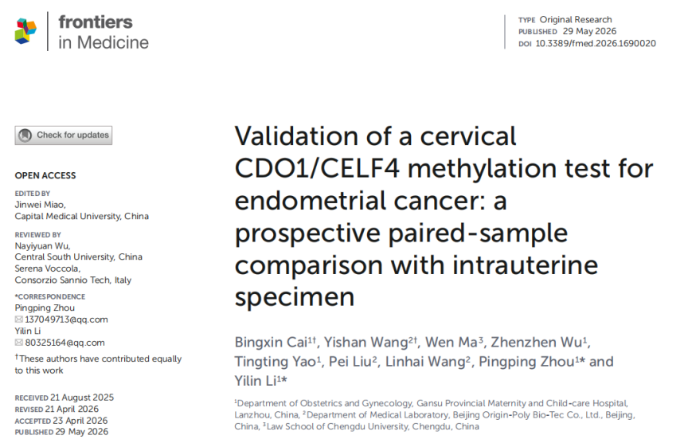
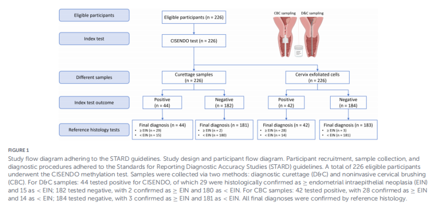

Recently, a team from Gansu Provincial Maternity and Child Health Hospital published a study titled *"Validation of a cervical CDO1/CELF4 methylation test for endometrial cancer: a prospective paired-sample comparison with intrauterine specimen"* in *Frontiers in Medicine*. This study confirmed that CDO1/CELF4 methylation detection based on cervical brush-collected samples can efficiently identify endometrial intraepithelial neoplasia (EIN) and endometrial cancer (EC), with diagnostic performance showing no significant difference compared to intrauterine D&C specimens, providing a more convenient and minimally invasive triage approach for early endometrial cancer detection.

**I. Background and Methods**

Endometrial cancer incidence continues to rise, and early diagnosis and treatment are crucial for improving prognosis. However, traditional diagnosis relies largely on hysteroscopy, D&C, and pathological examination, which are invasive, cause patient discomfort, and suffer from poor compliance. Non-invasive methods such as transvaginal ultrasound and CA125 lack sufficient specificity or stability. The research team conducted a prospective paired-sample study enrolling 226 women with indications for intrauterine examination or surgery. During the same visit, cervical brush-collected cells and intrauterine D&C specimens were sequentially collected, and CDO1/CELF4 methylation levels were detected, with pathological results serving as the diagnostic gold standard for comparison.

**II. Key Results**

Among 226 participants, 31 were diagnosed with EIN or endometrial cancer. Results showed that regardless of whether cervical brush samples or D&C specimens were used, CDO1, CELF4, and their combined CISENDO detection significantly outperformed traditional indicators. The AUC for cervical sample CISENDO detection reached 0.916, while the AUC for D&C specimens was 0.929, with no statistically significant difference in diagnostic performance. The two sample types showed high concordance in CDO1 and CELF4 detection results, with correlation coefficients of 0.86 and 0.78, respectively, suggesting that cervical brush samples can adequately reflect intrauterine lesion-associated methylation signals.

**III. Clinical Value**

The core value of this study lies in demonstrating that molecular detection results with high diagnostic value can be obtained through cervical brush sampling alone, without entering the uterine cavity. Compared to D&C and hysteroscopy, cervical sampling is simpler, more acceptable to patients, suitable for outpatient procedures, and can potentially integrate with existing cervical cancer screening workflows. For women with abnormal uterine bleeding, postmenopausal bleeding, or other high-risk factors, this test can serve as a precision triage tool, helping clinicians determine whether further invasive examination is needed, thereby reducing unnecessary D&C and hysteroscopy procedures while minimizing the risk of missed diagnoses.

**IV. Summary**

This study further validates the reliability of CDO1/CELF4 methylation detection in identifying endometrial cancer and precancerous lesions, particularly demonstrating that cervical brush specimens achieve diagnostic performance comparable to intrauterine D&C specimens. The results support cervical methylation detection as an important supplementary tool for early endometrial cancer detection and clinical triage. Future multicenter, large-sample studies are needed to further validate its applicability and health economics value in broader populations.

**Reference:**

Cai B, Wang Y, Ma W, Wu Z, Yao T, Liu P, Wang L, Zhou P and Li Y (2026) Validation of a cervical CDO1/CELF4 methylation test for endometrial cancer: a prospective paired-sample comparison with intrauterine specimen. Front. Med. 13:1690020. doi: 10.3389/fmed.2026.1690020

**About CISPOLY**

Beijing Origin-Poly Co., Ltd. is a technology enterprise driven by innovation and committed to health. As a pioneer in the field of early diagnosis of gynecologic tumors, CISPOLY has developed early detection products for cervical cancer, endometrial cancer, ovarian cancer and other gynecologic malignancies based on proprietary technologies and patent-protected biomarkers, filling gaps in this field.

As women's awareness of their own health continues to grow, the women's health market holds tremendous potential. Beyond the gynecologic tumor early screening and diagnosis product line, CISPOLY will continue to establish additional women's health-related product pipelines, striving to become a technology innovation leader in the women's health market.