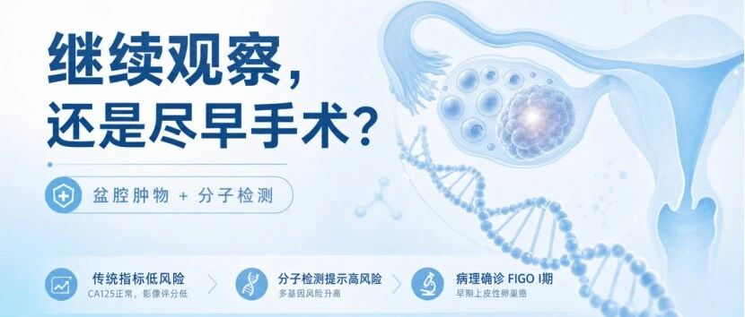
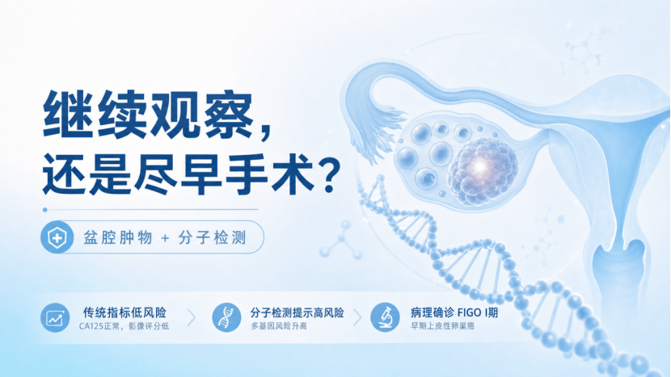
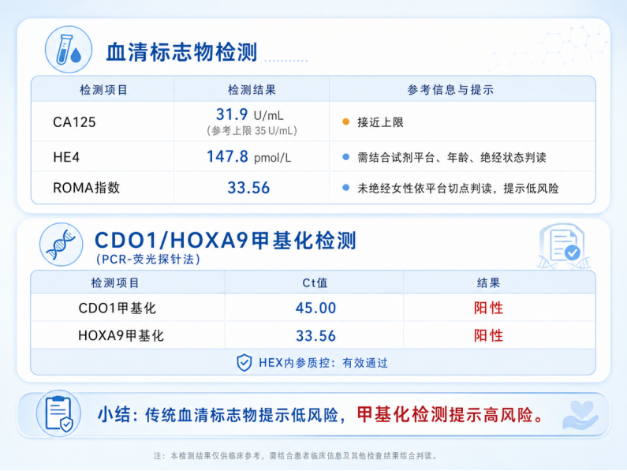
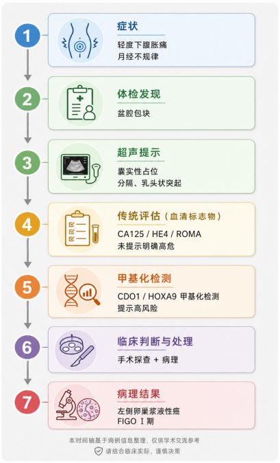
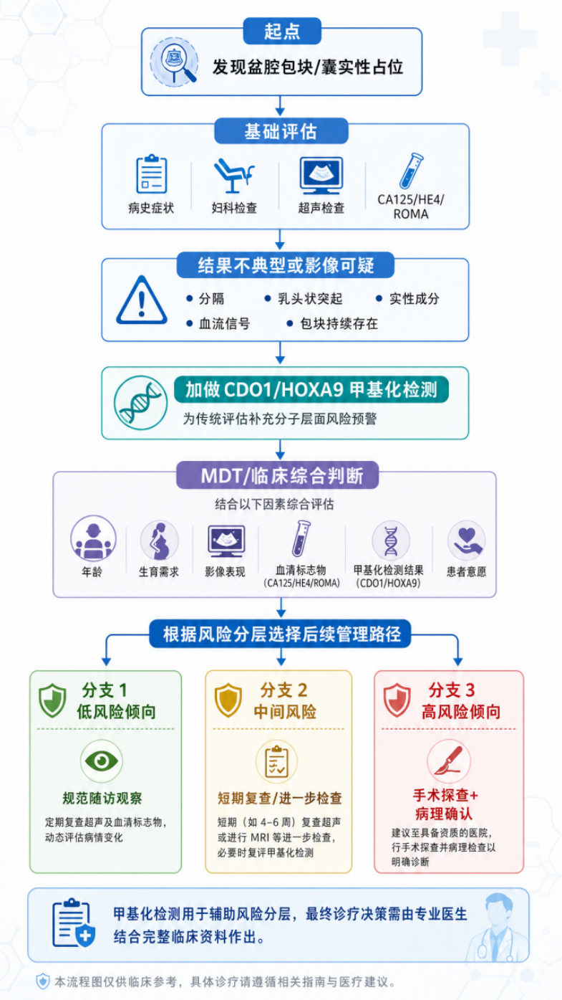

# 病例分享｜绝经前女性盆腔肿物，是继续观察还是尽早手术？CDO1/HOXA9基因甲基化检测助力临床实现无创精准预警！

_2026年06月09日 17:00_

**一、背景介绍**

卵巢癌起病隐匿，早期诊断困难，被称为妇科肿瘤中的“沉默杀手”。

目前临床常用 CA125 等生物标志物进行风险评估，但在**年轻、未绝经女性** 中，这些传统指标易受月经周期、炎症及良性疾病干扰，敏感性及特异性明显下降，尤其难以识别早期病变。

**二、病例分享**

1\. 患者基本信息

- 年龄：20 岁

- 生育史：G0P0（0-0-1-0）

- 现病史：未婚，未绝经。近 1 个月间断出现下腹轻度胀痛及坠胀不适，活动或经期加重，伴月经不规律、经量增多。因症状轻微未重视，体检发现盆腔包块后就诊。

**2\. 妇科检查与评估结果**

- 超声提示左侧卵巢可见囊实性占位，内部回声不均，可见分隔及局部乳头状突起，并探及少量血流信号。结合患者年轻、未绝经状态，临床初步考虑良性卵巢囊肿可能，遂进一步完善肿瘤标志物及分子检测评估。

- 血清标志物检查包括 CA125 ﹑ HE4 为阴性﹔ ROMA 评分提示低风险 ｡

- 血清 CDO1 和 HOXA9 甲基化检测综合评分提示高风险 ｡

**3\. 临床综合判断**

结合患者年轻、未绝经、盆腔包块持续存在、超声可疑表现及甲基化检测高风险，经多学科评估，建议手术探查 \+ 病理检查，避免延误潜在恶性肿瘤的治疗。

**4\. 病理诊断**

✅**左侧卵巢浆液性癌（FIGO I 期）**

**三、绝经前女性卵巢癌筛查与评估的特殊挑战**

卵巢癌因早期缺乏典型症状，尤其在绝经前女性中更易被忽视。绝经前女性常见功能性囊肿、子宫内膜异位症等良性病变，使盆腔包块良恶性鉴别更加困难。传统血清标志物及超声检查亦易受月经、炎症及复杂病灶影响，导致早期恶性病变不易明确诊断。

此外，许多年轻女性对妇科手术存在心理顾虑，包括担忧生育能力、荷尔蒙变化及生活质量受影响，因此倾向长期观察而延误治疗。由于卵巢癌进展隐匿且扩散迅速，多数患者确诊时已进入中晚期。

**四、病例总结与临床启示**

本案例报道了一名 20 岁未绝经女性，在传统血清标志物提示低风险的情况下，因 CDO1/HOXA9 基因甲基化检测阳性，经临床综合评估后经病理成功识别早期卵巢癌（FIGO I 期）。

血清CDO1/HOXA9甲基化检测可作为传统筛查的重要分子补充工具，帮助发现常规评估中易被忽视的隐匿性高风险患者，降低漏诊风险，并优化卵巢癌高风险人群的筛查与管理策略。

免责声明：本案例报道仅用于学术交流与医学科普，不构成对任何具体患者的医疗建议或诊断依据。临床诊疗请务必遵从专业医生的指导。

**关于聚禾生物**

北京起源聚禾生物科技有限公司是以创新科技为驱动、以关注健康为宗旨的科技企业。聚禾生物是妇科肿瘤早诊领域的开拓者，以独家技术和专利保护的标志物为核心，开发了宫颈癌、子宫内膜癌、卵巢癌等妇科肿瘤早诊产品，填补了该领域的空白。

随着女性对自身健康的关注越来越密切，女性健康市场将大有可为，除妇科肿瘤早筛早诊产品线外，未来聚禾生物还将建立更多女性健康相关的产品管线，打造女性健康市场的技术创新型领先企业。
