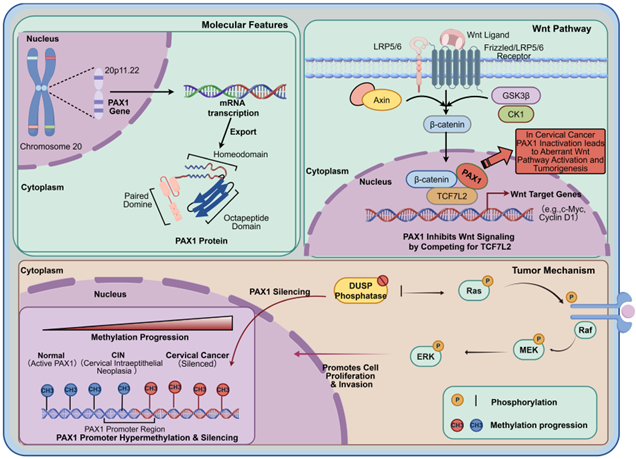

Recently, a review article titled *"PAX1/JAM3 methylation—a novel biomarker for early detection and accurate management of cervical adenocarcinoma"* systematically summarized research progress on PAX1/JAM3 dual-gene methylation in the early identification and precise management of cervical adenocarcinoma. The article points out that cervical adenocarcinoma lesions are anatomically occult, traditional cytology screening has limited sensitivity, and while high-risk HPV testing is sensitive, its specificity is insufficient—with some cases even being HPV-negative, increasing the risk of missed diagnoses.

**I. Local Expertise Driving Clinical Progress**

As the core technology driver, CISPOLY has collaborated deeply with multiple clinical centers nationwide. Since its core product CISCER received NMPA approval for marketing, substantial real-world data have accumulated, and related findings have been frequently presented at international academic conferences. This review was based on these solid evidence-based medical findings, confirming the critical pathway from research to clinical translation.

**II. Mechanistic Insights: "One Guards, One Attacks" to Block Carcinogenesis**

**The study indicates that dual-gene methylation captures carcinogenic signals from two dimensions:**

PAX1 (internal breach): Tumor suppressor gene silencing releases pro-cancer signals such as Wnt/EGF, leading to uncontrolled cell proliferation.

JAM3 (external loss of control): Decreased cell adhesion activates invasion pathways, accelerating tumor metastasis and spread.

**III. Clinical Innovation: Precision Triage, Rejecting "One-Size-Fits-All"**

Compared to single indicators, dual-gene methylation combined testing can effectively fill gaps in existing cytology and HPV screening:

Precision triage: In HPV-positive populations, it precisely distinguishes between "merely HPV infection" and "true high-grade lesions," reducing approximately 30% of unnecessary colposcopy examinations.

Filling detection gaps: Significantly improves detection rates of occult cervical adenocarcinoma, addressing the increasing challenge of cervical adenocarcinoma incidence and traditional screening "miss" difficulties.

Full-process management: Post-surgical continuous tracking of methylation levels can serve as a "molecular sentinel" for recurrence risk warning.

**IV. Conclusion**

With continuous validation through multicenter data, PAX1/JAM3 dual-gene methylation detection is poised to become an important component of cervical cancer screening strategies, driving clinical practice from "empirical medicine" toward "precision medicine."

**Reference**

Feng S, Wang D, He Q, An Y, Li S, Liu L. PAX1/JAM3 methylation—a novel biomarker for early detection and accurate management of cervical adenocarcinoma. Am J Cancer Res. 2026;16(4):1495–1508. doi:10.62347/SATU5579

**About CISPOLY**

Beijing Origin-Poly Co., Ltd. is a technology enterprise driven by innovation and committed to health. As a pioneer in the field of early diagnosis of gynecologic tumors, CISPOLY has developed early detection products for cervical cancer, endometrial cancer, ovarian cancer and other gynecologic malignancies based on proprietary technologies and patent-protected biomarkers, filling gaps in this field.

As women's awareness of their own health continues to grow, the women's health market holds tremendous potential. Beyond the gynecologic tumor early screening and diagnosis product line, CISPOLY will continue to establish additional women's health-related product pipelines, striving to become a technology innovation leader in the women's health market.