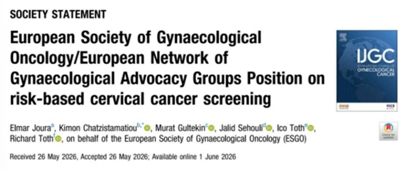

# ESGO发布子宫颈癌筛查新立场：甲基化成分流关键，聚禾CISCER®迎精准筛查风口

_2026年07月09日 15:05_

【北京讯】近日，欧洲妇科肿瘤学会（ESGO）与欧洲妇科倡导网络（ENGAGe）联合发布《基于风险的子宫颈癌筛查立场声明》，明确全球子宫颈癌二级预防正式从“普适筛查”转向“风险分层”阶段，其中**基因甲基化检测被列为 HPV 初筛后的核心分流工具**，为国产创新产品打开政策对标窗口。

欧洲大型随机研究证实,HPV 初筛对浸润性子宫颈癌的保护效力较传统细胞学高 60%–70%，但高敏感性也带来高假阳问题，若不分流直接转诊阴道镜，会造成大量过度诊疗；明确 HPV16 等高危型持续感染风险远高于其他型别、疫苗接种人群的筛查方案也需单独设计，仅靠分型不足以支撑精准风险分层，亟需更客观的下游分流工具。

声明中明确,基因甲基化可捕捉癌变早期稳定的表观遗传改变,比细胞学判读更客观、比 HPV 分型更贴近“病变是否真正进展”，能显着减少不必要的阴道镜转诊，是补齐“疫苗 \+ 初筛 \+ 分流 \+ 治疗 \+ 随访”消除子宫颈癌闭环的关键拼图。

**一、禾宫康® 已完成全球化布局**

值得关注的是，在 ESGO 新立场发布前，国产原研子宫颈癌甲基化产品**禾宫康 ®CISCER®（PAX1/JAM3 双基因甲基化检测）**已完成全球化布局：2023 年即获国家药监局 NMPA 三类医疗器械认证和欧盟 CE 认证，技术路径与 ESGO 倡导的“风险个体化”理念高度契合；学术层面，产品相关成果已多次亮相 Eurogin 欧洲子宫颈高峰会、ESGO 年会、国际子宫颈癌大会（IUCC）等顶级学术会议，累计发表近 20 篇高分 SCI 论文，具备成熟的中国人群循证验证能力。

临床数据显示，针对 HR-HPV 阳性人群,CISCER® 可将不必要的阴道镜转诊率较传统细胞学降低 44.5%, CIN3+ 残留风险仅 0.9%,阴性预测值达 99.1%；在绝经后女性、非 HPV16/18 感染等传统难筛人群中,AUC 高达 0.934，同时解决漏诊与过度诊疗双重痛点，可无缝适配 ESGO 提出的疫苗人群、老年人群等分层筛查需求。

子宫颈癌是当前最有望被消除的恶性肿瘤，而风险分层正是下一阶段筛查升级的核心。ESGO 刚把“甲基化分流”写入指南，国产创新产品已提前就位 —— 这款来自北京的“中国方案”，既承接国内两癌筛查提质扩容需求，也可对标国际标准，为全球消除子宫颈癌贡献技术力量。

**二、《基于风险的子宫颈癌筛查立场声明》对于子宫颈癌筛查影响**

**四个 " 真正的转变 "**

**① 甲基化检测，被 ESGO 明牌点名作为分流工具。**

立场声明中明确提到：**甲基化检测，可显著减少 HPV 阳性女性直接转诊阴道镜的比例**。

这句话分量很重 — 等于欧洲在国际指南宣告：子宫颈癌筛查的下一个瓶颈不在 " 发现 HPV 阳性 ",而在 " 从海量 HPV 阳性里捞出真正要治的人 "。甲基化因为捕捉的是**癌变早期已经稳定发生的分子事件**，比细胞学更客观，比 HPV 分型更靠近 " 是否真的要进展 "。

**② HPV 检测取代细胞学，是大方向，但不是终点。**

欧洲大型随机研究已证实,HPV 初筛对浸润性子宫颈癌的保护效应比细胞学高约**60%–70%**。但 HPV 敏感性高、特异性低于细胞学 —— 阳性后怎么分流，才是真问题。不分流，就会出现 "HPV 阳性 → 全员阴道镜 " 的新型过度医疗。

**③ HPV 分型是风险判断核心。**

HPV16 阳性长期风险显著高于普通高危型；HPV16 持续阳性风险更高。把 "HPV16 持续阳性 " 和 " 一次性其他高危型 " 塞进同一个管理流程，本来就不合理。

**④ 疫苗人群的筛查方案必须单独设计。**

接种后子宫颈癌 / 癌前病变风险已降，筛查间隔可以拉长、更依赖分型、对非疫苗型病变更保守 —— 这也是 " 风险分层 " 四个字落地的第一块试验田。

**文献来源：**

Joura E, Chatzistamatiou K, Gultekin M, et al. European Society of Gynaecological Oncology/European Network of Gynaecological Advocacy Groups Position on risk-based cervical cancer screening. Int J Gynecol Cancer .doi:10.1016/j.ijgc.2026.104794

**关于聚禾生物**

北京起源聚禾生物科技有限公司是以创新科技为驱动、以关注健康为宗旨的科技企业。聚禾生物是妇科肿瘤早诊领域的开拓者，以独家技术和专利保护的标志物为核心，开发了宫颈癌、子宫内膜癌、卵巢癌等妇科肿瘤早诊产品，填补了该领域的空白。

随着女性对自身健康的关注越来越密切，女性健康市场将大有可为，除妇科肿瘤早筛早诊产品线外，未来聚禾生物还将建立更多女性健康相关的产品管线，打造女性健康市场的技术创新型领先企业。
