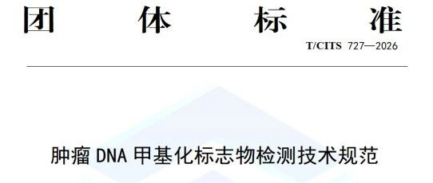

The China Association of Inspection and Testing has officially released and implemented the group standard **T/CITS 727—2026 *Technical Specifications for Tumor DNA Methylation Biomarker Detection*** (hereinafter referred to as the "Group Standard"). Three major gynecologic tumor DNA methylation detection products for **cervical cancer, endometrial cancer, and ovarian cancer** from Beijing Origin-Poly Co., Ltd. (hereinafter referred to as "CISPOLY") have all been included in Appendix A of the Group Standard, "Currently Approved Tumor DNA Methylation Biomarker Detection List," making CISPOLY one of the few innovative enterprises to achieve full coverage of methylation detection across the three major gynecologic cancers, aligned with the national group standard.

**📌 Group Standard Release: Methylation Detection Moves from "Unregulated Proliferation" to "Standardized Practice"**

T/CITS 727—2026 is administered by the **China Association of Inspection and Testing** and was jointly drafted by sixteen institutions including **the First Hospital of Jilin University, National Cancer Center/Cancer Hospital of the Chinese Academy of Medical Sciences, Peking Union Medical College Hospital of the Chinese Academy of Medical Sciences, Tianjin Medical University Cancer Institute and Hospital, Harbin Medical University Cancer Hospital, the First Affiliated Hospital of Army Medical University, and Hubei Cancer Hospital**. It is China's first technical specification covering the **entire workflow** of tumor DNA methylation biomarker detection, encompassing pre-analytical (specimen types, collection, storage and transport), analytical (method selection, DNA extraction, bisulfite conversion, PCR/NGS/MALDI-TOF MS operation), post-analytical (report content, interpretation), and quality control (internal QC, external quality assessment, performance verification).

Appendix A of the Group Standard lists **currently NMPA-approved methylation detection products** as a "reference," regarded by the industry as a "compliance whitelist" for the methylation sector.

**🎯 Three Gynecologic Products Precisely Aligned with Group Standard Entries**

| Cancer Type | Appendix A Specimen Type | Appendix A Biomarker Panel | Corresponding CISPOLY Product | NMPA Registration No. |
| ----------- | ------------------------ | ------------------------- | ----------------------------- | --------------------- |
| Cervical Cancer | Cervical brush specimen | Dual-target: PAX1/JAM3 | CISCER® (Human PAX1 and JAM3 Gene Methylation Detection Kit, PCR-Fluorescent Probe Method) | National Medical Device Registration No. 20233400253 |
| Endometrial Cancer | Cervical brush specimen / Intrauterine brush specimen | Dual-target: CDO1/CELF4 (cervical brush) | CISENDO® (Human CDO1 and CELF4 Gene Methylation Detection Kit) | National Medical Device Registration No. 20243402610 |
| Ovarian Cancer | Blood | Dual-target: CDO1/HOXA9 | CISOVA® (Human CDO1 and HOXA9 Gene Methylation Detection Kit, PCR-Fluorescent Probe Method) | National Medical Device Registration No. 20253402443 |

**🔑 Three Layers of Significance for Group Standard Inclusion**

**1. Compliance Moat**

The Group Standard defines the full-chain SOP for methylation detection, from specimen collection (e.g., heparin anticoagulants should not be used for blood cfDNA; 2–10 mL whole blood is recommended for cfDNA) to report interpretation (multi-gene panels should provide overall risk scores). Inclusion in Appendix A means that the methodologies and clinical positioning of CISPOLY's three products are now synchronized with national-level standards, providing a standardized basis for hospital procurement, bidding processes, and clinical communication.

**2. Scarcity of "Non-invasive Panoramic Coverage" in Gynecologic Early Diagnosis**

Currently, domestically approved methylation products are concentrated in colorectal cancer (Septin9, SDC2, etc.), lung cancer (SHOX2/RASSF1A), and liver cancer. **CISPOLY is the most representative case of an enterprise having approved products for all three major gynecologic cancers simultaneously included in the same group standard**—cervical (triage) + endometrial (early screening) + ovarian (auxiliary diagnosis) forming a complementary portfolio that can support a "one-stop methylation assessment" clinical pathway in gynecologic outpatient settings.

**3. From "Single-Point Innovation" to "Industry Infrastructure"**

The Group Standard drafting institutions are primarily public tertiary hospitals and provincial cancer specialty hospitals. The "approved list" in Appendix A essentially constitutes a secondary clinical value confirmation of marketed products. The inclusion of all three CISPOLY cancer products marks the company's transition from a "product-type company" to a "technology partner participating in industry rule-making."

**About CISPOLY**

Beijing Origin-Poly Co., Ltd. is a technology enterprise driven by innovation and committed to health. As a pioneer in the field of early diagnosis of gynecologic tumors, CISPOLY has developed early detection products for cervical cancer, endometrial cancer, ovarian cancer and other gynecologic malignancies based on proprietary technologies and patent-protected biomarkers, filling gaps in this field.

As women's awareness of their own health continues to grow, the women's health market holds tremendous potential. Beyond the gynecologic tumor early screening and diagnosis product line, CISPOLY will continue to establish additional women's health-related product pipelines, striving to become a technology innovation leader in the women's health market.