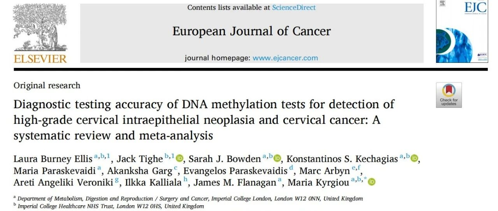
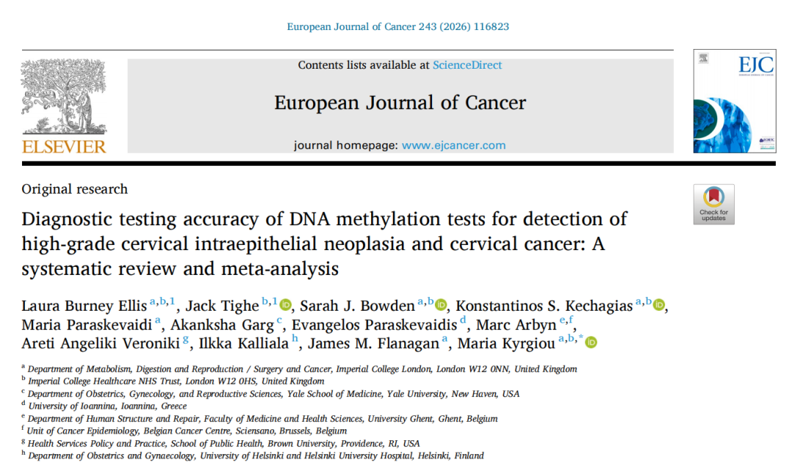

# 新文刊发｜WHO/ESGO 指南专家联合发表大型 Meta研究：PAX1/JAM3 双靶甲基化在子宫颈高级别病变检测中综合效能居首

_2026年07月15日 10:46_

近日，由**英国帝国理工学院、美国耶鲁大学医学院妇产科、比利时癌症中心、美国布朗大学、芬兰赫尔辛基大学医院**等团队联合完成的一项系统评价与 Meta 分析，发表于 European Journal of Cancer。

这篇文献的特殊之处：作者群包含**Marc Arbyn（WHO 宫颈筛查指南核心执笔人）、Maria Kyrgiou、Laura Burney Ellis**等 EU/WHO 指南撰写专家，**本篇 Meta 将作为下一轮 WHO ／ ESGO 宫颈指南更新的证据基底之一**。

研究纳入**125 项研究、49,242 名女性**，系统比较了 32 种人源及 HPV 相关甲基化标志物的诊断效能，是全球目前样本覆盖最广的宫颈甲基化 Meta 之一，为甲基化检测在宫颈癌筛查与分流管理中的应用提供了高级别循证依据。

**一、两个核心场景下的发现**

**① HPV 阳性后的分流（CIN3+ 为终点）**

在 51 项研究、28,977 名高危 HPV 阳性女性的分析中，评估 13 种甲基化标志物 ——**JAM3、C13ORF18、PAX1**三者综合诊断效位居前三。其中 JAM3 联合 PAX1 在维持较好灵敏度的同时特异度突出，意味着能更精准识别「需要进阴道镜＋组织学确认」的高风险人群，缓解当前 HPV 阳性分流「阴道镜过载」的痛点。

**② 不限定 HPV 状态的全人群（CIN2+ 为终点）**

PAX1/JAM3 双靶组合汇总了 5 项研究、3,929 名受试者数据，检测 CIN2+（高级别癌前病变）的**诊断比值比（DOR）达 76.00，为所有纳入比对的 32 种标志物 / 组合中最高**。

换句话说：**无论 HPV 是否阳性，PAX1/JAM3 双靶的「阳性信号」都高度对应 CIN2+ 真实病灶**—— 这点对甲基化检测从「HPV 分流辅助」走向「更广谱临床使用」是关键证据。

**二、小结**

这篇由国际宫颈指南制定专家联合发表的 Meta 给出两层证据：

·**单靶层面**：PAX1、JAM3 各自在 HPV+ 人群的 CIN3+ 检测中均已进入国际验证第一梯队；

·**双靶层面**：PAX1/JAM3 在全人群的 CIN2+ 检测中拿到国际指南专家认证最高综合效能指标（DOR=76）。

这篇系统评价直接把PAX1和JAM3列为全球证据最强的宫颈甲基化标志物。

双靶策略可在一定程度上**降低单一基因甲基化异质性带来的波动**,为子宫颈病变风险评估提供更稳健的分子信息，也呼应了 WHO ／ ESGO 近年「精准分流、减少过度阴道镜」的指南走向。此结论为 PAX1/JAM3 双靶甲基化试剂的临床采用提供指南级循证，并呼应 ESGO 2025 CIN2 主动监测共识。

**参考文献**

**Diagnostic testing accuracy of DNA methylation tests for detection of high-grade cervical intraepithelial neoplasia and cervical cancer: A systematic review and meta-analysis . European Journal of Cancer, 2026; 243**

**关于聚禾生物**

北京起源聚禾生物科技有限公司是以创新科技为驱动、以关注健康为宗旨的科技企业。聚禾生物是妇科肿瘤早诊领域的开拓者，以独家技术和专利保护的标志物为核心，开发了宫颈癌、子宫内膜癌、卵巢癌等妇科肿瘤早诊产品，填补了该领域的空白。

随着女性对自身健康的关注越来越密切，女性健康市场将大有可为，除妇科肿瘤早筛早诊产品线外，未来聚禾生物还将建立更多女性健康相关的产品管线，打造女性健康市场的技术创新型领先企业。
