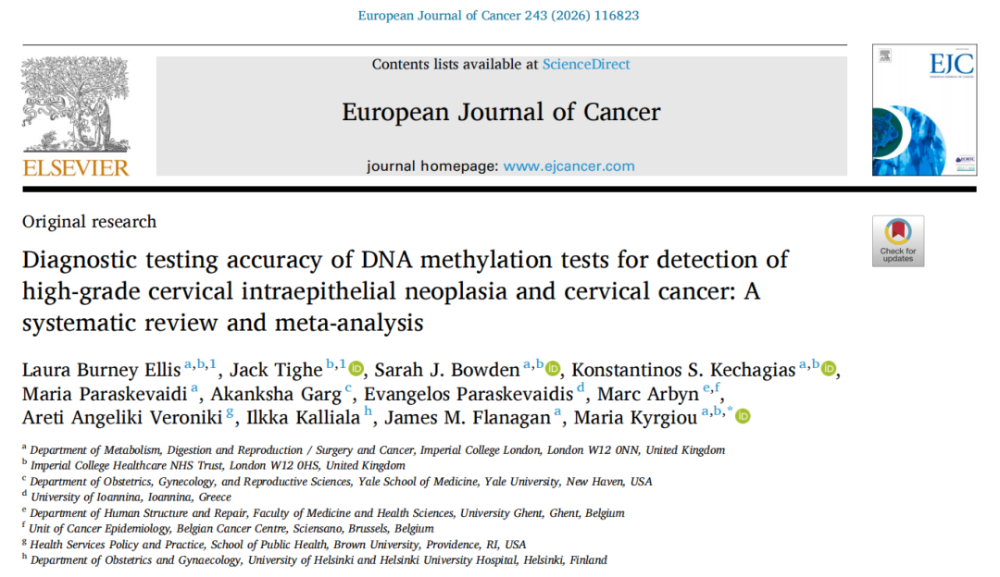

A mega meta-analysis covering nearly 50,000 samples worldwide was published in the *European Journal of Cancer*, propelling **PAX1/JAM3 dual-target methylation** detection to center stage on the international platform. This is not merely the publication of a high-impact paper—it represents an endorsement and "vote" by an international panel of authoritative experts on the future direction of cervical cancer methylation detection and screening.

Why did the PAX1/JAM3 dual-target combination stand out among 32 global competitors? We provide an in-depth analysis from two dimensions: international recognition and clinical characteristics.

**I. The "Highest Certification" from International Authorities**

The author list of this study is itself a "who's who of WHO/ESGO guideline experts." Professor **Marc Arbyn**, the "helmsman" of WHO cervical cancer guidelines, personally participated in this research—his conclusions often directly determine the direction of clinical guidelines for years to come. This study clearly states that the PAX1/JAM3 dual-target combination achieved a diagnostic odds ratio (DOR) of **76.00** for CIN2+ detection in the general population—one of the highest records in published evidence-based medicine to date.

The significance of this data lies in the fact that PAX1/JAM3 has received **"guideline-level" evidence-based endorsement, placing PAX1 and JAM3 as the globally strongest cervical methylation biomarkers.** For clinicians, this is not merely a triumph of laboratory data but a passport to align with future international diagnostic standards. It echoes the urgent need identified in the **ESGO 2025 CIN2 Active Surveillance Consensus** for more precise biomarkers.

**II. Three Key Features Addressing Clinical Pain Points**

Compared to traditional cytology and standalone HPV testing, PAX1/JAM3 dual-target methylation demonstrates significant advantages in clinical application:

**1. "Broad-Spectrum Detection Capability" Transcending HPV Limitations**

The current clinical dilemma is that HPV testing has high sensitivity but low specificity, leading to excessive referrals for numerous transient infections. This study confirms that PAX1/JAM3 dual-target detection performs excellently in the general population "**regardless of HPV status**" (DOR=76.00). This means it is no longer merely an "adjunct" to HPV positivity but an independent molecular biomarker that directly reflects cervical lesion progression. This property gives it exceptional value for detecting missed diagnoses in cases where HPV primary screening is negative but lesion risk persists.

**2. A Precise Triage Tool Resolving "Colposcopy Overload"**

In the HPV-positive population, JAM3 and PAX1 demonstrated excellent specificity (88% and 87%, respectively). The dual-target detection, combining the strengths of both, acts like a precision surgical knife—filtering out from the massive HPV-positive population those who truly require intervention. **This directly addresses the global pain points of "strained colposcopy resources" and "overtreatment,"** concentrating limited medical resources on the highest-risk populations.

**3. A "Dual Insurance" Mechanism Overcoming Heterogeneity**

Tumorigenesis and progression are complex processes involving multiple genes. This study specifically notes that the dual-target strategy can effectively reduce detection variability caused by single-gene methylation heterogeneity. PAX1 and JAM3 play different roles in carcinogenic pathways; the dual-target combination not only improves detection robustness but also substantially reduces false-negative risk from single-target variation, providing a more reliable molecular basis for clinical decision-making.

**III. Summary**

As WHO accelerates its strategy to eliminate cervical cancer, finding efficient, stable, and widely accessible biomarkers has become a global consensus. PAX1/JAM3 dual-target methylation, backed by top-tier evidence-based data and high recognition from international guideline experts, is gradually establishing its core position in precision cervical cancer screening, and is poised to become a key force in transforming future clinical practice.

**Diagnostic testing accuracy of DNA methylation tests for detection of high-grade cervical intraepithelial neoplasia and cervical cancer: A systematic review and meta-analysis.** European Journal of Cancer, 2026; 243

**About CISPOLY**

Beijing Origin-Poly Co., Ltd. is a technology enterprise driven by innovation and committed to health. As a pioneer in the field of early diagnosis of gynecologic tumors, CISPOLY has developed early detection products for cervical cancer, endometrial cancer, ovarian cancer and other gynecologic malignancies based on proprietary technologies and patent-protected biomarkers, filling gaps in this field.

As women's awareness of their own health continues to grow, the women's health market holds tremendous potential. Beyond the gynecologic tumor early screening and diagnosis product line, CISPOLY will continue to establish additional women's health-related product pipelines, striving to become a technology innovation leader in the women's health market.