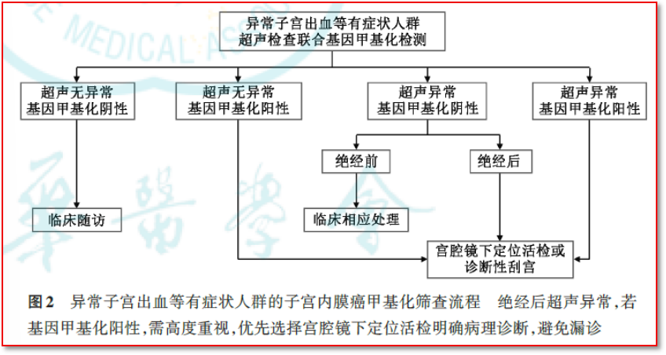
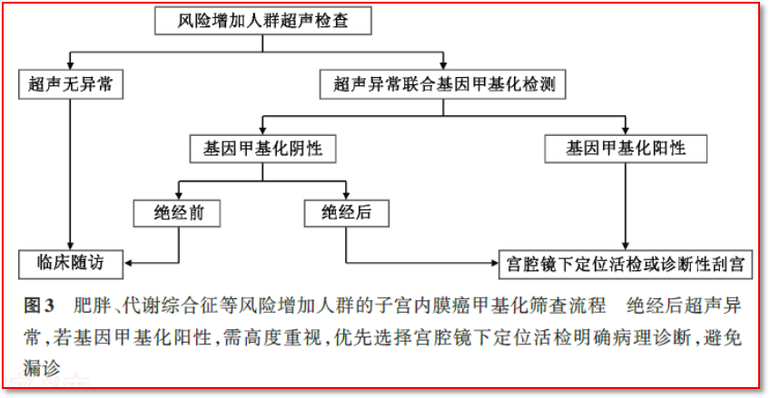
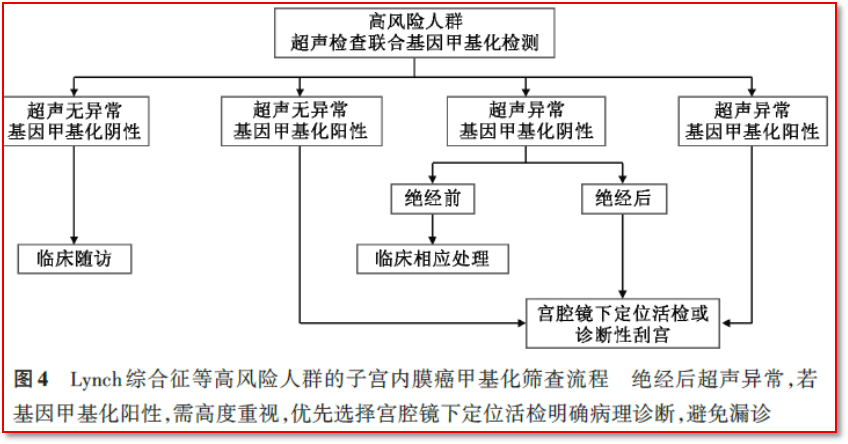

As the second article in the series, this piece focuses on the three core clinical pathway diagrams of the *Expert Consensus on Clinical Application of Endometrial Cancer Gene Methylation Screening Technology (2026 Edition)*, covering differentiated screening strategies for symptomatic populations, populations at increased risk, and high-risk populations.

**I. Symptomatic Population: Precise Triage for High-Frequency Outpatient Consultations**

(A) The symptomatic population includes:

1. Postmenopausal vaginal bleeding, considered the most common symptom of endometrial cancer, with approximately 90% of postmenopausal patients presenting with this complaint.

2. Abnormal uterine bleeding (AUB), of which only 0.3% of patients are ultimately diagnosed with endometrial cancer.

3. Abnormal vaginal discharge, presenting as a small amount of serous or bloody secretion in the early stage, which may progress to purulent and foul-smelling discharge in the late stage due to tumor necrosis and infection.

(B) Methylation application flowchart for the symptomatic population

(C) Recommendations

The traditional diagnostic dilemma for this population is that only a minority of patients are ultimately confirmed to have malignancy, yet to avoid missed diagnoses, a large number of patients must undergo invasive procedures such as diagnostic curettage, with a missed diagnosis rate as high as 60%. The methylation combined screening pathway proposed by the consensus for this population is as follows:

1. Recommendation 4: For symptomatic populations, ultrasound examination is recommended for initial assessment, combined with gene methylation testing for screening. (Strong recommendation)

2. Recommendation 5: Those with normal ultrasound but positive gene methylation testing should undergo diagnostic curettage or hysteroscopic biopsy for histopathological confirmation; those with normal ultrasound and negative gene methylation testing are advised to undergo follow-up observation. (Recommendation)

3. Recommendation 6: Those with abnormal ultrasound and positive gene methylation testing should all undergo histopathological confirmation; for those with abnormal ultrasound and negative gene methylation testing, postmenopausal patients still require histopathological confirmation, while premenopausal patients may receive symptomatic treatment followed by close follow-up. (Recommendation)

**II. Population at Increased Risk: Annual Management for Asymptomatic High-Risk Groups**

(A) The population at increased risk includes:

1. Obesity (body mass index BMI ≥ 28 kg/m²)

2. Metabolic syndrome: known insulin resistance, hyperinsulinemia, type 2 diabetes mellitus, and polycystic ovary syndrome

3. Medication factors: unopposed estrogen effects without progesterone antagonism, including functional ovarian tumors, postmenopausal estrogen replacement therapy alone, long-term tamoxifen therapy in breast cancer patients, and long-term use of mifepristone.

4. Other factors: advanced age, delayed menopause (>55 years) or early menarche (<12 years), as well as those with infertility (2-fold increased risk) or nulliparity.

(B) Methylation application flowchart for the population at increased risk

(C) Recommendations

This population is large in number, and traditional screening lacks unified standards. The pathway proposed by the consensus follows the health economics logic of "ultrasound primary screening + methylation triage."

1. Recommendation 7: For populations at increased risk, annual ultrasound examination is recommended to monitor endometrial thickness; patients with no ultrasound abnormalities may undergo clinical follow-up. (Strong recommendation)

2. Recommendation 8: Abnormal ultrasound findings require combined gene methylation testing; if methylation testing is positive, histopathological confirmation is required; if negative, postmenopausal patients still require histopathological confirmation, while premenopausal patients may receive symptomatic treatment followed by follow-up. (Recommendation)

**III. High-Risk Population: Enhanced Surveillance for Genetically Related Extremely High-Risk Groups**

(A) The high-risk population includes:

1. Lynch syndrome.

2. Other hereditary cancer syndromes (e.g., Cowden syndrome).

3. Family history: individuals with a family history of endometrial or colorectal cancer.

(B) Methylation application flowchart for the high-risk population

(C) Recommendations

This population faces an extremely high lifetime cancer risk, and the consensus provides the strongest level of screening recommendations:

1. Recommendation 9: High-risk populations are advised to undergo annual ultrasound examination combined with gene methylation testing for further evaluation. (Strong recommendation)

2. Recommendation 10: Those with normal ultrasound but positive gene methylation testing should undergo diagnostic curettage or hysteroscopic biopsy for histopathological confirmation; those with normal ultrasound and negative gene methylation testing are advised to undergo close follow-up, as well as genetic counseling and genetic testing (Recommendation).

3. Recommendation 11: Those with abnormal ultrasound and positive gene methylation testing should all undergo histopathological confirmation; for those with abnormal ultrasound and negative gene methylation testing, postmenopausal patients still require histopathological confirmation, while premenopausal patients are advised to undergo close follow-up, genetic counseling, and genetic testing. (Recommendation)

**IV. Core Common Value of the Three Pathways**

All three consensus pathways follow the core logic of "ultrasound primary assessment + methylation triage + pathological confirmation." The essence is to achieve precise triage through highly sensitive molecular testing: avoiding over-treatment of low-risk populations while reducing missed diagnoses through early warning. As one of the first domestically approved endometrial cancer methylation testing products, CISPOLY's Hekou'an® perfectly matches the sampling and performance requirements of all three pathways and will become the core tool for implementing the consensus requirements in clinical practice.

**Source:** Gynecologic Oncology Branch of the Chinese Medical Association, Professional Committee of Obstetrics and Gynecology of the Chinese Research Hospital Association, Maternal and Gynecologic Health Branch of the China International Exchange and Promotive Association for Medical and Health Care. Expert Consensus on Clinical Application of Endometrial Cancer Gene Methylation Screening Technology (2026 Edition). National Medical Journal of China, 2026, 106(26): 2701-2710. DOI: 10.3760/cma.j.cn112137-20260301-00576

**About CISPOLY**

Beijing Origin-Poly Co., Ltd. is a technology enterprise driven by innovation and dedicated to health. As a pioneer in early diagnosis of gynecologic tumors, CISPOLY has developed early-diagnosis products for cervical, endometrial, and ovarian cancers using proprietary technologies and patent-protected biomarkers, filling a gap in the field. As women pay increasing attention to their own health, the women's health market holds great potential. Beyond the gynecologic tumor early screening and early diagnosis product line, CISPOLY will continue to build more women's health-related product pipelines, establishing itself as a technology-innovative leading enterprise in the women's health market.
