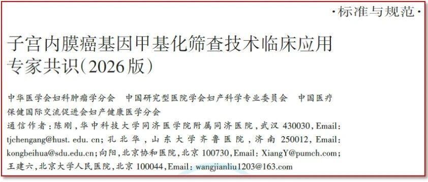
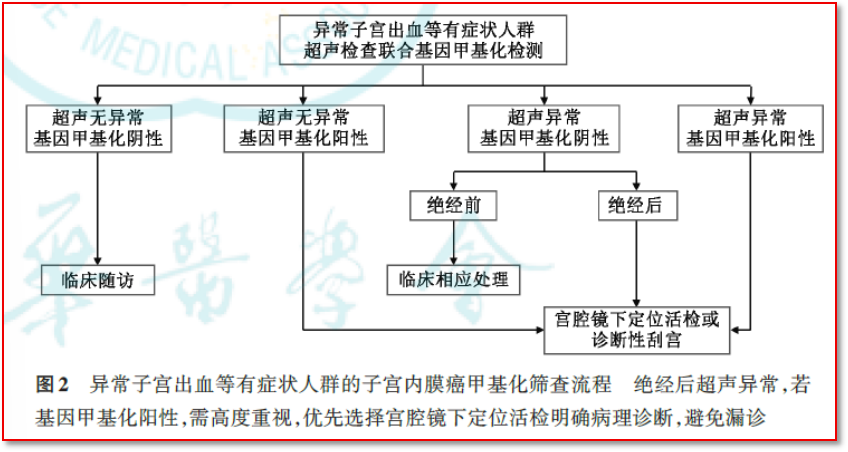

# 指南/共识 无创子宫内膜癌甲基化筛查临床路径-解读《子宫内膜癌基因甲基化筛查技术临床应用专家共识》甲基化筛查流程【系列报道三】

_2026年07月28日 13:46_

– 有症状人群的子宫内膜癌甲基化筛查流程 –

**一、有症状人群**

有症状人群指存在与子宫内膜癌相关的临床表现，需立即进行筛查以明确诊断。主要包括：

1.绝经后阴道出血，被认为是子宫内膜癌最常见的症状，约90%的绝经后患者以此就诊。只有8%~11%的绝经后出血女性最终会诊断子宫内膜癌，而且该人群的内膜癌发生率也会随年龄增加显著增长，50岁以下女性不足1%，55岁女性上升到3%，80岁以上女性上升到24%。

2.异常子宫出血（abnormal uterine bleeding，AUB），表现为经期延长、经量增多、月经淋漓不尽或阴道不规则出血，其中仅0.3%患者最终确诊为子宫内膜癌。因此，对异常子宫出血的女性实施筛查检测，可以精准分流出高危患者，减少大量诊断性刮宫和宫腔手术操作，具有重要意义。

3.阴道异常排液，早期为少量浆液性或血性分泌物，晚期因肿瘤坏死感染可出现脓血性恶臭液体。

**二、推荐意见**

1.推荐意见4：对有症状人群，推荐使用超声检查进行初步评估，联合基因甲基化检测进行筛查。（强推荐）

2.推荐意见5：超声无异常而基因甲基化检测阳性者需进行诊断性刮宫或宫腔镜下活检取材，再通过组织病理确诊；超声无异常而基因甲基化检测阴性者建议随访观察。（推荐）

3.推荐意见6：超声检查异常而基因甲基化阳性者均需进行组织病理学确诊；超声检查异常而基因甲基化阴性者，若为绝经后，仍需通过组织病理确诊，若为绝经前，则可仅行对症处理后密切随访。（推荐）

**三、流程图**

图2针对「异常子宫出血（AUB）等有症状人群」的子宫内膜癌甲基化筛查临床路径。其核心逻辑是『超声初筛 + 甲基化分流』。

**四、流程的详细步骤说明**

(一)第一步：联合检测与分流

对于有异常子宫出血等症状的患者，临床首先进行两项并行检测：

1.超声检查：评估子宫内膜厚度及形态。

2.基因甲基化检测（如无创聚禾生物的禾蔻安®）：评估细胞内是否存在恶性表观遗传特征。

(二)第二步：四象限决策矩阵

根据两项检测结果，患者被分为四个处理路径：

1.路径一：超声无异常 + 甲基化阴性

(1). 处理：临床随访。

(2). 解读：双重低风险，暂不考虑内膜癌，定期观察即可。

2.路径二：超声无异常 + 甲基化阳性

(1). 处理：宫腔镜下定位活检或诊断性刮宫。

(2). 解读：虽然超声未提示明显异常，但甲基化阳性提示表观遗传特征异常。这种情况可能涉及局灶性病变或早期改变，需结合临床情况决定进一步措施（如宫腔镜检查）。

3.路径三：超声异常 + 甲基化阴性

(1). 处理：需结合绝经状态决定。

(a). 绝经前：进行临床相应处理（通常需警惕，因年轻女性超声异常合并假阴性风险需综合判断）；

(b). 绝经后：仍需病理确诊。

(2). 解读：绝经后女性超声异常（如内膜增厚）本身恶性风险较高，即便甲基化阴性，仍需病理确诊以排除假阴性。

4.路径四：超声异常 + 甲基化阳性

(1). 处理：宫腔镜下定位活检或诊断性刮宫。

(2). 解读：双重高风险，恶性概率高。共识特别强调："绝经后超声异常且甲基化阳性者，需高度重视，优先选择宫腔镜下定位活检明确病理诊断，避免漏诊。"

5.流程核心价值

该流程通过甲基化检测提高了筛查精度。特别是在"超声异常但甲基化阴性"或"超声无异常但甲基化阳性"的灰区人群中，提供了更精细的分流策略，减少了盲目刮宫或漏诊的发生。

免责声明：以上内容仅基于图表信息进行解读，不构成医疗诊断或治疗建议。具体诊疗方案请遵循专业医生的指导。

**五、聚禾生物禾蔻安®(CDO1/CELF4甲基化)检测技术**

聚禾生物的技术极大地优化了有症状人群的筛查路径，经由经双无创「阴道超声」+「禾蔻安®检测」能够让有症状人群不需考虑有创可能的宫腔损伤风险，早期捕捉癌变信号，真正实现了『该查才查，查必精准』的个体化医疗理念，这在全球子宫内膜癌筛查指南中都具有里程碑意义。

"斜线文字"和图为专家共识引用标示。

**文献出处**

中华医学会妇科肿瘤学分会,中国研究型医院学会妇产科学专业委员会,中国医疗保健国际交流促进会妇产健康医学分会. 子宫内膜癌基因甲基化筛查技术临床应用专家共识(2026版). 中华医学杂志,2026,106(26)：2701-2710.DOI:10.3760/cma.j.cn112137-20260301-00576

**关于聚禾生物**

北京起源聚禾生物科技有限公司是以创新科技为驱动、以关注健康为宗旨的科技企业。聚禾生物是妇科肿瘤早诊领域的开拓者，以独家技术和专利保护的标志物为核心，开发了宫颈癌、子宫内膜癌、卵巢癌等妇科肿瘤早诊产品，填补了该领域的空白。

随着女性对自身健康的关注越来越密切，女性健康市场将大有可为，除妇科肿瘤早筛早诊产品线外，未来聚禾生物还将建立更多女性健康相关的产品管线，打造女性健康市场的技术创新型领先企业。
