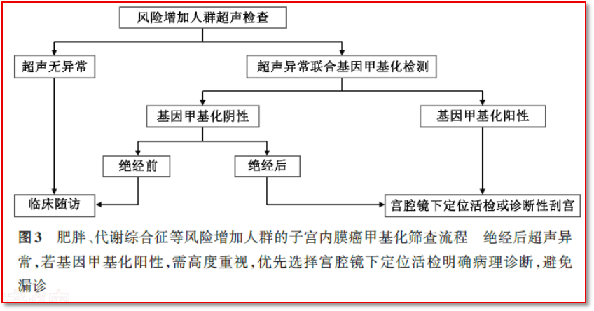

# 指南/共识 无创子宫内膜癌甲基化筛查临床路径-解读《子宫内膜癌基因甲基化筛查技术临床应用专家共识》甲基化筛查流程【系列报道四】

_2026年07月30日 10:15_

– 肥胖、代谢综合症等风险增加人群的子宫内膜癌甲基化筛查流程 –

随着生活方式的改变，肥胖及代谢综合征已成为中国女性健康的隐形杀手。这类人群正是《子宫内膜癌基因甲基化筛查技术临床应用专家共识（2026版）》（以下简称"共识"）中定义的"风险增加人群"。针对这一基数庞大但尚未出现明显症状的群体，共识首次明确了标准化的筛查路径。作为国内首批获NMPA三类证的检测工具，北京起源聚禾生物科技有限公司的"禾蔻安®（人CDO1和CELF4基因甲基化检测试剂盒）"凭借其无创采样与优异性能，依据此专家共识将成为此类人群"罹癌恐惧"与"过度诊疗"矛盾的关键利器。

**一、风险增加人群：隐匿在生活中的高危群体**

共识明确指出，风险增加人群指存在非遗传性危险因素，导致子宫内膜癌患病风险显著升高的群体。这类人群往往因无症状而忽视检查，或因惧怕宫腔操作而拒绝就医。

共识界定危险因素包括：

1.肥胖［体质指数（body mass index，BMI）≥28 kg/m²］：子宫内膜癌是与肥胖联系最强的恶性肿瘤，BMI每增加5 kg/m²，发生子宫内膜癌的风险就会增加60%（95%CI：40%~60%）。

2.代谢综合征：已知胰岛素抵抗、高胰岛素血症、2型糖尿病和多囊卵巢综合征（polycystic ovary syndrome，PCOS）通过降低性激素结合球蛋白和胰岛素样生长因子1（insulin-like growth factor 1，IGF-1）结合蛋白的水平来促进子宫内膜增生。这一事实引起了雌激素和IGF-1生物利用度的增加，导致促致癌PI3K-AKT-mTOR信号通路的激活，从而导致子宫内膜增殖。考虑到这类代谢紊乱在女性人群中的高患病率，在选择子宫内膜癌患者的风险人群时，应将其视为重要的危险因素。

3.药物因素：无孕激素拮抗的雌激素作用，包括功能性卵巢肿瘤、绝经后单纯的雌激素替代治疗、乳腺癌患者长期应用他莫昔芬治疗和长期应用米非司酮等。接受他莫昔芬治疗的乳腺癌幸存者则会增加患子宫内膜癌的风险。他莫昔芬与子宫内膜异常的发生率增加有关，包括增生、异型性和恶性肿瘤。这种发病率增加是剂量和持续时间依赖性的。

4.其他因素：包括高龄、绝经延迟（>55岁）或月经初潮年龄早（<12岁），以及有不孕不育（风险增加2倍）或未生育相关人群。

**二、推荐意见**

针对此类人群，共识给出了清晰的年度管理策略，强调在"不漏诊"与"不过度诊疗"之间寻找平衡点：

1.推荐意见7：对风险增加人群，建议每年进行超声检查以监测子宫内膜厚度，对于超声未发现异常的患者，可以进行临床随访。（强推荐）

2.推荐意见8：超声检查异常需联合基因甲基化检测，如基因甲基化检测阳性，则需进行组织病理学确诊；若基因甲基化检测阴性，绝经后仍需进行组织病理学确诊，绝经前则可仅行对症处理后随访。（推荐）

**三、流程图**

流程图图3展示了针对"肥胖、代谢综合征等风险增加人群"的子宫内膜癌甲基化筛查管理路径。与图2（针对已有症状人群）不同，图3主要针对无症状但具备高危因素的人群。其核心逻辑是：先进行低成本、无创的超声初筛，仅在超声发现异常时，才引入高精度的甲基化检测进行二次分流，从而在确保不漏诊的前提下，最大程度降低高危人群的医疗负担。

**四、流程的详细步骤说明：图3路径如何实现精准减负**

共识配套的图3流程图，专门针对"肥胖、代谢综合征等风险增加人群"设计。其核心逻辑是：先通过低成本的超声进行初筛，仅在超声发现异常时，才引入高精度的甲基化检测进行二次分流，从而在确保不漏诊的前提下，最大程度降低高危人群的医疗负担和心理压力。

(一)第一步：基线筛查（超声检查）

所有风险增加人群首选超声检查，评估子宫内膜厚度及形态。若超声无异常，仅需临床随访，无需过度焦虑。

(二)第二步：根据超声结果将人群分为两大路径

1.路径一：超声无异常

(1). 处理方案：临床随访。

(2). 解读：说明当前子宫内膜在影像学上表现正常。由于这类人群属于长期高危状态，建议定期进行超声复查，动态监测风险变化。

2.路径二：超声异常（如内膜增厚、不均质回声等）

(1). 处理方案：联合基因甲基化检测。

A.基因甲基化阴性

(A). 绝经前女性：通常建议临床随访。年轻女性的生理性内膜变化较多，甲基化阴性提示恶性风险较低，可暂缓有创操作；

(B). 绝经后女性：建议进行宫腔镜下定位活检或诊断性刮宫。因为绝经后女性内膜本应萎缩，超声异常本身恶性风险较高，即便甲基化阴性，仍需病理确诊以排除假阴性。

B.基因甲基化阳性

(A). 处理方案：宫腔镜下定位活检或诊断性刮宫。

(B). 解读：超声异常叠加甲基化阳性，提示病变风险极高。共识强调："绝经后超声异常且甲基化阳性者，需高度重视，优先选择宫腔镜下定位活检明确病理诊断，避免漏诊。"

(2). 解读：超声异常是一个警示信号，但由于良性疾病（如息肉、单纯性增生）也可能导致超声异常，此时直接进行有创活检容易造成"过度诊疗"。引入甲基化检测可以进一步评估细胞的分子层面风险。

免责声明：以上内容仅基于图表信息进行解读，不构成医疗诊断或治疗建议。具体诊疗方案请遵循专业医生的指导。

**五、禾蔻安®的流程核心价值**

1.采样优势，破解"难采"痛点：肥胖及绝经后女性常伴有宫颈萎缩、内膜菲薄，传统诊刮或微组织活检采样困难、失败率高。禾蔻安®采用宫颈脱落细胞采样（与HPV检测一致），完全不受内膜厚度限制，采样成功率接近100%。

2.精准分流，终结"恐癌"焦虑：对于超声异常但甲基化阴性的绝经前患者，禾蔻安®的高特异度能有效安抚患者情绪，避免不必要的手术干预。

3.卫生经济学最优：通过超声初筛过滤掉大部分低风险人群，仅对高危可疑人群使用禾蔻安®检测，既保证了筛查精度，又符合医疗资源合理配置原则。

**六、结语**

对于数以亿计的肥胖及代谢综合征女性而言，共识图3路径的建立具有里程碑意义。它不仅是一套筛查流程，更是一种人文关怀。

**关于聚禾生物**

北京起源聚禾生物科技有限公司是以创新科技为驱动、以关注健康为宗旨的科技企业。聚禾生物是妇科肿瘤早诊领域的开拓者，以独家技术和专利保护的标志物为核心，开发了宫颈癌、子宫内膜癌、卵巢癌等妇科肿瘤早诊产品，填补了该领域的空白。

随着女性对自身健康的关注越来越密切，女性健康市场将大有可为，除妇科肿瘤早筛早诊产品线外，未来聚禾生物还将建立更多女性健康相关的产品管线，打造女性健康市场的技术创新型领先企业。
