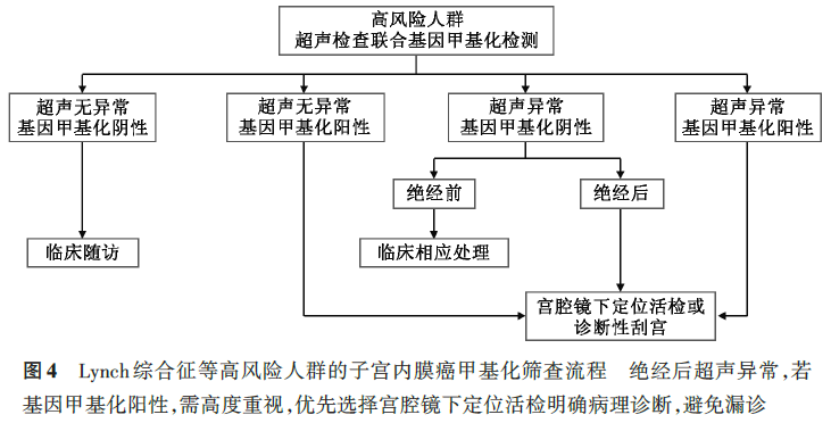

# Guidelines/Consensus Noninvasive Endometrial Cancer Methylation Screening Clinical Pathway — Interpretation of the Expert Consensus on Clinical Application of Endometrial Cancer Gene Methylation Screening Technology: Methylation Screening Workflow (Series Report 5)

*July 31, 2026, 10:49*

– Endometrial cancer methylation screening workflow for high-risk populations –

As the concluding article of this series, this piece focuses on the "high-risk population" — the group receiving the most attention and strictest management in the *Expert Consensus on Clinical Application of Endometrial Cancer Gene Methylation Screening Technology (2026 Edition)* (hereinafter "the Consensus"). Due to genetic factors, this population has a significantly elevated lifetime risk of endometrial cancer, and traditional monitoring methods often struggle to balance the dual needs of "early diagnosis" and "fertility preservation." The Consensus establishes for the first time an intensified "ultrasound + methylation" combined screening pathway for this population. In this process, Beijing Origin-Poly's "Hekou'an® (Human CDO1 and CELF4 Gene Methylation Detection Kit)", with its noninvasive and highly sensitive characteristics, serves as a "molecular sentinel" protecting the health of high-risk populations.

**I. High-Risk Population: An Extremely High-Risk Group Requiring Lifelong Vigilance**

The Consensus clearly states that the high-risk population mainly refers to those whose risk of endometrial cancer is significantly elevated due to genetic factors. This population tends to develop the disease at younger ages than sporadic cases, often with familial clustering.

The high-risk population includes:

1. Lynch syndrome: Also known as hereditary non-polyposis colorectal cancer. The lifetime risk of endometrial cancer in affected women is as high as 25%–60%, more than ten times that of the general population.

2. Other hereditary cancer syndromes: Such as Cowden syndrome, caused by PTEN gene mutations, with a 19%–28% increased lifetime risk of endometrial cancer by age 70 in carriers.

3. Family history: Individuals with a first-degree relative affected by endometrial or colorectal cancer have a doubled risk.

**II. Recommendations**

For this high-risk population, the Consensus provides the highest level of screening recommendations, emphasizing a shift from "passive response" to "active monitoring":

1. Recommendation 9 (strong recommendation): High-risk populations are advised to undergo annual ultrasound examination combined with gene methylation testing for further evaluation.

2. Recommendation 10 (recommendation): Those with normal ultrasound but positive gene methylation testing should undergo diagnostic curettage or hysteroscopic biopsy for histopathological confirmation; those with normal ultrasound and negative gene methylation testing are advised to undergo close follow-up, as well as genetic counseling and genetic testing.

3. Recommendation 11 (recommendation): Those with abnormal ultrasound and positive gene methylation testing should all undergo histopathological confirmation; for those with abnormal ultrasound and negative gene methylation testing, postmenopausal patients still require histopathological confirmation, while premenopausal patients are advised to undergo close follow-up, genetic counseling, and genetic testing.

**III. Clinical Pathway Diagram**

**IV. Detailed Steps of the Pathway: How Figure 4 Achieves Whole-Life-Cycle Management**

The Figure 4 pathway in the Consensus is specifically designed for "endometrial cancer methylation screening workflows for high-risk groups such as Lynch syndrome." Its core logic is: through high-frequency, high-sensitivity combined screening, provide early warning at the very early stage of carcinogenesis or precancerous lesions, while integrating genetic counseling to achieve whole-life-cycle management.

(1) Step 1: Annual Baseline Screening (Ultrasound + Methylation Combined)

Unlike traditional single-modality approaches, high-risk populations need annual simultaneous ultrasound assessment and Hekou'an® methylation testing. This "imaging + molecular biology" double insurance greatly improves the detection rate of early lesions.

(2) Step 2: Triage Based on Combined Test Results

Based on the results of both ultrasound and methylation, populations are precisely directed into different management pathways:

1. Pathway 1: Normal ultrasound + methylation negative

(1). Management: Close follow-up + genetic counseling and genetic testing.

(2). Interpretation: Dual low risk, but vigilance is still required. Genetic counseling is crucial to help family members assess risk.

2. Pathway 2: Normal ultrasound + methylation positive

(1). Management: Hysteroscopic targeted biopsy or diagnostic curettage.

(2). Interpretation: No lesion found on imaging, but molecular-level abnormalities already exist. Pathological examination at this time often reveals very early lesions or precancerous lesions, achieving true "early detection" — one of the most valuable scenarios for Hekou'an®.

3. Pathway 3: Abnormal ultrasound + methylation positive

(1). Management: Hysteroscopic targeted biopsy or diagnostic curettage, with mandatory histopathological confirmation.

(2). Interpretation: Dual high risk requiring immediate intervention. The Consensus emphasizes that for postmenopausal patients, hysteroscopic targeted biopsy should be prioritized to improve the diagnosis rate.

4. Pathway 4: Abnormal ultrasound + methylation negative

(1). Management: Depends on menopausal status. Premenopausal patients are advised to undergo close follow-up and genetic counseling; postmenopausal patients still require histopathological confirmation.

(2). Interpretation: Although negative methylation suggests a lower probability of malignancy, given the high-risk background of this population, especially postmenopausal women, pathological examination is still needed to rule out possible false negatives.

Disclaimer: The above content is an interpretation based on the diagram information only and does not constitute medical diagnosis or treatment advice. Please follow the guidance of professional physicians for specific diagnosis and treatment plans.

**V. Core Value of Hekou'an® in the Pathway**

1. Fertility preservation: A considerable proportion of the high-risk population consists of young women with fertility needs. Hekou'an®'s micro-noninvasive cervical exfoliated cell sampling avoids the irreversible damage to the endometrium caused by diagnostic curettage, winning precious time for young patients preparing for pregnancy.

2. Capturing very early lesions: Carcinogenesis in patients with Lynch syndrome may be multifocal or skip lesions, and ultrasound can easily miss them. Hekou'an®'s clinical sensitivity of up to 94.51% makes it a "discerning eye" for detecting hidden lesions.

3. Optimizing follow-up experience: High-risk populations require lifelong monitoring, and frequent intrauterine procedures are not only painful but may also cause intrauterine adhesions. Hekou'an®'s convenient sampling makes it the most suitable monitoring tool for annual re-examination.

**VI. Conclusion**

For high-risk populations such as those with Lynch syndrome, cancer prevention is a lifelong battle. The release of the Figure 4 pathway in the 2026 Edition Consensus provides them with a scientific battle map. On this map, CISPOLY's Hekou'an®, with its precise molecular detection technology, gives high-risk populations more initiative and a sense of security in facing genetic destiny, truly realizing the transformation from "passive treatment" to "proactive health."

**About CISPOLY**

Beijing Origin-Poly Co., Ltd. is a technology enterprise driven by innovation and dedicated to health. As a pioneer in early diagnosis of gynecologic tumors, CISPOLY has developed early-diagnosis products for cervical, endometrial, and ovarian cancers using proprietary technologies and patent-protected biomarkers, filling a gap in the field. As women pay increasing attention to their own health, the women's health market holds great potential. Beyond the gynecologic tumor early screening and early diagnosis product line, CISPOLY will continue to build more women's health-related product pipelines, establishing itself as a technology-innovative leading enterprise in the women's health market.
