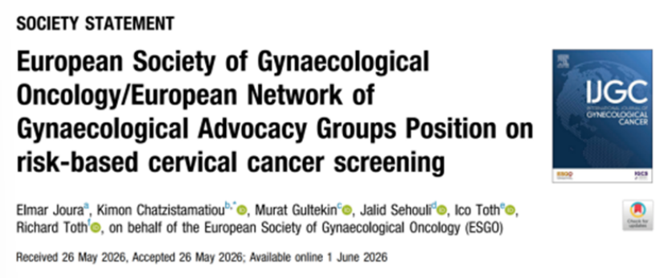

# 对标ESGO新标准，禾宫康®CISCER®凭国际硬实力破解子宫颈癌筛查"分流难题"

_2026年08月06日 16:42_

欧洲妇科肿瘤学会（ESGO）与欧洲妇科倡导网络（ENGAGe）近日重磅发布《基于风险的子宫颈癌筛查立场声明》，首次系统提出7条核心推荐，明确将全球筛查策略从"一刀切"推向"风险分层"时代。其中，声明特别强调"筛查方案按目标人群固有风险个体化设计"及"癌前病变管理按HPV型别及致癌潜能调整"，这对筛查分流技术提出了前所未有的高要求。

**一、禾宫康®CISCER®践行分子分流**

在这一国际背景下，北京起源聚禾生物旗下禾宫康®CISCER®凭借深厚的国际化布局脱颖而出。该产品不仅持有中国NMPA三类证与欧盟CE认证，更支撑了国际近20篇SCI文献发表及多项国际大会演讲。CISCER®基于PAX1/JAM3双基因甲基化技术，正是ESGO声明中倡导的"分子分流"理念的完美践行者。

临床数据表明，CISCER®能精准识别高风险患者，将HR-HPV阳性人群不必要的阴道镜转诊率较传统细胞学检查降低44.5%，同时保证CISCER阴性人群的CIN3+风险低至0.9%的极高安全性。尤其在绝经后女性及非HPV16/18型感染人群中，其AUC值高达0.934，有效解决了临床"漏诊"与"过度诊疗"的双重痛点。

随着ESGO新标准的落地，这款源对标国际的"国产利器"，正以其扎实的循证医学证据，成为实现子宫颈癌二级预防精准化管理的关键一环，助力全球消除子宫颈癌战略加速达成。

**二、《基于风险的子宫颈癌筛查立场声明》重点整理与问题解决**

为什么说"旧逻辑"不够用了？

过去几十年我们熟悉的路径是：≥30岁开始定期TCT或HPV检测 → HPV阳性看细胞学 → 异常明显转阴道镜。这套模式推动过"两癌筛查"的成功，但几个老问题越来越绕不开：

·同样是HPV阳性，HPV16持续阳性和一次性其他高危型阳性，风险能一样吗？

·打过疫苗的人，和从未接种的人，筛查间隔要一样吗？

·年轻女性CIN2，和高龄女性HPV16持续阳性，管理策略要一样吗？

答案都是"否"。

ESGO/ENGAGe这次给出7条核心推荐：

1.HPV DNA检测作为子宫颈癌二级预防的主要初筛方法

2.支持男女共种HPV疫苗，加速消除子宫颈癌

3.筛查机构与临床医生双向沟通，按疫苗史/筛查史/参与度识别高危

4.筛查方案按目标人群固有风险个体化设计

5.癌前病变管理按HPV型别及致癌潜能调整

6.自取样 + HPV DNA检测提高筛查参与率

7.重视HPV感染与筛查带来的心理与沟通问题

**文献来源**

Joura E, Chatzistamatiou K, Gultekin M, et al. European Society of Gynaecological Oncology/European Network of Gynaecological Advocacy Groups Position on risk-based cervical cancer screening. Int J Gynecol Cancer. doi:10.1016/j.ijgc.2026.104794

**关于聚禾生物**

北京起源聚禾生物科技有限公司是以创新科技为驱动、以关注健康为宗旨的科技企业。聚禾生物是妇科肿瘤早诊领域的开拓者，以独家技术和专利保护的标志物为核心，开发了宫颈癌、子宫内膜癌、卵巢癌等妇科肿瘤早诊产品，填补了该领域的空白。

随着女性对自身健康的关注越来越密切，女性健康市场将大有可为，除妇科肿瘤早筛早诊产品线外，未来聚禾生物还将建立更多女性健康相关的产品管线，打造女性健康市场的技术创新型领先企业。
