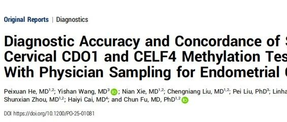
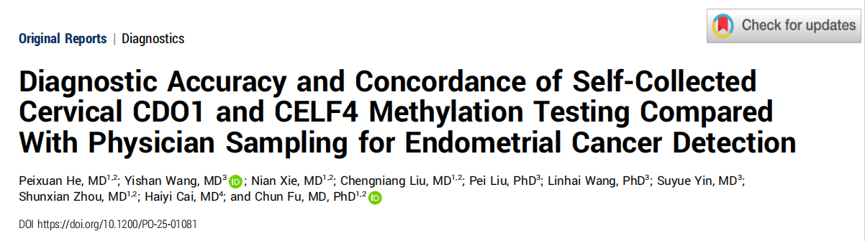
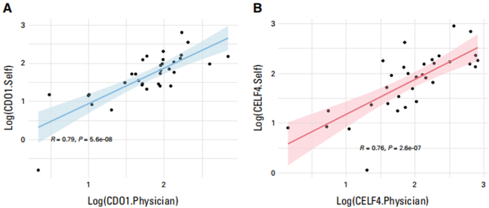
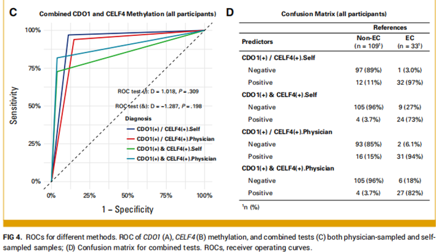

# 新文刊发 | 宫颈自采样子宫内膜癌检测突破：无创CDO1/CELF4甲基化检测准确度媲美医生采样

_2026年08月13日 14:00_

近日，中南大学湘雅二医院研究团队在国际肿瘤学权威期刊JCO Precision Oncology（JCO子刊）在线发表题为Diagnostic Accuracy and Concordance of Self-Collected Cervical CDO1 and CELF4 Methylation Testing Compared With Physician Sampling for Endometrial Cancer Detection的研究论文。该研究针对子宫内膜癌发病率持续上升、现有早诊手段缺乏无创便捷方案的临床痛点，以病理结果为金标准，系统评估了患者自采集阴道/宫颈样本中CDO1与CELF4基因甲基化检测的临床可行性、与医生采样的一致性及对子宫内膜癌的诊断效能，为自采样模式纳入临床路径提供了直接循证依据。

**一、研究背景**

子宫内膜癌发病率近年来呈持续上升趋势，且发病年龄有前移倾向。目前疑似子宫内膜癌的临床评估主要依赖盆腔检查、经阴道超声（TVS）及侵入性宫腔镜/子宫内膜活检，上述手段或因侵入性强、或受操作者依赖性影响，患者依从性受限，早期漏诊仍时有发生。

既往研究已证实，医生采集的宫颈脱落细胞中CDO1与CELF4基因甲基化检测对子宫内膜癌具有较高诊断价值，但一个关键问题长期未被充分解答：患者自采样能否获得与医生采样的甲基化检测相当的检测质量与病理比对的高诊断性能？

**二、研究方法**

本研究采用前瞻性横断面设计，纳入因异常子宫出血、TVS异常或其他临床指征接受宫腔镜检查的女性。每位受试者同步完成配对双采样：

自行采集阴道/宫颈样本和医生采集宫颈脱落细胞样本进行甲基化检测，以宫腔镜活检病理为金标准，比较两种采样方式的一致性及两者对子宫内膜癌的诊断表现。

**三、关键研究结果**

🔬标志物区分能力

无论自采样或医生采样，子宫内膜癌组的CDO1/CELF4甲基化水平均显著高于非癌组，证实这两个标志物在自采样样本中同样可稳定区分子宫内膜癌与良性病变。

🤝采样一致性

自采样与医生采样甲基化值高度相关——CDO1和CELF4相关系数均达统计学显著性，说明自采样在子宫内膜癌分子检测层面与医生采样具有良好一致性。

📊诊断效能（自采样）

CDO1/CELF4联合检测AUC达0.930，且该检测在绝经前与绝经后人群中均保持较高诊断效能，适用性不受单一亚群限制。

**四、临床价值**

本研究的核心贡献在于：它不仅证明自采样"可行"，更证实其具有与医生采样相当的诊断效力。对出现异常子宫出血、TVS异常或需评估子宫内膜病变风险的女性而言，自采样提供了一种更便捷、舒适、具隐私性的选择。

其潜在优势体现在四个层面：

·可及性：降低对医疗机构现场采样的依赖，惠及偏远地区、医疗资源不足地区及就诊不便人群；

·依从性：非侵入、自主完成，减少尴尬与不适，提升患者接受度；

·分流价值：可作为TVS/宫腔镜/活检前的风险分层工具，优化临床决策，提高早期发现率；

·远程诊疗适配性：自采样CDO1/CELF4甲基化检测便于随访与高危人群自我管理，支持居家采样后远程获知风险分层结果。

**五、未来临床应用展望**

自采样CDO1/CELF4甲基化检测若能在后续多中心、大样本队列中进一步验证，有望逐步嵌入多条临床路径：

①作为异常子宫出血门诊的一线分流工具——结合甲基化与影像学联合评估，二者均阴性者可在社区/基层随访，任一阳性者再转诊行宫腔镜，有效缓解三甲医院宫腔镜资源压力；

②拓展至绝经后无症状高危人群（肥胖、Lynch综合征、长期雌激素暴露）的早筛场景，填补目前TVS特异性不足的空白；

③与液体活检、宫腔镜AI影像等组合形成多模态EC风险评估模型；

④在基层与远程医疗场景中，构建"居家自采样—邮寄检测—云端报告—临床干预"的闭环管理模式，让EC早诊与高危人群长期随访真正下沉。

正如本研究强调的："超声看形态，甲基化看分子，互补不漏诊"。将无创形态学检查（TVS）与分子检测（甲基化）相结合，有望构建更全面、精准的子宫内膜癌基层筛查体系，最大限度降低漏诊风险。

**六、小结**

本研究证明，自采集宫颈/阴道样本用于CDO1/CELF4甲基化分析，作为一种可靠、非侵入、以患者为中心的策略，在远程医疗及医疗资源匮乏场景中具有重要应用价值，有望在子宫内膜癌早期发现、风险分层与诊疗流程优化中发挥实质作用。

**参考文献**

He P, Wang Y, Xie N, et al. Diagnostic Accuracy and Concordance of Self-Collected Cervical CDO1 and CELF4 Methylation Testing Compared With Physician Sampling for Endometrial Cancer Detection[J]. JCO Precision Oncology, 2026, 10: e2501081.

**关于聚禾生物**

北京起源聚禾生物科技有限公司是以创新科技为驱动、以关注健康为宗旨的科技企业。聚禾生物是妇科肿瘤早诊领域的开拓者，以独家技术和专利保护的标志物为核心，开发了宫颈癌、子宫内膜癌、卵巢癌等妇科肿瘤早诊产品，填补了该领域的空白。

随着女性对自身健康的关注越来越密切，女性健康市场将大有可为，除妇科肿瘤早筛早诊产品线外，未来聚禾生物还将建立更多女性健康相关的产品管线，打造女性健康市场的技术创新型领先企业。
