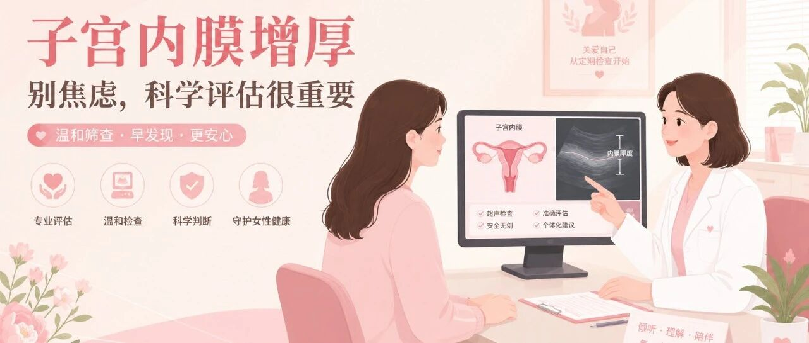
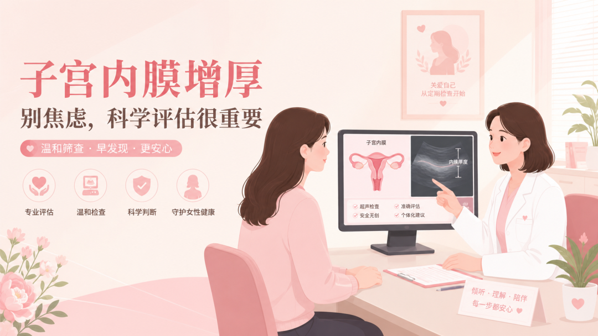

# 科普｜体检发现子宫内膜厚，一定要做宫腔镜吗？

_2026年08月20日 13:18_

很多女性在体检做经阴道超声（TVS）后，都会遇到一个让人紧张的问题：报告提示“子宫内膜增厚”，医生建议进一步检查。听到“宫腔镜”三个字，不少人会担心疼痛、麻醉和对生育力的影响。

先别急着做最有创的检查。子宫内膜厚度是影像学信号，不等同于癌症诊断。针对需要进一步评估的人群，临床正在探索从无创到有创、逐级确认风险的“三阶梯”路径，让检查更有针对性。

**一、什么是子宫内膜癌“三阶梯”筛查？**

这一路径借鉴了宫颈癌筛查中“先筛查、再分流、最后确诊”的思路：

1. **第一阶梯：经阴道超声（TVS）**。这是常用的初筛方式，用于观察子宫内膜的厚度、回声和局部形态。
2. **第二阶梯：微组织活检或分子标志物检测**。在门诊完成的取样或检测，可以帮助进一步区分风险，减少不必要的侵入性操作。
3. **第三阶梯：宫腔镜检查及病理活检**。当影像学和分流结果提示较高风险时，再由医生安排进一步检查，以获得病理学诊断依据。

三阶梯不是让所有人都按同一顺序检查，而是根据年龄、月经状态、症状、危险因素和前一步结果进行个体化决策。

**二、为什么不能只看超声结果？**

TVS方便、普及度高，但它主要观察的是形态，不能直接识别细胞层面的恶性变化。若把内膜厚度阈值设得较低，可能漏掉一部分早期病变；若把标准设得过严，又可能让大量良性增厚者被归入高风险，带来过度检查。

因此，“内膜增厚”更像是一个需要结合临床信息解释的提示，而不是一个自动触发宫腔镜的结论。异常子宫出血、绝经后出血、肥胖、长期月经不规律或相关家族史等因素，都应一并告知医生。

**三、分子检测可以成为宫腔镜前的“二次分流”**

DNA甲基化检测关注的是肿瘤相关分子信号，能够从形态学之外提供另一层风险信息。部分检测可以像宫颈筛查取样一样，通过宫颈刷采集脱落细胞，再检测子宫内膜癌相关基因的甲基化状态。

在临床路径中，它的价值可以理解为一道缓冲：

- **结果提示低风险时**，在医生评估后可选择随访或复查，避免立即进行不必要的宫腔操作；
- **结果提示高风险时**，可帮助医生判断是否需要更积极地安排宫腔镜和病理检查。

检测结果不能替代病理诊断，也不能由患者自行据此停诊或延迟就医。真正的检查方案，应由妇科医生结合症状、超声表现、绝经状态及个人风险共同决定。

**四、少一次不必要的宫腔操作，也是对生育力的保护**

宫腔镜和诊刮是重要的诊断工具，但都属于有创操作。对于仍有生育计划的女性，反复取样或刮宫可能增加内膜损伤、宫腔粘连等风险。能够在安全前提下先完成更温和的风险分层，有助于把有创检查留给真正需要的人。

禾蔻安®（CISENDO®）是聚禾生物的子宫内膜癌DNA甲基化检测产品。相关检测不需要扩宫和麻醉，通常可由医护人员完成宫颈刷取样，为医生进行无创风险评估提供分子信息。

**五、小结：发现内膜增厚，先评估，再决定**

发现子宫内膜增厚后，不必因为看到一个数字就过度恐慌，也不应忽视绝经后出血等危险信号。更合理的思路是：先由医生判断是否属于需要进一步评估的人群，再根据超声、症状和风险因素选择合适的分流方式，必要时及时完成宫腔镜和病理检查。

面对高风险人群，建议向医生了解：除直接进行宫腔镜外，是否可以先采用无创DNA甲基化检测作为过渡性的风险分层工具。精准、分层的检查，目标是少走弯路，也更好地保护女性的身心与生育力。

**文章出处**

本文根据《子宫内膜癌三阶梯筛查策略》（《中国实用妇科与产科杂志》，2026，42（5）：494–498）改编。文中所述DNA甲基化检测技术已纳入《肿瘤DNA甲基化标志物检测技术规范》团体标准。具体检查方式及临床决策请遵从专业医生建议。

**关于聚禾生物**

北京起源聚禾生物科技有限公司是以创新科技为驱动、以关注健康为宗旨的科技企业。聚禾生物聚焦妇科肿瘤早诊领域，以自主技术和专利保护的标志物为核心，开发了宫颈癌、子宫内膜癌、卵巢癌等妇科肿瘤早诊产品。

随着女性健康需求不断提升，聚禾生物将继续推进妇科肿瘤早筛早诊产品和更多女性健康相关产品管线的研发，为女性健康管理提供技术支持。
