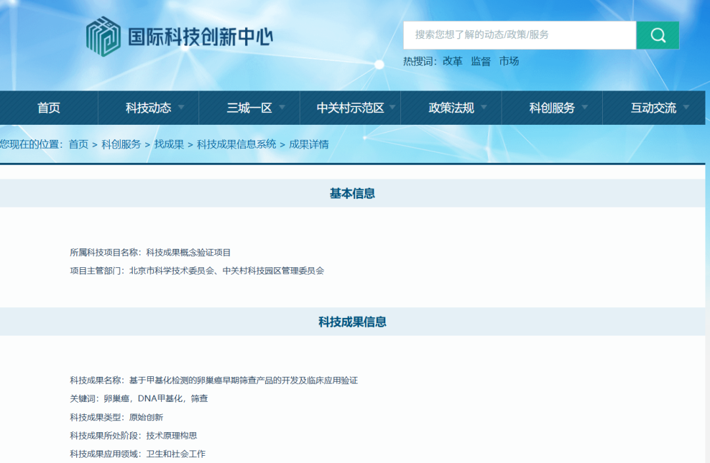

# CISPOLY’s Original Ovarian Cancer Methylation Innovation Recognized by a National Science and Technology Platform

*August 21, 2026, 14:46*

Beijing Origin-Poly Co., Ltd. (CISPOLY)’s independently developed **Human CDO1 and HOXA9 Gene Methylation Detection Kit (PCR-Fluorescent Probe Method)**, marketed as He Wei Yi® (CISOVA®), has been included in the technology achievement database of the National Center of Technology Innovation International ([ncsti.gov.cn](https://www.ncsti.gov.cn/kcfw/zcg/kjcgxxxt/cgxq/?id=16672)). The product is a core outcome of the project *Development and Clinical Validation of an Early Ovarian Cancer Screening Product Based on Methylation Detection*.

The project belongs to the “Technology Achievement Concept Validation Program” overseen by the Beijing Municipal Science and Technology Commission and the Zhongguancun Science Park Administrative Committee, and has been recognized as an “original innovation.” This recognition follows CISPOLY’s Class III medical device registration and the inclusion of its products in the group standard for tumor DNA methylation biomarker detection.

**I. Inclusion in a national platform recognizes original innovation**

The technology achievement database of the National Center of Technology Innovation International supports technology transfer and innovation services. Inclusion places this ovarian cancer methylation achievement within the platform’s national science and technology information system, with its technical rationale, intellectual property foundation, and clinical application direction clearly documented.

He Wei Yi® is the product through which this achievement is translated into clinical use. It received a Class III medical device registration from China’s National Medical Products Administration on December 1, 2025, under registration number **20253402443**, providing a new molecular testing tool for early ovarian cancer detection and clinical risk assessment.

**II. From a single achievement to a three-cancer gynecologic portfolio**

With CISOVA® approved, CISPOLY’s gynecologic tumor methylation portfolio now covers cervical, endometrial, and ovarian cancer, with a Class III medical device registration for each product:

| Cancer Type | Product | Registration No. |
| --- | --- | --- |
| Cervical cancer | CISCER® (He Gong Kang®) | 20233400253 |
| Endometrial cancer | CISENDO® (He Kou An®) | 20243402610 |
| Ovarian cancer | CISOVA® (He Wei Yi®) | 20253402443 |

The three products address complementary clinical needs: CISCER® supports cervical cancer risk triage, CISENDO® provides noninvasive testing for endometrial cancer, and CISOVA® uses blood samples for ovarian cancer-related methylation testing. Together, they form CISPOLY’s technology portfolio for early diagnosis across major gynecologic cancers.

**III. Product registration and standardization advance together**

In July 2026, the China Association of Inspection and Testing officially released and implemented **T/CITS 727—2026, Technical Specification for Tumor DNA Methylation Biomarker Detection**. It is China’s first technical specification covering the full workflow of tumor DNA methylation biomarker detection, including specimen collection, storage and transport, analytical methods, quality control, reporting, and interpretation.

All three of CISPOLY’s gynecologic cancer DNA methylation products—cervical, endometrial, and ovarian—are included in the group standard’s list of currently approved tumor DNA methylation biomarker detection products. The ovarian cancer project’s inclusion in the national technology achievement database further shows the continuous path from original innovation and clinical validation to product registration and standardized application.

**IV. Turning innovation into better women’s health support**

Ovarian cancer often presents with subtle early symptoms, making early recognition a continuing clinical challenge. CISPOLY will keep advancing methylation testing research and validation around real clinical needs, with the goal of supporting more clinical settings through compliant and standardized applications.

From a dual-gene biomarker study to national platform recognition, a three-cancer product portfolio, and alignment with a group standard, CISPOLY is working to translate its principle of “innovative technology, commitment to health” into evidence-based and usable solutions for women’s health management.

**Source**

[National Center of Technology Innovation International: Technology Achievement Information System](https://www.ncsti.gov.cn/kcfw/zcg/kjcgxxxt/cgxq/?id=16672)

**About CISPOLY**

Beijing Origin-Poly Co., Ltd. is a technology enterprise driven by innovation and committed to health. CISPOLY focuses on early diagnosis of gynecologic tumors and develops products for cervical, endometrial, and ovarian cancer based on proprietary technologies and patent-protected biomarkers.

Going forward, CISPOLY will continue developing early screening and early diagnosis products, together with new women’s health solutions, to bring sustained technological innovation to women’s health.
