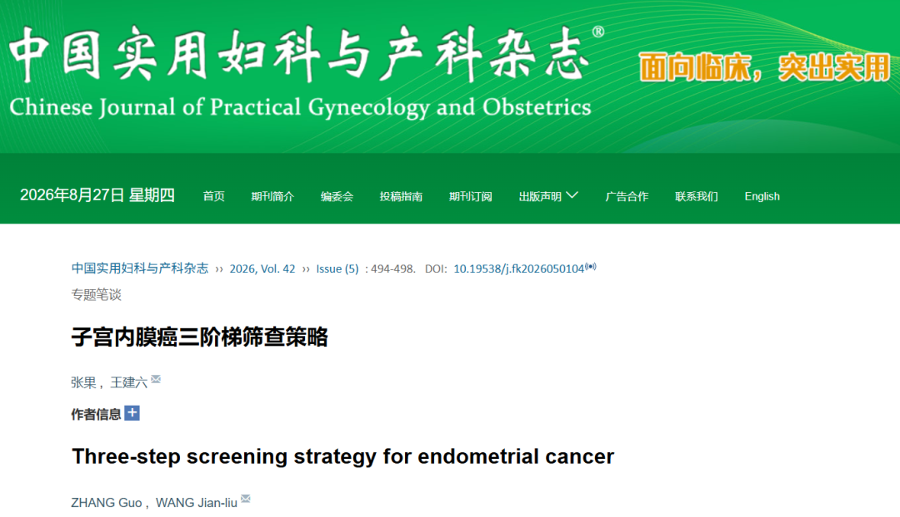

# Endometrial Cancer “Three-Step” Screening Strategy: Clinical Value and Pathway Selection for DNA Methylation as a Second-Line Triage Tool

*August 27, 2026, 15:04*

A recently published three-step strategy for endometrial cancer follows the cervical cancer principle of “screen first, triage next, confirm when needed.” It establishes a staged pathway of transvaginal ultrasound (TVS), micro-tissue biopsy or molecular testing, and hysteroscopy-guided biopsy. The goal is not to send every patient through the same sequence, but to match the next test to the patient’s risk.

**I. Why is a second-line triage step needed between TVS and hysteroscopy?**

TVS is accessible and widely used, but it mainly provides morphological information. Available data suggest that even with an endometrial thickness threshold of 4 mm, the missed-diagnosis rate may be about 9.5%. Lowering the threshold to 3 mm may reduce the missed rate to about 3.8%, but substantially increases false positives and unnecessary referrals.

Hysteroscopy and pathological biopsy remain important for definitive diagnosis, but they are invasive, consume procedural resources, and may involve pain, infection, cervical stenosis, or endometrial injury. Micro-tissue biopsy also depends on operator experience, lesion type, and endometrial thickness. A risk-stratification tool between imaging and invasive confirmation is therefore clinically valuable.

**II. Why can DNA methylation serve as a second-line triage tool?**

DNA methylation can arise as an early epigenetic change in tumor development and can be detected in exfoliated cells. CISPOLY’s CISENDO® CDO1/CELF4 dual-gene methylation test uses cervical exfoliated cells, providing molecular risk information without entering the uterine cavity.

Clinical evidence summarized in the source article reports 93.94% sensitivity, 96.7% specificity, and a 99.90% negative predictive value for CDO1/CELF4 methylation testing in endometrial cancer. In a related study, combining TVS with methylation testing achieved 100% sensitivity. For patients with a thickened endometrium but no clear indication for immediate hysteroscopy, a negative result may help reduce concern after physician assessment, while a positive result may support earlier pathological evaluation.

**III. How should the two sampling pathways be considered?**

1. **Cervical exfoliated cells collected with a cervical brush:** The procedure is similar to TCT, is usually performed by trained healthcare staff, and avoids the infection, perforation, and endometrial injury risks associated with entering the uterine cavity. It is suitable for broad triage after TVS, including patients who wish to preserve fertility, are concerned about intrauterine procedures, or are being managed in primary care.
2. **Uterine-cavity exfoliated cells collected with an intrauterine brush:** The sampling site is closer to the lesion, but the procedure is minimally invasive and requires an experienced clinician. It may be more difficult in postmenopausal patients with cervical atrophy and still carries a risk of endometrial injury.

For many patients with an abnormal or concerning TVS result, cervical-cell methylation testing may offer a safer intermediate step before hysteroscopy. The final choice should be based on bleeding symptoms, menopausal status, ultrasound findings, obesity or metabolic risk, and other clinical factors.

**IV. From research pathway to standardized practice**

Following the release of the Technical Specification for Tumor DNA Methylation Biomarker Detection, CISENDO® has been included in the relevant compliant product scope. The pathway of “TVS plus cervical exfoliated-cell methylation” is therefore moving toward more standardized clinical use. A negative result may support a more appropriate follow-up plan, while a positive result can help prioritize limited hysteroscopy resources for patients at higher risk.

Endometrial cancer screening is moving from broadly invasive evaluation toward precision triage. DNA methylation testing, particularly testing based on cervical exfoliated cells, may become a key second-line tool in the three-step pathway. It does not replace pathological diagnosis and should not be used to delay medical care. Patients with postmenopausal bleeding, abnormal uterine bleeding, or other warning symptoms should seek professional evaluation promptly.

**About CISPOLY**

Beijing Origin-Poly Co., Ltd. is a technology enterprise driven by innovation and committed to health. CISPOLY focuses on early diagnosis of gynecologic tumors and develops products for cervical, endometrial, and ovarian cancer based on proprietary technologies and patent-protected biomarkers.

Going forward, CISPOLY will continue developing early screening and early diagnosis products, together with new women’s health solutions, to bring sustained technological innovation to women’s health.
