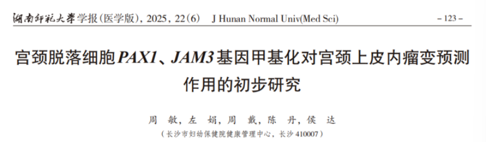

# 突破HPV检测可能的过度转诊：PAX1/JAM3甲基化联合HPV，精准识别宫颈高级别病变风险

_2026年09月03日 13:37_

长沙市妇幼保健院健康管理中心团队在《湖南师范大学学报（医学版）》发表《宫颈脱落细胞PAX1、JAM3基因甲基化对宫颈上皮内瘤变预测作用的初步研究》，评估PAX1和JAM3甲基化作为联合生物标志物识别宫颈高级别上皮内瘤变的效能，并探索其与HPV分型结合后的分流价值。

**一、从“发现感染”到“识别风险”**

PAX1和JAM3都是与宫颈癌发生发展相关的宿主基因。持续高危型HPV感染可能诱导抑癌基因启动子区域异常甲基化，使相关基因表达沉默，推动宫颈上皮从癌前病变向浸润癌发展。PAX1/JAM3联合检测从细胞异常增殖和组织屏障破坏两个层面提供风险信息，有望补充HPV检测难以区分一过性感染与高进展风险感染的局限。

**二、联合策略带来更清晰的分流信号**

研究构建了“HPV分型 + 双基因甲基化”的联合预测策略：当受试者为高危型HPV阳性，且PAX1或JAM3任一基因甲基化阳性时，预测CIN2及以上病变的AUC达到0.8789，高于单独PAX1检测的0.8310、单独JAM3检测的0.7915以及单一HPV分型的0.4858。

该联合策略的准确度为94.44%，特异度为96.88%，F1值为0.8594。结果提示，在细胞学意义不明确的ASC-US等场景中，分子检测可能帮助识别真正的高风险人群，减少单纯依赖HPV阳性结果造成的过度阴道镜转诊。

**三、对临床管理意味着什么？**

PAX1/JAM3甲基化检测采用宫颈脱落细胞样本，属于相对非侵入性的检测方式。将其与HPV分型结合，可进一步识别已经发生宿主细胞表观遗传改变的个体，为阴道镜转诊、随访间隔和后续治疗决策提供更加客观的参考。对于基层筛查而言，这种“病毒感染 + 宿主风险”的联合视角，也有助于把有限的诊疗资源优先用于更可能存在高级别病变的人群。

需要强调的是，研究数据支持的是风险分层和临床决策辅助，而不是由检测结果单独替代阴道镜或病理诊断。最终管理方案应由医生结合HPV型别、细胞学结果、既往病史及病理证据综合判断。

PAX1/JAM3甲基化联合HPV检测，代表宫颈癌筛查从“是否感染病毒”进一步走向“宿主细胞是否已经出现进展风险”的重要方向，为精准分流和分层管理提供了新的分子工具。

**文献来源**

周敏、左娟、周戴、陈丹、侯达. 宫颈脱落细胞PAX1、JAM3基因甲基化对宫颈上皮内瘤变预测作用的初步研究[J]. 湖南师范大学学报（医学版）, 2025, 22(6): 123–128.

**关于聚禾生物**

北京起源聚禾生物科技有限公司是以创新科技为驱动、以关注健康为宗旨的科技企业。聚禾生物聚焦妇科肿瘤早诊领域，以自主技术和专利保护的标志物为核心，开发了宫颈癌、子宫内膜癌、卵巢癌等妇科肿瘤早诊产品。

未来，聚禾生物将继续推进妇科肿瘤早筛早诊产品和更多女性健康相关产品管线的研发，以持续的技术创新服务女性健康。
