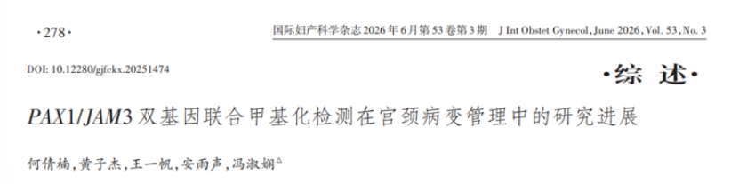

# PAX1/JAM3 Dual-Gene Methylation Testing Opens a New Pathway for Precision Cervical Cancer Screening

*September 11, 2026, 15:03*

A recently published review summarizes the progress of PAX1/JAM3 dual-gene methylation testing in cervical lesion screening, risk stratification, treatment decisions, and postoperative follow-up. Its central idea is that PAX1 is better suited to capturing early carcinogenic signals, while JAM3 is more informative for high-grade lesions and invasive potential. Together, they provide complementary information from the initiation of transformation to lesion progression.

**I. Two genes, complementary risk signals**

PAX1 methylation may appear at the low-grade squamous intraepithelial lesion stage and increase as lesions become more severe, making it a useful early-warning marker. JAM3 methylation has higher specificity for CIN2+ and CIN3+ and may better indicate whether a lesion has acquired progression or invasive potential. The review also notes that PAX1 is relatively sensitive to cervical squamous carcinoma, whereas JAM3 may be more sensitive to adenocarcinoma, providing complementary coverage across pathological types.

**II. Evidence across screening, triage, and treatment management**

Studies summarized in the review report sensitivity of up to 98.1% for CIN3+ and a nearly 70% reduction in colposcopy referrals with dual-gene methylation testing. In a triage study of women with ASC-US, colposcopy referrals were reduced by 79.5%. These findings suggest that methylation testing may help clinicians prioritize limited colposcopy resources for people at genuinely higher risk.

The potential value extends beyond screening. PAX1 methylation positivity has been reported as an independent risk factor for pathological upgrading after cervical conization and may help identify patients who need timely excisional treatment. Post-treatment methylation status may also support assessment of CIN2+ recurrence risk. Persistent positivity may warrant closer follow-up, while a negative result may support a more conservative plan after comprehensive clinical assessment.

**III. Self-sampling can improve screening access**

PAX1/JAM3 testing can use cervical exfoliated cells and is compatible with vaginal self-sampling. This may improve access for women in rural or primary-care settings and for those who have difficulty attending conventional screening. In 2025, five authoritative Chinese academic organizations jointly issued an expert consensus covering sampling, laboratory procedures, quality control, reporting, and clinical use, marking a step toward standardized application.

In a case involving a 56-year-old woman with persistent high-risk HPV infection for six years, repeated cytology and colposcopy biopsies had mostly shown inflammation or normal findings. PAX1/JAM3 methylation testing provided a clearer risk boundary between “HPV infection” and a host-cell lesion with a meaningful progression risk. A single case cannot replace large clinical studies, but it illustrates how methylation status may add information for people with persistent infection and repeated inconclusive evaluations.

**IV. From detecting infection to identifying true carcinogenic risk**

The review suggests that, as self-sampling, artificial intelligence, and primary-care screening systems continue to develop, PAX1/JAM3 dual-gene methylation testing may extend across screening, triage, treatment, and follow-up. This would move cervical cancer prevention from simply detecting infection toward identifying true risk of malignant transformation. Results still need to be interpreted together with HPV genotype, cytology, colposcopy, and pathology; methylation testing does not replace clinical diagnosis.

**About CISPOLY**

Beijing Origin-Poly Co., Ltd. is a technology enterprise driven by innovation and committed to health. CISPOLY focuses on early diagnosis of gynecologic tumors and develops products for cervical, endometrial, and ovarian cancer based on proprietary technologies and patent-protected biomarkers.

Going forward, CISPOLY will continue developing early screening and early diagnosis products, together with new women’s health solutions, to bring sustained technological innovation to women’s health.
