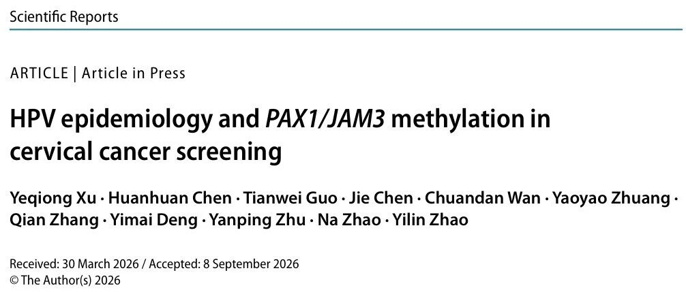
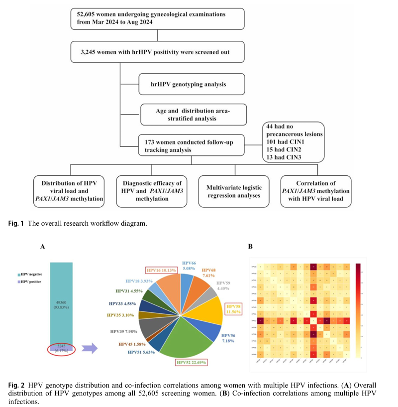
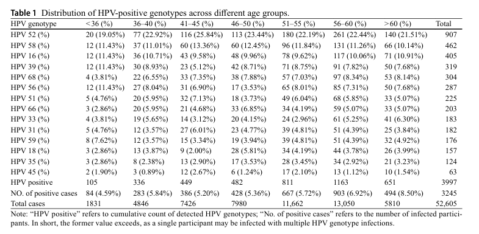
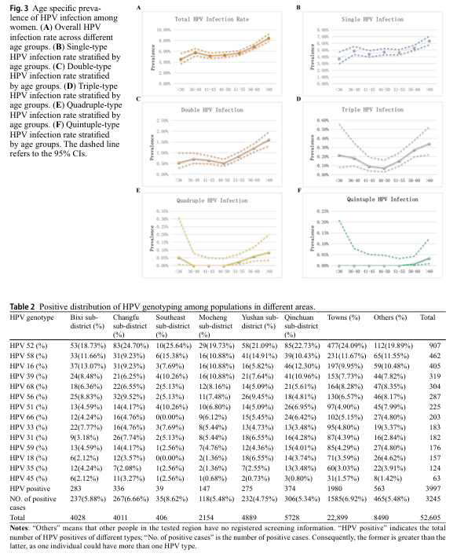

# 常熟52,605名女性研究：HPV流行病学与PAX1/JAM3甲基化在宫颈癌筛查中的应用

_2026年09月24日 14:55_

发表于《Scientific Reports》的研究基于中国常熟地区女性筛查人群，分析高危型人乳头瘤病毒（hrHPV）感染特征，并在173人的进一步评估亚组中考察PAX1/JAM3基因甲基化的诊断价值，为宫颈癌筛查和HPV阳性人群分流提供研究依据。

## 一、研究背景与目的

持续hrHPV感染是宫颈高级别上皮内病变及宫颈癌发生发展的关键因素。HPV检测已广泛应用于筛查，但单纯HPV阳性难以区分一过性感染与具有病变进展风险的持续性感染，可能增加不必要的阴道镜检查和临床干预。HPV病毒载量与病变严重程度之间的关系也尚未形成一致结论。

DNA甲基化是宫颈癌发生发展中的重要表观遗传改变。既往研究提示，PAX1和JAM3甲基化水平随宫颈病变程度增加而升高，可能为高级别病变识别提供补充信息。本研究主要关注：

- 常熟地区30–65岁女性HPV感染率、主要基因型及年龄和地区分布。
- 不同宫颈病变级别中的PAX1/JAM3甲基化水平及其诊断效能。
- 甲基化水平与HPV病毒载量的相关性。
- 甲基化与CIN2+病变的独立关联及其风险分层价值。

## 二、研究方法

2024年3–8月，研究招募常熟地区30–65岁女性52,605名，采集宫颈脱落细胞样本。所有受试者签署知情同意书，研究经常熟医学检验所生物医学伦理委员会批准。

研究采用SLAN-96 S PCR系统检测14种hrHPV基因型：16、18、31、33、35、39、45、51、52、56、58、59、66、68。从HPV阳性人群中按年龄和地区分层选取173人，进行组织病理学评估、HPV病毒载量定量检测，以及PAX1、JAM3甲基化特异性qPCR检测。甲基化检测以GAPDH为内参，通过ΔCt反映甲基化水平：ΔCt越低，甲基化程度越高。

采用GraphPad Prism 10.0、SPSS 22.0及R软件开展统计分析，包括卡方检验、秩和检验或方差分析、Pearson/Spearman相关分析、ROC曲线和二元逻辑回归。加权综合甲基化评分基于单变量回归β系数构建。

## 三、研究结果

### 1. HPV感染的流行病学特征

总体HPV阳性率为**6.17%（3,245/52,605）**，共检出3,997例次HPV基因型。各型别占检出基因型例次的比例依次以HPV52（22.69%）、HPV58（11.56%）、HPV16（10.13%）为主，其次为HPV39（7.98%）、HPV68（7.61%）和HPV56（7.18%）；HPV18占3.93%。这些比例不同于全体受筛女性的型别感染率。

单一基因型感染占阳性者的81.23%（2,636人），多重感染占18.77%（609人）。其中双重感染489人，最常见组合为HPV52+58；三重感染100人，四重及以上感染20人。

总体感染率随年龄增长显著升高（χ²=101.3，P<0.0001），60岁以上组最高，为8.50%。单一感染趋势与总体一致；双重感染率在46–50岁最低、60岁以上最高；三重感染呈U型分布，四重及以上感染在56岁后逐步上升。

不同辖区感染率为4.75%–8.62%（χ²=61.53，P<0.0001），东南辖区最高、玉山辖区最低。型别分布也存在地区差异：HPV52在东南和长福分区的检出基因型中分别占25.64%和24.70%；HPV16在碧西分区占13.07%、玉山分区占5.82%；HPV18在玉山分区占6.55%，东南分区未检出。

### 2. 病变级别、甲基化与病毒载量

173人亚组的病理结果为：正常44人、CIN1 101人、CIN2 15人、CIN3 13人。无论总HPV、HPV16/18型还是非16/18型，病毒载量在不同病变级别间均无统计学差异。

随着病变程度升高，PAX1和JAM3的ΔCt均阶梯式下降，即甲基化水平升高（P均<0.0001）；CIN3组甲基化水平显著高于正常组和CIN1组。两基因甲基化水平呈正相关（R=0.519，P<0.0001），但均与HPV病毒载量无显著相关性。

### 3. 诊断效能与多变量分析

原文报告，PAX1/JAM3联合甲基化检测识别CIN3等高级别病变的效能优于HPV16/18分型；对于较低级别病变，两者整体效能相当，甲基化检测在CIN1中灵敏度更高、CIN2中特异度更高。

校正年龄后，加权综合甲基化评分与CIN2+独立相关：**校正后OR=1.965（95% CI：1.520–2.541，P<0.001）**。评分每增加1单位，CIN2+的优势（odds）增加96.5%；这一优势比不能直接解释为患病概率增加96.5%。年龄与CIN2+呈轻度负相关（校正后OR=0.933，P=0.022）。Hosmer–Lemeshow检验未提示明显拟合不足（P=0.347）。

## 四、讨论与研究局限

本研究主要流行型别为HPV52、HPV58和HPV16，与华东部分地区研究结果相近；地区间差异提示筛查和防控应结合本地感染特征。60岁以上女性感染率较高，也提示应持续关注老年女性的筛查需求。原文讨论了筛查覆盖、疫苗接种、生活方式，以及绝经后免疫、激素和阴道微生态变化等可能影响因素，但这些解释不能视为本研究已证实的因果关系。

研究未观察到病毒载量与病变严重程度之间的明确关联。感染持续时间、取样时点与病变部位，以及高级别病变数量有限，都可能影响结果。PAX1/JAM3甲基化可能提供相对独立于病毒即时复制状态的分层信息，但本研究中未发现相关性并不等同于证明完全独立。

原文提出，持续HPV感染与病毒DNA整合可能伴随表观遗传改变，PAX1和JAM3启动子高甲基化及相关基因表达抑制可能参与异常增殖和侵袭。这是对潜在机制的讨论，不能由本研究直接确立因果关系。

研究为横断面设计，无法确定感染、甲基化改变与病变进展的时间顺序或因果关系，也不能描述指标随病程的动态变化。研究未纳入30岁以下女性；173人亚组中CIN2和CIN3分别仅15人和13人，可能限制部分比较和关联分析的统计学效能。

## 五、研究结论

常熟52,605名30–65岁女性的筛查数据呈现了当地HPV感染的年龄及地区差异。173人亚组中，PAX1/JAM3甲基化随病变程度升高，并与CIN2+独立相关，提示其有望作为HPV初筛阳性女性的辅助分流指标。

这些结果为优化宫颈癌筛查提供了研究依据。检测结果仍需结合HPV分型、细胞学、阴道镜和病理结果综合解释，不能单独替代医生诊断或病理诊断。

**文献来源**

Xu, Y., Chen, H., Guo, T. et al. HPV epidemiology and PAX1/JAM3 methylation in cervical cancer screening. *Scientific Reports* (2026). [DOI：10.1038/s41598-026-71236-4](https://doi.org/10.1038/s41598-026-71236-4)

**原文链接**

[聚禾生物cispoly：中国常熟地区（30–65岁女性，共52,605名）HPV流行病学与PAX1/JAM3甲基化在宫颈癌筛查中的应用](https://mp.weixin.qq.com/s/HMhSvM0Nr0I_Ygp0iizBnA)

**关于聚禾生物**

北京起源聚禾生物科技有限公司是以创新科技为驱动、以关注健康为宗旨的科技企业。聚禾生物聚焦妇科肿瘤早诊领域，以自主技术和专利保护的标志物为核心，开发了宫颈癌、子宫内膜癌、卵巢癌等妇科肿瘤早诊产品。

未来，聚禾生物将继续推进妇科肿瘤早筛早诊产品和更多女性健康相关产品管线的研发，以持续的技术创新服务女性健康。
