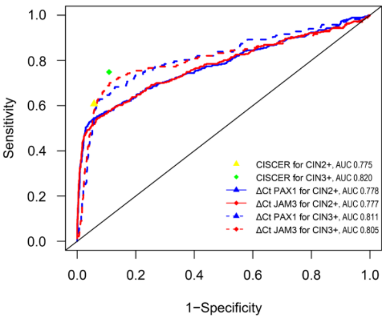

# CISCER®甲基化检测技术助力提升子宫颈癌筛查中轻度异常結果的精准分流效率——国内研究成果登国际权威期刊《IJGO》

_2025年04月17日 14:02_

Cytologic DNA methylation for managing minimally abnormal cervical cancer screening results 用细胞学 DNA 甲基化检测用于管理子宫颈癌筛查轻度异常结果

近日，北京协和医院开展的一项临床研究表明，针对子宫颈癌筛查中“轻度异常”结果（如ASCUS、LSIL或HPV阳性但细胞学阴性）的女性，通过检测PAX1和JAM3基因甲基化水平（CISCER检测），可有效识别宫颈高级别病变（CIN3+）患者，显著减少阴道镜转诊率，推动子宫颈癌筛查向更精准、高效方向发展。

**研究背景丨轻度异常患者如何管理？**

子宫颈癌是全球女性第四大常见癌症，2020年中国新增病例约11万例，死亡病例近6万例，疾病负担沉重。目前，常规筛查手段包括高危型人乳头瘤病毒（hrHPV）检测与宫颈细胞学检查。对于筛查结果为ASCUS、LSIL、HPV阳性但细胞学阴性等“轻度异常”结果管理难度大，易造成过度转诊或病变漏检。已有研究提示，基因甲基化与子宫颈癌早期发生密切相关，但尚缺乏对联合PAX1和JAM3基因甲基化检测用于轻度异常筛查结果分流的系统研究。

**研究方法丨真实世界大队列验证有效性**

本研究基于北京协和医院开展的METHY2和METHY3队列研究。纳入1857名经hrHPV分型、细胞病理学检查，宫颈活检及禾宫康CISCER检测（基于PAX1/JAM3基因甲基化检测）后，细胞学诊断为ASCUS、LSIL或hrHPV阳性但细胞学正常的“轻微异常”女性。研究通过比对组织病理结果，评估CISCER技术在不同风险人群中的筛查能力与适配性。

**关键技术：**

- 样本处理：使用液基细胞学（LBC）和全自动实时荧光定量PCR技术检测PAX1和JAM3基因甲基化水平。

- 判定标准：当PAX1或JAM3甲基化水平低于阈值（△Ct PAX1≤6.6或△Ct JAM3≤10.0）时判定为阳性。

- 数据分析：通过ROC曲线评估检测效能，并计算不同筛查策略下的CIN3+风险和阴道镜转诊需求。

**研究结果 ｜ 降低转诊率同时保持高敏感性**

禾宫康CISCER检测CIN3+的敏感性为74.9%，特异性为89.1%，检测阳性者的CIN3+风险为40.5%，远高于检测阴性者的2.7%。通过该技术，每发现一例CIN3+仅需转诊2.5人，显著优于传统方法的11.1人。在细胞学结果为NILM合并hrHPV感染的女性中，禾宫康CISCER的AUC值最高（0.867），提示其在此类人群中分流效果优于传统方法。此外，针对年龄≥50岁的绝经后女性的敏感性更高（79.5%）。

**研究意义 ｜探索更智慧的子宫颈癌筛查路径**

本研究证实，禾宫康CISCER甲基化检测为轻度异常筛查结果的管理提供了更精准的分流策略，既能高效识别潜在高级别病变，又能减少低风险人群的过度干预，有效降低轻微异常筛查结果患者的阴道镜转诊率，有效缓解医疗资源压力，降低低风险女性的过度诊疗负担。此外，禾宫康CISCER在绝经后女性筛查中的优异表现，为其在个性化筛查中的应用提供了新思路。未来，CISCER检测有望作为常规筛查体系的有力补充，优化筛查流程并提升效率，助力实现“早诊早治”的公共卫生目标。

**总结**

北京协和医院团队的这项研究为子宫颈癌筛查提供了创新解决方案。通过结合DNA甲基化检测与现有筛查手段，CISCER技术实现了风险分层管理的突破，有望在全球范围内推动子宫颈癌防控策略的升级。
**文章链接**

Full article available at: DOI: 10.1002/ijgo.70167
