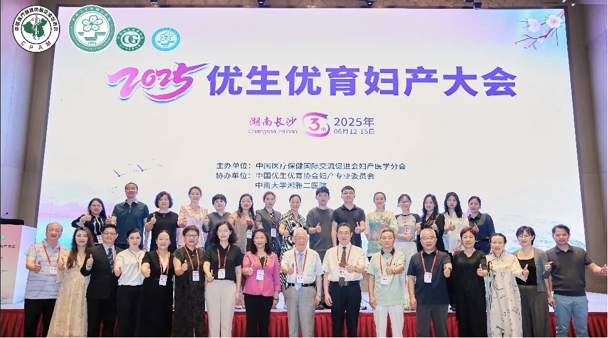
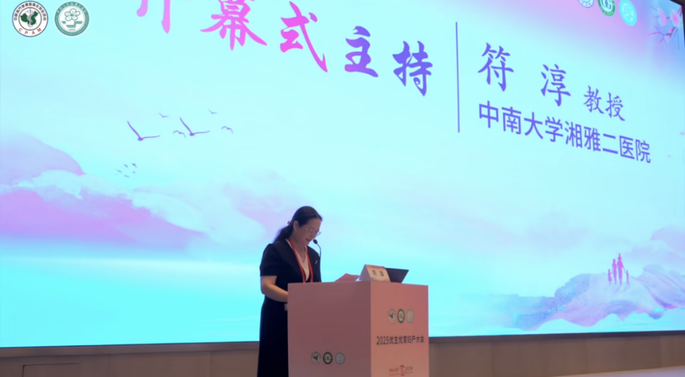
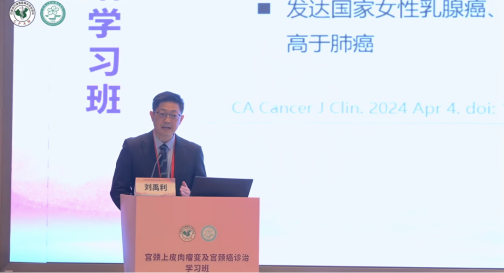

# 聚焦2025优生优育妇产大会在长沙开幕，寻探生育力保护之道——聚禾DNA甲基化检测用全新角度为妇科肿瘤提供新思路笔记分享

_2025年06月19日 11:27_

2025年6月13日，由中国医疗保健国际交流促进会妇产医学分会主办，中国优生优育协会妇产专业委员会、中南大学湘雅二医院协办的“2025优生优育妇产大会”在星城长沙盛大开幕！本次大会汇聚了全国妇产科专家和学者，旨在推动优生优育理念的普及，提升妇产科医疗水平。与会专家将围绕妇产科热点问题和前沿技术展开交流，共同为女性健康保驾护航。

开幕式由中南大学湘雅二医院符淳教授主持，向莅临现场的各位嘉宾、学者以及线上参会的同仁们，致以最热烈的欢迎和最诚挚的感谢！符淳教授介绍本次大会以“生命起点，健康未来”为主题，承载着推动妇产医学创新和守护母婴健康的时代责任。

随后，大会名誉主席曹泽毅教授致辞，指出当前妇产科界面临的最重要问题就是优生优育，近年来我国人口出生率下降，面临着新的时代挑战。曹教授特别指出本次大会应深入讨论、交流、总结我国在优生优育和妇女健康方面的现状与挑战，这不仅是妇产医学领域的议题，更是国家卫生健康战略中的重要组成部分，责任重大。

符淳教授总结本次大会共设有1个主论坛和妇科肿瘤论坛、生殖抗衰整复论坛、中西结合妇产论坛、HPV 感染与阴道微环境论坛、宫内疾病生育力保护论坛等9个论坛。

在一场妇科肿瘤论坛讲座中，北京清华长庚医院刘禹利教授以《妇科肿瘤的风险分层管理到个体化精准策略思考与科研探索》为题从女性恶性肿瘤流行病学的现状切入，深入分析了女性生殖道恶性肿瘤的现状、痛点和面临的挑战，提出了针对这些问题的解决思路。

**大会心得——子宫内膜癌早筛破局新产品**

参加会议后回顾现行子宮內膜癌检测方法学，尚无有效精准筛查方法，从使现行的影像学敏感度低，刮宮可因不同医師手法造成取材不完整与检测不准群，宫腔镜虽改良了刮宮的低敏感性问题，但对于內膜亦可能造成损伤，对于育龄女性可能造成生育风险。总结了禾蔻安子宮內膜癌甲基化检测技术通过宫颈脱落细胞无创检测，实现癌前病变的精准识别，为內膜癌高风险人群分层提供关键依据。

基于基因检测与DNA甲基化的个体化精准医疗是未来核心方向，尤其在平衡内膜癌早诊和复查与生育力保护的需求上，禾蔻安新技术将重构诊疗路径，提升患者生存质量。这一讲座为与会者提供了最新的內膜癌篩查和管理思路，为将来的临床实践和科研探索提供了重要的理论依据和创新视角。

图一

**核心技术与发现**

- 检测原理
    - 子宫内膜癌细胞黏附力弱，易脱落至宫颈管（图1）。
    - 内膜癌患者宫颈脱落细胞中，内膜癌细胞占89%（图1柱状图），证明宫颈取样可行性。
    - PCR高灵敏度可满足微量细胞检测需求（图1）。
- 临床问题解决
    - 克服绝经后宫颈管狭小、阴道超声假阳性、诊刮漏诊风险（图1）。
    - 无创取样：替代传统宫腔镜/诊刮，降低损伤

图二

**标志物与效能**

CDO1&CELF4甲基化联合检测对比影像学在癌种分型、分期中均表现更优（图2）。

图三

**临床验证数据**

基线CDO1&CELF4聯合甲基化检测的阳性率4.75%（无病理异常人群&高风险无宫腔镜指徵女性）。

随访发现：基线阳性者6个月内经病理检查确诊3位子宫内膜癌与2位EIN，CDO1&CEL F4联合甲基化检测阳性预测值100%。基线阴性者随访阴性率95.8%。

图四

**多中心验证**

4家医院4818例临床试验 + 全国12家医院1万例真实世界验证（图4）。

双基因联合检测（CDO1 & CELF4 甲基化）：灵敏度94.51%（子宫内膜癌）、特异性94.16%（图4）。

对癌前病变（EIN/AH）灵敏度83.16%、特异性97.66%（图4）。

禾蔻安CISENDO®试剂盒：全球首个无创子宫内膜癌检测试剂盒（2024年12月获中国Ⅲ类医疗器械证）。

用途：联合超声辅助诊断疑似患者。专利覆盖，CE认证。

**关键结论与建议**

1、技术优势

✅ 无创、高灵敏度/特异性

✅ 解决绝经后女性诊断难题

✅ 预测癌前病变进展（EIN→癌）

2、临床意义

风险分层：基线甲基化阳性需密切随访（6个月周期）。

早诊价值：联合影像学可提升检出率，减少漏诊。

上述提到的禾寇安®子宫内膜癌甲基化产品于2024年获中国首个子宫内膜癌甲基化检测产品注册证。聚禾生物致力于妇科肿瘤早筛产品研发，开发了子宫内膜癌、卵巢癌、宫颈癌等检测试剂盒。聚禾生物以创新性的技术填补了妇科肿瘤筛查场景的不足，尤其是以无创技术对内膜癌筛查填补了该临床应用的空白。由聚禾生物联合多加医院联合开发的甲基化试剂盒，该试剂盒联合超声检测灵敏度可达94.51%，特异性达94.16%，成为全球首个基于宫颈脱落细胞的无创筛查方案，为子宫内膜癌的早期诊断提供了高效、安全的新选择。

**关于聚禾生物**

北京起源聚禾生物科技有限公司是以创新科技为驱动、以关注健康为宗旨的科技企业。聚禾生物是妇科肿瘤早诊领域的开拓者，以独家技术和专利保护的标志物为核心，开发了宫颈癌、子宫内膜癌、卵巢癌等妇科肿瘤早诊产品，填补了该领域的空白。

随着女性对自身健康的关注越来越密切，女性健康市场将大有可为，除妇科肿瘤早筛早诊产品线外，未来聚禾生物还将建立更多女性健康相关的产品管线，打造女性健康市场的技术创新型领先企业。
