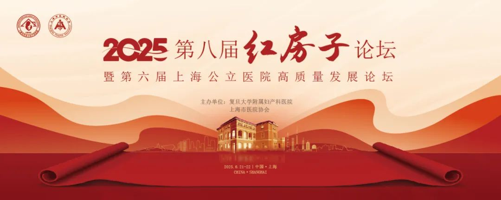

# 技术创新与国际协作的妇产科医学盛宴，第八届红房子论坛笔记

_2025年06月25日 10:30_

近开幕式与主题演讲：全球视野下的妇产科发展蓝图

2025年6月21日，第八届红房子论坛暨第六届上海公立医院高质量发展论坛在上海盛大开幕。本届论坛以「开放合作·技术赋能·智慧医疗」为核心，汇聚国内外70余位顶尖专家，围绕妇科肿瘤、围产医学、生殖内分泌、人工智能（AI）应用等议题展开深度探讨，推动科研成果转化与全球女性健康事业的进步。

**会议启示：技术创新引领子宫颈癌筛查提供精准分层管理模式**

在第八届红房子论坛中，“精准医疗”与“国际协作”成为核心议题。与会专家反复强调，传统诊断技术（如宫腔镜、影像学）存在侵入性高、漏诊风险等痛点，及新技术如何解决临床难点。

宫颈癌筛查中新技术如何优化高危HPV感染患者的临床精细化管理、降低阴道镜转诊率、拓展分型检测并同时满足筛查和风险分层。《中国子宫颈癌筛查指南(二)》重点推介了宫颈癌筛查异常的新型分流技术，包括p16/Ki-67双染、宿主基因和(或)HPV基因甲基化检测、HPV拓展分型、HPV基因整合检测等已展示出良好的临床应用前景，为宫颈癌的早期分层管理提出适合不同地域人群的精准管理之路。

**思考聚禾生物禾宫康(PAX1/JAM3甲基化) 检测在子宫颈癌筛查中意义**

聚禾生物的DNA甲基化检测技术通过无创、高灵敏度的特性，为子宫颈癌等妇科肿瘤的早筛与风险分层提供了突破性解决方案。

**甲基化检测技术的潜力与应用场景**

聚甲基化检测作为表观遗传学的前沿技术，其在子宫颈癌检测应用前景引发深思。以下结合论坛议题与行业趋势，提出甲基化检测的应用方向：

1. 宫颈癌早筛的革新

现状与挑战：传统HPV检测存在过度诊断问题，而甲基化检测（如PAX1/JAM3）可识别宫颈上皮细胞的表观遗传变化，灵敏度高达89.6%，特异性超过96.5%，且能检测早期病变。

临床价值：红房子医院案例显示，甲基化强阳性患者后续病理确诊为浸润性腺癌的比例显著升高，提示其可作为「液体活检」的补充工具。

2. 宫颈癌：从「形态学依赖」到「分子分层」

PAX1/JAM3双基因甲基化模型:

在宫颈腺癌（如胃型腺癌GAS）的诊断中，传统方法易与良性病变（如叶状宫颈腺体增生LEGH）混淆。聚禾的PAX1/JAM3检测显示，癌变组织甲基化阳性率达94.05%，特异性96.30%，成功区分GAS与LEGH，降低34%的误诊风险。

3. HPV阳性分流策略

对HPV 16/18阳性的女性，联合甲基化检测可将CIN3+的特异性提升至96.1%，减少过度阴道镜检查。案例显示，HPV持续感染但甲基化阴性者3年累积癌变风险仅2.9%，验证其风险预测价值。

4. 妊娠期子宫颈病变进展的预测

结合甲基化标志物与AI模型，可实现妊娠期宫颈病变进展问题，降低宫颈病变孕妇担忧。

**总结**

学习第八届红房子论坛精彩内容，了解新技术驱动下的妇瘤医疗模式转型。甲基化检测作为表观遗传学的“窗口”，未来可与AI深度融合，在早筛、诊断、治疗监测全链条中发挥核心作用。期待通过国际协作与临床转化，让这些创新技术真正惠及全球女性，实现“健康中国”的愿景。

**关于聚禾生物**

北京起源聚禾生物科技有限公司是以创新科技为驱动、以关注健康为宗旨的科技企业。聚禾生物是妇科肿瘤早诊领域的开拓者，以独家技术和专利保护的标志物为核心，开发了宫颈癌、子宫内膜癌、卵巢癌等妇科肿瘤早诊产品，填补了该领域的空白。

随着女性对自身健康的关注越来越密切，女性健康市场将大有可为，除妇科肿瘤早筛早诊产品线外，未来聚禾生物还将建立更多女性健康相关的产品管线，打造女性健康市场的技术创新型领先企业。
