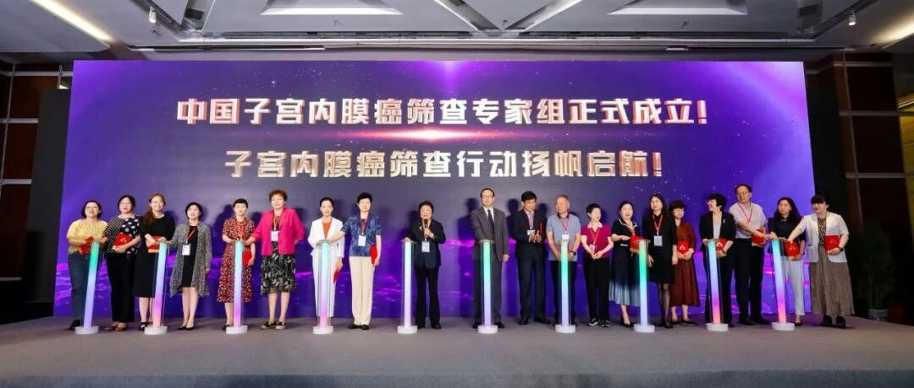
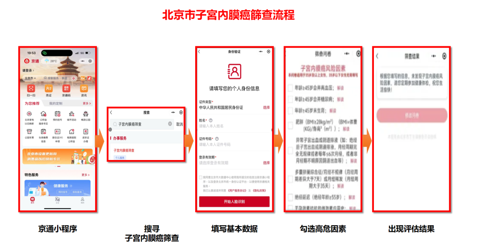

# 好消息！全国子宫内膜癌筛查专家组正式成立！~北京居民享有全球首个子宫内膜癌筛查的绿色通道了！~

_2025年06月30日 08:00_

2025年6月28日，第十二届子宫内膜癌筛查及早期诊断——子宫内膜细胞学技术培训班正式组建子宫内膜癌筛查专家组，并在北京清华长庚医院设立首个国家级子宫内膜癌筛查培训基地！伴随子宫内膜癌筛查专家组成立，聚焦筛查体系建设、学术前沿突破及公共卫生实践落地。

“国家级基地”建设将强化标准化培训与质量控制，而“进入北京政府项目推动三癌筛查”的举措，则标志着子宫内膜癌筛查正式纳入国家区域重大公共卫生服务体系，加速实现“早发现、早干预”的健康目标。这一举措标志着中国为全球子宫内膜癌筛查迈出关键第一步。

**重大民生福利**

北京清华长庚医院正式启用国家级子宫内膜癌筛查培训基地，同步开通全市居民专属筛查绿色通道！这意味着咱们北京女性在家门口就能享受国际领先的早癌筛查服务，高危人群最快当天就能完成检测！专家组主席清华长庚医院廖秦平教授二十年从'破冰'到'燎原'"呼吁："从今日触柱之手开始，让筛查之光惠及每一位中国女性！子宫内膜癌筛查事业扬帆起航！"，未来需全国同仁携手，将'中国方案'铸成国际金标准！

**筛查革命：不用住院、不用痛苦诊刮**传统筛查需要住院做诊刮手术，现在通过筛查新技术：

✔ 全程无痛：只需类似妇科检查门诊的取样操作 ✔ 结果快速 ✔ 精准度突破！

**子宫内膜癌受到那么多人的关注是为什么？**

因为子宫内膜癌是高度发展城市中女性生殖恶性肿瘤首位，早期症状（如异常出血）在未绝经女性与许多宫腔疾病相似易被忽视，若不及时筛查可能进展到晚期，威胁生命；且近年发病率随肥胖、激素变化等因素呈上升趋势，关注筛查和预防能有效提高早诊率，降低危害。

**子宫内膜癌已成为我国发达地区女性头号妇科肿瘤且呈现年轻化趋势：**

1. 发病率飙升：过去30年上升132%，北京、上海等城市发病率接近欧美水平；
2. 隐匿性强：出现阴道出血等症状可能是其他宫腔内疾病，子宫内膜癌常伴随其他宫内疾病一起发生，易被忽视；
3. 可防可治：早期发现治愈率超90%，晚期治疗费用高、效果差。

参与此次会议看到未来在无创/微创基础下，子宫内膜细胞学和宫颈细胞学整合AI系统、子宫内膜细胞学和免疫细胞化学、染色体不稳定性、基因甲基化，将在子宫内膜癌筛查进展中创建更符合女性筛查方式。

北京市市民通过微信的京通小程序，填写基本数据即可以享有子宫内膜癌筛查流程指引，完成自我评估与结果，作为指导北京市女性一步到指定医院进行筛查。

【特别提醒】符合以下任一条件请立即预约：

☑ 45岁以上女性 ☑ 肥胖（BMI≥28）☑ 糖尿病史超过5年 ☑ 异常阴道出血 ☑ 家族肿瘤史

**绿色通道-北京居民专属福利**

北京清华长庚医院开通“子宫内膜癌筛查绿色通道”：

1. 快速预约：高危人群（如绝经后出血、肥胖、糖尿病等）优先安排；
2. 当日检查：超声、血液检测半日出结果，符合条件者当天完成取样；
3. 专业指导：筛查报告由专家组骨干审核，可疑病例直通专家会诊。

**参与方式：**

① 微信搜索“京通小程序”→点击“子宫内膜癌风险因素调查”；② 拨打北京清华长庚医院妇产中心热线 010-56119018 预约；③ 社区医院转诊患者享快速通道。

此次会议学习到国内子宫内膜癌筛查的临床与病理注意事项，期待未来完整系统建立后将成为国际保护女性健康三癌筛查的新模式。

基于国际持续高度上升的子宫内膜癌发生率，以无创子宫颈细胞进行禾蔻安甲基化检测将成为新的子宫颈内膜癌重要筛查方式。

**“禾蔻安”是适配于现阶段的子宫癌筛查最有效的产品:**

禾蔻安（人CDO1/CELF4基因甲基化检测试剂盒）作为国内首个获批的子宫内膜癌甲基化检测三类医疗器械产品，基于 CDO1和CELF4双基因甲基化特征，通过检测宫颈脱落细胞或宫腔分泌物的DNA甲基化水平，实现无创早筛。

其灵敏度达94.51%-95%，特异性92%-94%，显著优于传统超声（灵敏度约52.6%）和诊刮术，尤其对早期病变（如癌前病变EIN）检出率超83%，假阴性率低于5%。

**临床革新：无创采样重构筛查范式**

传统筛查依赖侵入性诊刮术，患者痛苦且基层普及率低。禾蔻安首创“宫颈分泌物无创采样”技术，仅需一次性宫颈细胞采集器即可完成取样，全程无痛、操作简便，患者依从性提升60%以上。检测周期缩短至3小时，成本较病理检查降低50%-60%，适配基层医疗及偏远地区筛查需求。

多中心临床试验（覆盖4818例样本）显示，其对绝经后无症状人群灵敏度达92.67%，绝经前异常出血女性超90%，阳性预测值100%，阴性预测值95.8%。

禾蔻安以“高精度、低创伤、高普惠”重塑子宫内膜癌筛查标准,不仅填补了国内技术空白，更通过临床数据验证与生态协同，为全球女性健康管理树立新标杆。

**关于聚禾生物**

北京起源聚禾生物科技有限公司是以创新科技为驱动、以关注健康为宗旨的科技企业。聚禾生物是妇科肿瘤早诊领域的开拓者，以独家技术和专利保护的标志物为核心，开发了宫颈癌、子宫内膜癌、卵巢癌等妇科肿瘤早诊产品，填补了该领域的空白。

随着女性对自身健康的关注越来越密切，女性健康市场将大有可为，除妇科肿瘤早筛早诊产品线外，未来聚禾生物还将建立更多女性健康相关的产品管线，打造女性健康市场的技术创新型领先企业。
