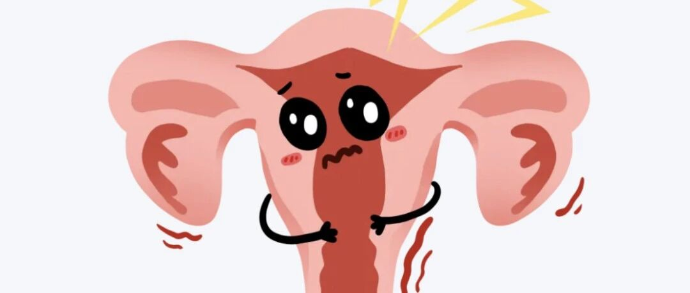
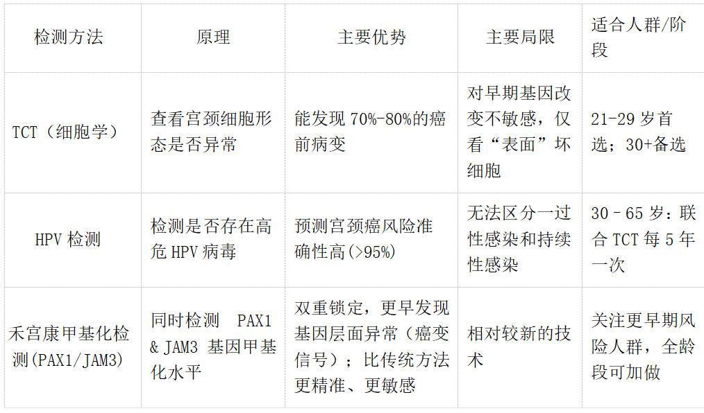

# 宫颈癌筛查：谁该查？多久查？一次看懂！

_2025年08月01日 09:24_

子宫颈癌是全球女性第四大常见癌，但它也是唯一能“查着预防、查着扼杀”的癌症！关键在于定期筛查，将癌症扼杀在萌芽！

**一、筛查方法大不同：选对工具是关键**

禾宫康PAX1/JAM3 甲基化检测，就像给细胞做了一次“深度癌化CT”——不仅看表面形态，更潜入基因“开关”内部，一旦PAX1或JAM3有甲基化异常，便是癌变最初信号，无所遁形！

**二、筛查频率指南：年龄 & 风险说了算！**

我国结合国际指南（ASCCP 2020、中国《子宫颈癌综合防控指南》），推荐以下科学筛查方案：

（1）退出需满足任一：
- 最近10年内2次联合阴性（且最近一次≤5年）
- 最近10年内3次TCT阴性（且最近一次≤3年）

❗有宫颈癌/癌前病变史或免疫缺陷者需终身筛查

（2）多性伴侣、初次性早（<16岁）、既往HPV/尖锐湿疣、免疫差（HIV/移植）、吸烟、长期避孕/激素疗法、家族史

**三、筛查前注意：结果准确靠细节！**

- 时间：月经干净后3-7天最佳 (避开经期)。
- 准备：检查前24小时避免性生活、阴道冲洗或用药。
- 炎症：如有急性阴道炎/宫颈炎，先治疗再筛查。

**四、扫清误区，筛查不踩坑！**

❌ 误区1：打了HPV疫苗=不用筛查？

错！疫苗不能覆盖所有高危型HPV，且对已感染无效。打了疫苗也要按时筛查！

❌ 误区2：TCT正常=绝对安全？

错！TCT可能漏检仅有HPV持续感染但未细胞病变的情况。30+强烈推荐联合筛查！

❌ 误区3：筛查越频繁越好？

错！过度筛查可能导致不必要的阴道镜、活检，徒增负担和焦虑。遵循指南频率最科学！

**五、禾宫康 PAX1/JAM3 甲基化检测优势**

（1）“双重基因侦察”：同时监测 PAX1和JAM3 基因甲基化，早期发现细胞深层癌化倾向（2）高敏感、低假阳：敏感度可达 ≥98%，特异性高于普通甲基化检测（3）补充传统筛查：与 TCT/HPV 检测互为补充，提升整体检出率

**六、结语：早筛早干预，风险无处遁形！**

记住：癌症不是突袭，是病变未被发现。早筛查、早干预，宫颈癌根本没机会“长大”！

**关于聚禾生物**

北京起源聚禾生物科技有限公司是以创新科技为驱动、以关注健康为宗旨的科技企业。聚禾生物是妇科肿瘤早诊领域的开拓者，以独家技术和专利保护的标志物为核心，开发了宫颈癌、子宫内膜癌、卵巢癌等妇科肿瘤早诊产品，填补了该领域的空白。

随着女性对自身健康的关注越来越密切，女性健康市场将大有可为，除妇科肿瘤早筛早诊产品线外，未来聚禾生物还将建立更多女性健康相关的产品管线，打造女性健康市场的技术创新型领先企业。
