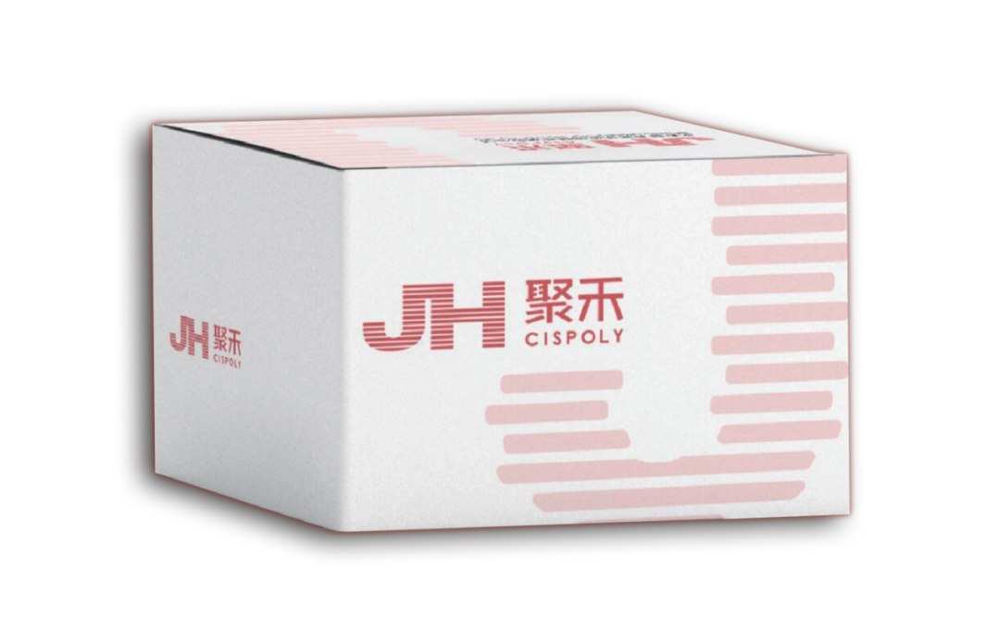

# 刮宫诊断：传统方法里的“摸黑采样”，可能漏掉什么？

_2025年08月06日 15:30_

张阿姨最近总感觉月经乱了套——本该结束的出血拖拖拉拉半个月，偶尔还夹杂着暗红色血块。妇科医生建议她做门诊“诊断性刮宫”（简称“诊刮”），通过刮取子宫内膜做病理检查，找出出血原因。但做完检查后，报告却显示“未见明显异常”。张阿姨纳闷：“既然没问题，为啥我还一直出血？”后来换了一家医院，医生用了一种带“摄像头”的小镜子（宫腔镜）直接看宫腔，这才发现——她的子宫角藏着一颗绿豆大小的息肉，传统刮宫根本没刮到！

这并不是个例。传统刮宫诊断虽然用了几十年，但有个缺陷：它是一种归咎于医生刮取手法的“盲操作”，就像在黑屋子里摸东西，很容易漏掉关键病变。

**刮宫是怎么“盲采”的？**

简单来说，传统诊刮的操作是这样的：医生用一根细长的刮勺，从阴道经宫颈伸入子宫腔，然后旋转刮勺刮取子宫内膜组织。整个过程中，医生看不到子宫内部的样子，全凭手感和经验判断“有没有刮到东西”。

这种“摸黑”操作，就像用手在封闭的盒子里搅和——如果盒子里有块小纸片藏在角落，你可能碰不到；同理，如果子宫内膜上的病变（比如小息肉、局部增生或早期癌变）刚好长在刮勺“够不着”的位置，就会被漏掉。

**盲采样，到底会漏掉什么？**

局灶性病变：子宫内膜的病变常“躲猫猫”，比如子宫内膜息肉可能只有米粒大小，却爱长在子宫角、宫底部这些“隐蔽角落”。传统刮勺的覆盖范围有限，很容易“扫不到”。有研究发现，约15%的子宫内膜息肉会逃过传统诊刮的“追捕”。

取材不均匀：子宫内膜的厚度和状态会随月经周期变化，不同区域的组织也可能有差异（比如靠近宫底的子宫内膜更厚）。如果刮勺只集中在某个区域刮取，可能漏掉其他区域的关键病变。

经验依赖性强：新手医生可能因操作不熟练，无法全面刮取；即使是有经验的医生，“盲刮”的准确性也受限于子宫形态（比如子宫过度前倾或后屈），相当于“在弯曲的隧道里摸黑找路”。

**漏诊的后果有多严重？**

最直接的后果是“检查结果正常，但症状没消失”。像张阿姨的情况，如果漏诊了子宫角的小息肉，它会持续刺激内膜，导致反复出血；更危险的是，如果病变是早期子宫内膜癌，漏诊可能延误治疗时机——毕竟，癌症早期可能只是内膜上的小凸起，传统刮勺“摸”不到，就会给出“未见异常”的假象。

**有没有更“亮”的方法？**

当然有！" 禾蔻安 (CDO1/CELF4) " 的新甲基化检测技术就好比是让传统刮宫黑夜中那“一束灯光”只需要像宮頸癌篩查一樣，无痛取点宫颈分泌物就能查子宮内膜癌风险！这到底是怎么做到的？

原来，癌细胞有个"小尾巴"：DNA甲基化。简单说，我们的细胞里有一套"基因开关"，正常细胞的开关是"开着"的，能让抑癌基因正常工作；但癌细胞会偷偷把这些"开关"用"小锁"锁死（甲基化异常），让抑癌基因罢工，癌细胞就开始疯狂生长。

禾蔻安检测就是专门找子宫内膜癌的"重要锁"的。它通过分析宫颈脱落细胞里的2个关键锁(关键基因 - CDO1和CELF4）的甲基化水平，就能判断子宫内膜有没有癌变风险。这方法就像每次总要去看看保险箱是否有被动过，珠宝有没有不见，看保险箱锁有没有跟上次一样锁好锁紧，一样道理。女性子宫健康就像珠宝一样，超声总会看出问题，但大部分有问题超声都是不致命危险。

**推荐作为刮宫的"黄金搭档"，特别适合这些情况：**

- 绝经后突然出血、阴道排液；

- 月经长期不干净、量特别多；

- 彩超提示内膜增厚或长东西；

- 刮宫结果不清楚，需要再确认；

查出癌前病变，定期复查。

**总结**

传统刮宫是妇科的经典检查手段，在没有可视化工具时帮助了很多患者。但它“盲采样”的局限性，可能导致关键病变漏诊。随着医学技术进步，DNA甲基化检测方法已能更精准地“揪出”隐藏的病变。如果检查后症状未缓解，或医生建议进一步排查，不必抗拒——更清晰的“视野”，才是对健康更负责的态度。

**关于聚禾生物**

北京起源聚禾生物科技有限公司是以创新科技为驱动、以关注健康为宗旨的科技企业。聚禾生物是妇科肿瘤早诊领域的开拓者，以独家技术和专利保护的标志物为核心，开发了宫颈癌、子宫内膜癌、卵巢癌等妇科肿瘤早诊产品，填补了该领域的空白。

随着女性对自身健康的关注越来越密切，女性健康市场将大有可为，除妇科肿瘤早筛早诊产品线外，未来聚禾生物还将建立更多女性健康相关的产品管线，打造女性健康市场的技术创新型领先企业。
