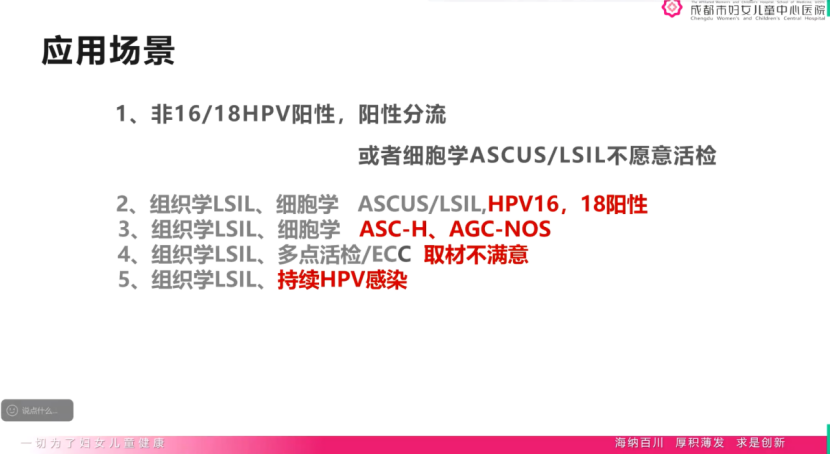
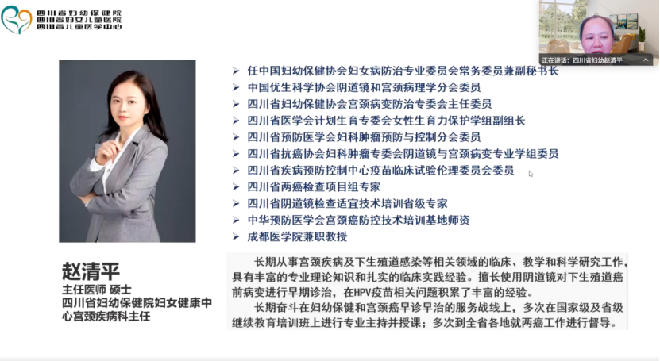
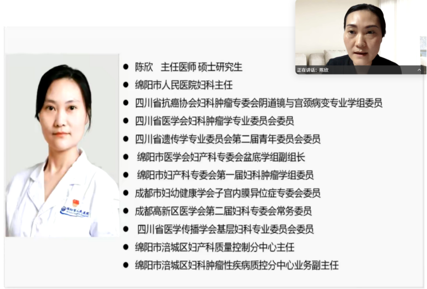

# 宫颈癌甲基化学术交流会—病例讨论聚焦子宫颈癌甲基化检测临床应用 —— 一例绝经女性HPV16反复感染

_2025年08月26日 17:02_

2025年8月25日，由四川省妇幼保健院赵清平主任与山东省妇幼保健院董玉燕主任联合主持的宫颈癌甲基化学术交流会在线上举行。会议将依据《中国子宫颈癌筛查指南（二）》发布的内容，聚焦于“子宫颈癌甲基化检测的病例分析及临床应用”。重点讨论甲基化检测在子宫颈癌筛查、分流及治疗决策中的重要作用,并探讨其在临床应用方面的发展方向。这一交流活动将为未来的临床研究以及相关指南和专家共识的制定提供前沿探索。

##**一、病例分享**

成都市妇女儿童中心医院的代倩苓主任分享了一例 56 岁女性患者的病例。该患者持续感染高危型 HPV 长达 6 年，历次细胞学检查与阴道镜下活检结果多为炎症或正常。

1\. 基本信息性别：女; 年龄：56岁; 民族：汉族; 婚姻史：已婚; 2\. 主诉：HPV感染7年活检看见结果。3\. 现病史 (1).病史摘要：

  * 6年前HPV16、18感染阳性，行活检未见异常，后续随访皆为HPV16感染｡
  * 2022年 HPV16阳性、SCC正常、LBC未见异常、HPV E6E7阴性｡
  * 2025年HPV16、52阳性、LBC未见异常、活检病理炎症、宫颈双基因甲基化阳性。

(2). 月经婚育史：绝经；P1顺产｡ 4.诊断诊断性锥切：宫颈高级别鳞状上皮内病变（CIN2级）｡ 5.医患沟通与决策过程注意事项 (1).患者可能顾虑：担心手术风险（如宫颈锥切术后并发症，如出血、感染、宫颈机能不全等）。(2). 患沟通内容：

  * 告知HPV16持续感染及可能高级别病变的潜在风险（进展为浸润癌的风险升高），建议完善进一步检查排除宫颈管内病变（如盆腔MRI）。
  * 解释手术（诊断性宫颈锥切术）的必要性：明确病变范围、可排除浸润癌风险，同时达到治疗效果（切除病变组织）。
  * 经医生充分告知与医患共同决策。

##**二、病例小结**

患者为绝经期女性，HPV16型持续感染多年，但阴道镜活检未发现病变，辅助检查尚未发现异常｡因甲基化检测阳性，经医患充分沟通中并充分告知风险与获益，诊断性锥切病理提示宫颈高级别病变，排除浸润癌，制定个体化诊疗方案，强调术后长期随访的重要性。

绝经女性由于宫颈萎缩，易形成宫颈鳞柱交界区域隐匿，常造成细胞学采样受限和阴道镜未能完全观察到病变区域而导致结果不尽如人意。

面对“持续HPV16阳性数年及细胞学与组织学显示与临床症状甚至疾病发展不一致临床困境，这使得HPV感染者长期心理压力及恐慌。

针对日益增加的此类疾病困扰人群，医疗团队积极探索更为精准的检测手段，以期为HPV持续感染患者提供更加有效的方法，从而避免漏诊及由此引发的癌症恐慌所带来的巨大心理压力。经过团队多方面的评估，引入了PAX1/JAM3双基因甲基化检测技术。在门诊中采集宫颈脱落细胞标本后进行相关检测，该患者PAX1/JAM3双基因甲基化结果显示阳性，这提示其宫颈管内可能存在隐匿性的高级别病变。

代主任依据临床症状与不同检测综合分析并与患者讨论后，建议选择诊断性锥切以明确病理；同时也指出，对于不愿行锥切的患者，甲基化结果可成为权衡随访与手术的参考证据。

代主任并分享了临床实践观察：在多中心验证中，该类甲基化检测的阴性预测值较高（接近90%），在分流与随访管理中有较大参考价值，需要结合临床与影像/阴道镜综合判断。

##**三、科室将甲基化检测主要用于两类场景**

代主任总结其科室将甲基化检测主要用于两类场景：

(1)对非16/18型高危HPV阳性者或细胞学低风险但患者有高危因素者做分流；(2)对活检与细胞学存在不一致、取材不满意或疑似宫颈管隐匿病变的病例，用以判断是否存在漏诊的高级别病变。

##**四、病例讨论**

四川省妇幼保健院赵清平主任与绵阳市人民医院陈欣主任分别对病例管理思路与筛查流程优化进行了总结讨论，专家一致认为甲基化检测可作为补充工具，降低漏诊、优化分流、辅助治疗决策。

1. 赵清平主任（四川省妇幼保健院）讨论并总结

赵清平主任肯定了代主任所分享病例的代表性与现实意义，指出在绝经期女性中，宫颈萎缩与三型转化区不易暴露会增加阴道镜和活检的漏诊风险。

PAX1+JAM3双基因甲基化检测为临床提供了“及时且具有补充作用”的风险评估工具；面对持续高危HPV感染但传统检测与组织学结果不一致的患者时，甲基化检测可帮助临床在“谨慎随访”与“早期诊断性手术”之间做出更个体化决策｡

随着检测成本下降，该技术有望在更多三级医院和筛查流程中被合理纳入，改善筛查的精准度与分流效率。

2. 陈欣主任（绵阳市人民医院）讨论并总结

陈欣主任从筛查学与公共卫生视角出发，强调宫颈癌筛查的目标是“早期识别并精确管理”宫颈上皮病变。指出传统TCT依赖病理经验、HPV检测敏感性高但特异性不足，容易导致转诊与过度干预；PAX1与JAM3甲基化联合检测可提高分流的精确性，尤其适用于持续感染、取材困难或细胞学/活检结果不一致的患者；在实际工作中，甲基化检测更常被用于有高危因素的随访与分流决策，从而减少不必要的阴道镜转诊，同时尽量降低漏诊高级别病变的风险。临床应用亮点：

  * 补充性分流工具：对非16/18高危HPV阳性或细胞学低风险但有高危因素者，用以降低不必要的阴道镜转诊。
  * 防漏诊：在绝经期或宫颈管病变隐匿的情况下，甲基化阳性提示需加强随访或考虑诊断性锥切。
  * 术后/活检后决策支持：当组织学与临床影像/阴道镜不一致时，甲基化结果可作为术前风险评估的参考。
  * 较高阴性预测值：会中提到产品在临床验证中阴性预测值接近90%，有助于对低风险患者安心随访，但仍需结合临床综合判断以防假阳性。

##**五、结语**

本次学术交流会通过典型病例和专家讨论，突出展示了PAX1联合JAM3双基因甲基化检测在宫颈癌筛查与临床管理中的实用价值。专家一致认为，PAX1联合JAM3双基因甲基化是作为重要的补充工具，能在复杂或高风险病例中提高诊断敏感性、优化分流路径、并为个体化治疗决策提供有力参考。随着更多多中心验证数据和检测成本的进一步改善，PAX1+JAM3甲基化联合检测将在临床筛查体系中发挥愈发重要的作用。

**关于聚禾生物**

北京起源聚禾生物科技有限公司是以创新科技为驱动、以关注健康为宗旨的科技企业。聚禾生物是妇科肿瘤早诊领域的开拓者，以独家技术和专利保护的标志物为核心，开发了宫颈癌、子宫内膜癌、卵巢癌等妇科肿瘤早诊产品，填补了该领域的空白。

随着女性对自身健康的关注越来越密切，女性健康市场将大有可为，除妇科肿瘤早筛早诊产品线外，未来聚禾生物还将建立更多女性健康相关的产品管线，打造女性健康市场的技术创新型领先企业。
