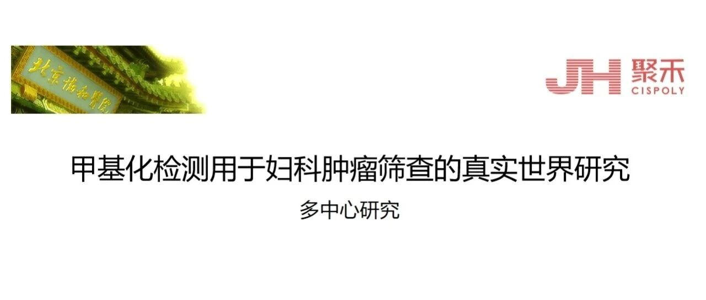

# 诚邀全国医院加入 —“甲基化检测用于子宫颈癌筛查的真实世界多中心研究”正式启动招募

_2025年08月29日 17:30_

##【前言】

随着分子检测在妇科肿瘤筛查中应用的快速发展，PAX1/JAM3等肿瘤靶基因甲基化检测在HPV阳性人群分流及提高CIN2+检出率方面显示出良好价值。近年来包括 WHO宫颈癌筛查指南（第2版）、多项中国子宫颈癌筛查指南与专家共识的发布，为甲基化检测进入临床提供了坚实的指南与学术支持。我们的前期工作包括多项临床队列与临床试验以及多篇相关学术论文（其中若干已SCI收录），并已开展大规模真实世界数据采集，为本次多中心研究奠定了基础。

##**一、研究要点与合规信息（摘要）**

  * 研究名称：甲基化检测用于妇科肿瘤筛查的真实世界多中心研究（Multicenter Real-World Study of Methylation Testing for Gynecologic Tumor Screening）
  * 牵头单位：中国医学科学院北京协和医院、妇产科妇科肿瘤中心、疑难重症及罕见病全国重点实验室李雷团队。
  * 数据收集内容：参加者基本资料、细胞学、HPV分型检测、PAX1/JAM3双基因甲基化检测等

##**二、招募对象**

全国各有条件开展宫颈癌筛查与分流工作的三级甲等医院、区域医院及社区医疗机构，欢迎具有伦理与数据管理能力的单位报名参与。

##**三、合作流程（主要步骤）**

1. 依照国家临床研究规范进行数据收集；
2. 申办单位阅读研究方案并评估参与可行性；
3. 签署科研合作协议；
4. 临床信息的数据收集；
5. 不定期举行在线工作会议（研究进展、质控、方法学讨论）；
6. 最终进行大数据统计分析并共同发表学术论文与研究报告。

**关于聚禾生物**

北京起源聚禾生物科技有限公司是以创新科技为驱动、以关注健康为宗旨的科技企业。聚禾生物是妇科肿瘤早诊领域的开拓者，以独家技术和专利保护的标志物为核心，开发了宫颈癌、子宫内膜癌、卵巢癌等妇科肿瘤早诊产品，填补了该领域的空白。

随着女性对自身健康的关注越来越密切，女性健康市场将大有可为，除妇科肿瘤早筛早诊产品线外，未来聚禾生物还将建立更多女性健康相关的产品管线，打造女性健康市场的技术创新型领先企业。
