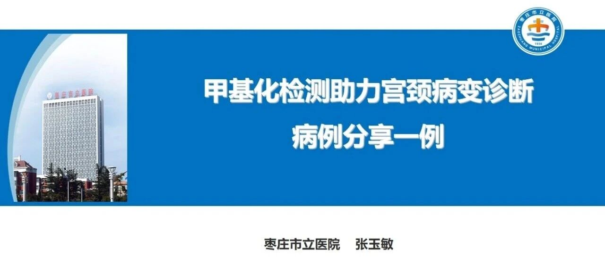
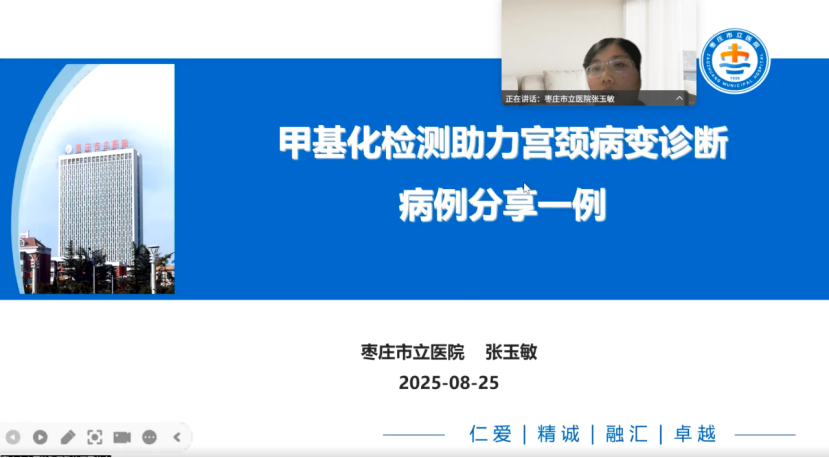
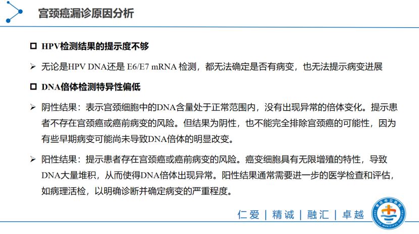
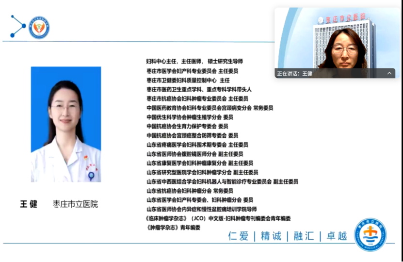
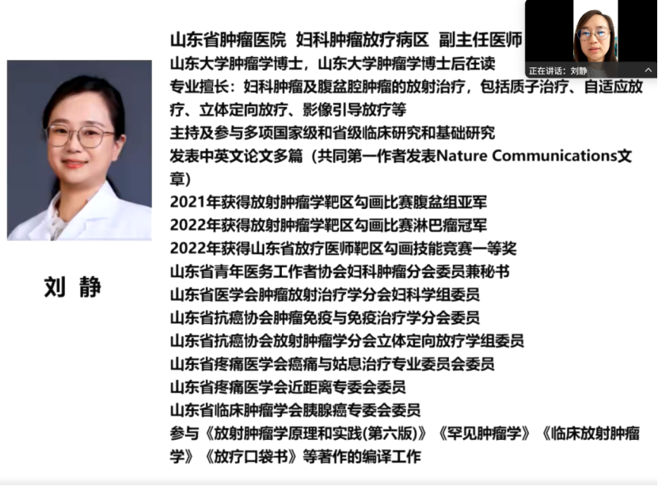

# 宫颈癌甲基化学术交流会——聚焦宫颈癌甲基化检测在宫颈高级别病变评估和治疗后检测

_2025年09月12日 14:32_

2025年8月25日，由四川省妇幼保健院赵清平主任与山东省妇幼保健院董玉燕主任联合主持的宫颈癌甲基化学术交流会在线上举行。会议点讨论甲基化检测在子宫颈癌筛查、分流及治疗决策中的临床病例分享，探讨其在临床应用可行性。这一交流活动将为未来的临床研究以及相关指南和专家共识的制定提供前沿探索。

枣庄市立医院张玉敏医师分享了一例术后 HPV 持续阳性且病理及影像结果复杂的宫颈病变病例，重点展示了 PAX1/JAM3 双基因 DNA 甲基化检测在分流、术后监测与临床决策中的应用。山东省妇幼保健院董玉燕主任、枣庄市立医院王健主任及山东省肿瘤医院刘静教授等专家就该病例展开热烈讨论，达成对甲基化检测“在有指征时作为补充分流和术后监测工具”的共识，同时指出了临床应用中的若干关键问题与注意事项。

##**一、病例分享**

【基本信息】

姓名：刘 X,女,38 岁。

首次就诊：2024-02-02。

主诉：宫颈锥切术后 3 年余，高危型 HPV 持续阳性 1 年余。

【既往史】

2019 年外院 TCT 示 HSIL,HPV16 阳性；2019-12-27 阴道镜活检示 HSIL。

2020-03-17 行宫颈冷刀锥切术，术后病理为 CIN Ⅲ，病灶伴小灶性微浸润（宽度 <7 mm,深度 <2 mm），部分边缘为 CIN Ⅱ，余切缘未见特异性病变。术后建议行进一步手术（提示 IA 期病变），但患者因强烈生育愿望择保守治疗。

无其它慢性病史、过敏史或家族遗传病史。

【现病史】

- 2020–2023年多次复查：TCT多呈“炎症/细胞增生”，DNA倍体检测多次阴性，但高危型HPV（以HPV16为主）间歇或持续阳性。SCC指数低波动（如2021年1.13，2022年1.81）。阴道镜多次未见明确浸润性肿瘤的典型征象（记录不详或低级别印象）。
- 2024-02：高危型HPV仍持续阳性，当次行PAX1/JAM3双基因甲基化检测，结果均为阳性（ΔCtPAX1=6.47（阳性判定范围0–6.6），ΔCtJAM3=5.55（阳性判定范围0–10）。随后取活检病理示：宫颈管见高级别上皮内瘤变（CINⅡ–Ⅲ），免疫组化：Ki-67（+，约90%），p16(++)。

【治疗经过】2020 年首次锥切术后病理提示微浸润（IA期）并建议行根治性手术（子宫切除），但患者明确要求保留生育功能，遂接受保守管理并随访。

2024年经连续影像/分子与病理证据评估（包括本次双基因甲基化提示高风险与复查活检提示CINⅡ–Ⅲ），为平衡保宫与安全，团队为患者实施第二次宫颈冷刀锥切术，术后病理示HSIL，累及腺体，内口切缘及深切缘见CINⅢ，外口切缘阴性。术后以PAX1/JAM3甲基化检测作为术后监测之一，纳入随访方案以评估残余或进展风险并指导后续分流/治疗决策。

##**二、DNA 甲基化检测在本病例中的应用与重要性**

弥补常规检测的盲区：本例中，传统的TCT、DNA倍体检测与单纯 HPV检测存在取材、主观阅片和假阴性/假阳性问题，导致对病变进展风险判断不充分。PAX1/JAM3双基因甲基化检测在hrHPV阳性且细胞学不明确或随访矛盾时，提供了更直接的分子学证据，以提示潜在的高级病变或病理升级风险，从而帮助临床决定是否需要尽早行活检或手术。

提高分流与减少过度诊疗：作为HPV阳性人群的分流工具，甲基化检测具有较高的特异性，能减少不必要的重复阴道镜或过度手术，尤其在TCT不典型或HPV非16/18 型但持续阳性的情况下，甲基化结果对“谁需要尽快行诊治”具有重要参考价值。

术后监测与生命周期管理：对于希望保留生育功能、采取保守手术的患者，甲基化检测可作为术后随访的分子学指标之一，用以早期提示残留病变或复发风险，从而在保守与根治之间实现更精准的动态决策。临床研究也报道甲基化指标在术后监测或短期风险预测中具有补充价值。

##**三、甲基化的临床意义与适用场景**

HPV-阳性人群的分流决策：对持续hrHPV 阳性但细胞学结果不明确或阴性者，采用甲基化检测可帮助判断是否需尽快行阴道镜/活检。

辅助判断病理升级风险：在既往有CIN 或锥切史、拟保宫管理的患者中，甲基化结果可作为决定保守观察还是行二次锥切/根治手术的重要参考。

术后随访与监测：将甲基化检测纳入随访指标，有助于早期发现残留或复发，尤其适合不愿立即行根治手术、希保生育的患者群体。筛查体系的优化：在资源或人力有限的设置下，甲基化检测可与HPV 筛查结合，优化转诊流程、减少不必要阴道镜并提高高危病变检出率。

##**四、病例讨论**

枣庄市立医院的妇科中心主任医师王建教授和山东省的肿瘤医院肿瘤放疗病区的副主任医师刘静教授对DNA甲基化在宫颈癌筛查中的应用发表了自己的看法：

**王健（枣庄市立医院）——强调检测局限、流程协同与个体化**

王主任指出任何检测均有短板（取材、样本保存、技术和主观阅片等可造成假阴/假阳），建议：

1. 在初筛或随访中尽早引入甲基化检测作为分流手段，以降低漏诊风险，尤其是HPV16/18 持续阳性的患者；
2. 明确各检测的时间窗口与取样间隔，讨论在HPV/TCT 结果出炉后“一周内”再行甲基化取样是否会影响结果准确性；
3. 强调阴道镜、门诊取样与病理科之间的信息共享与协作，以形成“诊断合力”，并提出将甲基化纳入术后随访用于动态评估的建议。

**刘静（山东省肿瘤医院）——放疗与复发监测角度的关注**

- 刘教授表示放疗科室对早期筛查与甲基化了解较少，但对甲基化在复发筛查和可疑复发患者的潜在作用非常关注，尤其是在已接受放化疗或手术治疗后，传统手段难以早期识别复发情形时，选择性测甲基化可能提供帮助。
- 关注甲基化在复发监测、可疑残留或放化疗后仍持续HPV 阳性/细胞学异常患者中的潜在作用，认为传统手段在这些场景早期识别复发较困难。
- 建议有选择性地在可疑复发或持续异常患者中使用甲基化检测，并期待更多循证数据支持其在复发筛查与监测中的应用。

**董玉燕（山东省妇幼保健院）——聚焦临床场景与管理疑问**

**最后，山东省妇幼保健院董玉燕主任进行总结：**

- 董主任肯定甲基化检测在“术后仍持续HPV阳性”这类临床场景中的价值，认为其能提高对“隐匿病灶”的识别灵敏度，尤其对希望保留生育功能的患者具有重要分流意义。她提出对本例的疑问与关注点：
- 患者既往存在微浸润且锥切切缘曾呈阳性，二次冷刀后内切缘及肌底缘仍为阳性，如何制定后续管理方案？
- 在平衡保宫与安全的前提下，如何用甲基化检测指导“继续保守vs进一步根治”的决策？
- 董主任强调甲基化有助于分流、辅助保宫患者的决策，但需有明确指征并结合患者生育意愿与经济可承受性，建议继续随访并动态评估。

##**五、病例小结**

本次病例分享与专家讨论体现了甲基化检测在临床实践中的现实价值与挑战：它为“HPV 持续阳性但常规检查不明确”的患者提供了有力的分子学证据，有助于优化分流与随访策略；同时，临床应用需谨慎、个体化，并依赖良好的取样规范与多学科协作。专家一致建议在“有明确指征”时优先采用甲基化检测，并继续对病例进行动态追踪以验证其在术后监测和保宫管理中的长期效用。

**关于聚禾生物**

北京起源聚禾生物科技有限公司是以创新科技为驱动、以关注健康为宗旨的科技企业。聚禾生物是妇科肿瘤早诊领域的开拓者，以独家技术和专利保护的标志物为核心，开发了宫颈癌、子宫内膜癌、卵巢癌等妇科肿瘤早诊产品，填补了该领域的空白。

随着女性对自身健康的关注越来越密切，女性健康市场将大有可为，除妇科肿瘤早筛早诊产品线外，未来聚禾生物还将建立更多女性健康相关的产品管线，打造女性健康市场的技术创新型领先企业。
