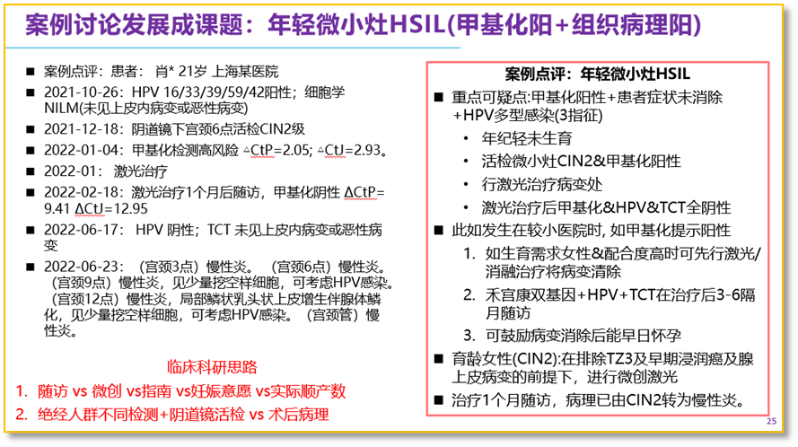

# 参会学习手记：2025年湖南省医学会妇产科学专业委员会学术年会—妇科肿瘤精准治疗：DNA甲基化检测在宫颈癌和子宫内膜癌精准检测

_2025年09月18日 15:11_

2025年湖南省医学会妇产科学专业委员会学术年会于9月5-7日在长沙隆重举行。本次会议由中南大学湘雅二医院承办，来自国内近千名顶尖妇产科专家齐聚长沙，共襄学术盛宴！此次大会聚焦妇产科前沿技术、研究成果与诊疗理念，围绕学科创新与发展展开深度学术交流。不仅为与会者提供了展示科研成果与临床经验的平台，为妇产科医学注入新活力，更为妇产科诊疗技术的提升奠定坚实基础并推动妇产科医疗事业高质量发展。

本次会议设立了 1 个主会场和 11 个分会场，涵盖了 82 场专题讲座。本次学术盛会将为与会专家提供一个高水平的学术交流平台，促进妇产科疾病诊疗新技术的学习与分享，提升临床诊治与科研水平。

主论坛由中国福利会国际和平妇幼保健院王玉东教授为与会人员带来了题为“宫颈癌诊治的争议”的精彩讲座，从多个维度对妇女健康阐述，并从 DNA 甲基化，ARRP-seq 的宫颈癌相关融合基因等诊断方面和宫颈癌的具体治疗方案结合案例分析进行了讨论。

妇科肿瘤精准治疗论坛集结多位国内知名专家围绕妇科肿瘤的遗传学基础、罕见类型、创新治疗方式及临床策略展开了深入交流与精彩分享。遗传性妇科肿瘤均与特定基因的突变有关，包括 Lynch 综合征相关子宫内膜癌、遗传性乳腺癌卵巢癌综合征（HBOC）、遗传性平滑肌瘤病和肾细胞癌综合征、Cowden 综合征相关的子宫体肿瘤、黑板息肉综合征相关的宫颈胃型腺癌在内的五大常见遗传性妇科肿瘤。分子检测与免疫治疗在子宫内膜癌中的应用探索是现行重要临床方法，需要特别注意基因与治疗结局的影响 ｡

妇科肿瘤发病呈现地域差异、年龄变化与防控挑战的关键趋势，因此早筛早诊有利于生存率提升和医疗成本的优化，尤其中国在癌症甲基化快速发展已获得世界有目共睹，临床科研设计如何建立医院标准化流程与挖掘自我临床特色 ｡

目前在子宫颈癌甲基化检测的 PAX1 和 JAM3 作为筛查和分层管理已累积了许多文献证据力和临床精准检测：包括

**一、PAX1/JAM3 双基因甲基化可避免绝经后女性在常规检测因三型转化区造成的漏诊，并作为随访监测**

**二、年轻女性小灶高级别宫颈病变可使用微创治疗 ( 例如激光等 ),避免立即锥切，并以 PAX1/JAM3 进行治疗前后监测**

此外，分享了宫颈刷取细胞进行子宫内膜癌甲基化检测在子宫内膜癌不同期别与不同癌种具有稳定表达，相较于影像学的波动性,CDO1/CELF4 双基因甲基化的无创检测更适合无创筛查和联合影像学检测子宫内膜癌，避免内膜有创检查而造成损伤 ｡

**三、CDO1/CELF4 甲基化的无创检测联合影像学检测子宫内膜癌，避免内膜有创检查而造成损伤**

以临床为主的系统化和规范化检测与治疗方案可形成多种临床研究的设计框架及策略，同时挖掘具有医院特色的临床研究对于临床医生更具临床意义。

**关于聚禾生物**

北京起源聚禾生物科技有限公司是以创新科技为驱动、以关注健康为宗旨的科技企业。聚禾生物是妇科肿瘤早诊领域的开拓者，以独家技术和专利保护的标志物为核心，开发了宫颈癌、子宫内膜癌、卵巢癌等妇科肿瘤早诊产品，填补了该领域的空白。

随着女性对自身健康的关注越来越密切，女性健康市场将大有可为，除妇科肿瘤早筛早诊产品线外，未来聚禾生物还将建立更多女性健康相关的产品管线，打造女性健康市场的技术创新型领先企业。
