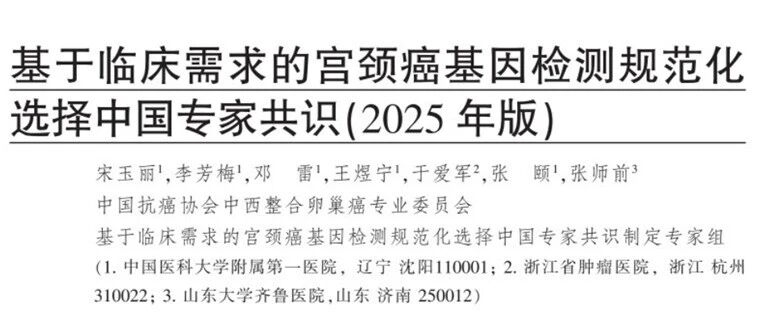
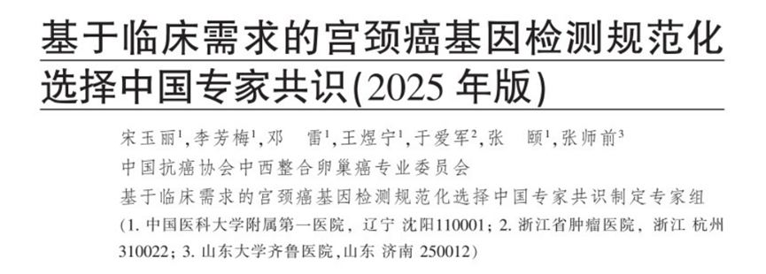

# 专家共识中国首发2025宫颈癌基因检测规范化选择! PAX1/JAM3甲基化检测精准锁定高危人群，降低阴道镜转诊率和患者负担

_2025年09月23日 13:49_

中国抗癌协会中西整合卵巢癌专业委员会基于临床需求的宫颈癌基因检测规范化选择中国专家共识制定专家组邀请国内顶级专家联合制定的《基于临床需求的宫颈癌基因检测规范化选择中国专家共识（2025 年版）》正式发布，规范了基因检测在宫颈癌预防、筛查、诊断和治疗全流程中的规范化应用,推动宫颈癌精准防控体系的建设。该共识明确提出基因检测在宫颈癌筛查与分流中的重要地位,并把 DNA 甲基化检测列为 HR-HPV 阳性或细胞学异常患者的重要分流工具之一。

**一、共识摘要**

共识指出,HPV-DNA联合细胞学仍为一线筛查手段,但HPV E6/E7 mRNA和 DNA甲基化检测可弥补传统方法不足, 帮助区分一过性HPV感染与需进一步诊疗的高风险患者，从而减少不必要的阴道镜检查与过度诊疗。甲基化检测的敏感度和特异度不低于液基薄层细胞学，可单独或与其他方法联合用于HR-HPV阳性患者的分流。

其中，DNA甲基化检测因其能直接反映基因调控状态、识别癌前病变风险，成为共识中备受关注的技术方向。多项研究表明，甲基化标志物在提升筛查特异性和减少不必要的阴道镜转诊方面表现优异。

**二、**PAX1/JAM3 双基因检测的临床特色和价值

共识中特别强调了PAX1/JAM3甲基化在分流中的优势，一项多中心前瞻性研究显示，在非16/18型高危HPV感染者中，PAX1/JAM3甲基化对CINII+的检出率显著优于常规细胞学；当液基薄层细胞学结果为ASC-US及以上时，采用 PAX1/JAM3甲基化(+)作为分流标准，可将阴道镜转诊率由74.66%降至17.45%,显著降低不必要的转诊与患者负担。

**三、结语**

此次专家共识为临床推广基因甲基化检测提供了权威依据，尤其是 PAX1/JAM3 双基因检测在 HPV 阳性患者分流中显示出高效、可操作的临床价值。对希望既提高病变检出又降低不必要侵入性检查的医疗机构而言，基于共识推荐的甲基化检测方案值得重点考虑与应用。

四、共识引用

**推荐意见 1:**

HPV-DNA 联合细胞学检测是宫颈癌一线筛查手段。甲基化检测可以弥补传统检测手段的不足，有助于区分 HPV 感染状态 : 甲基化检测具有不亚于 TCT 的灵敏感和特异度，单独或联合可用于分流HR-HPV 阳性患者 ( 证据等级 : 中 , 推荐强度 : 强 )。

**本文来源：**基于临床需求的宫颈癌基因检测规范化选择中国专家共识（2025 年版）. 肿瘤学杂志 : 2025 年第 31 卷第 7 期 557-566 页,DOI:10.11735/j.issn.1671-170X.2025.07.B001

**关于聚禾生物**

北京起源聚禾生物科技有限公司是以创新科技为驱动、以关注健康为宗旨的科技企业。聚禾生物是妇科肿瘤早诊领域的开拓者，以独家技术和专利保护的标志物为核心，开发了宫颈癌、子宫内膜癌、卵巢癌等妇科肿瘤早诊产品，填补了该领域的空白。

随着女性对自身健康的关注越来越密切，女性健康市场将大有可为，除妇科肿瘤早筛早诊产品线外，未来聚禾生物还将建立更多女性健康相关的产品管线，打造女性健康市场的技术创新型领先企业。
