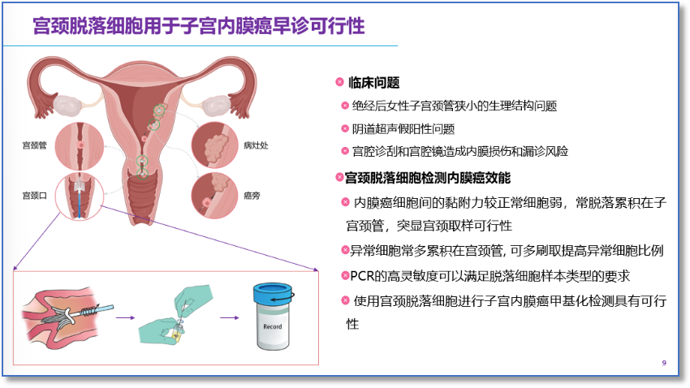
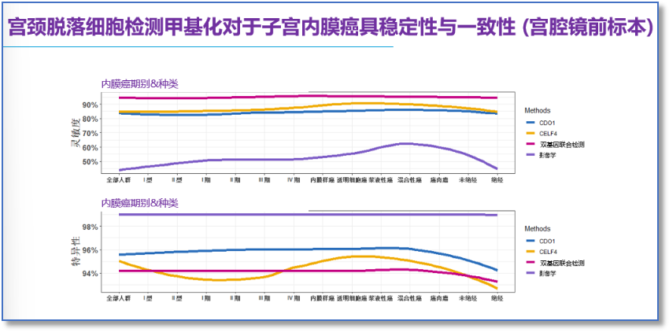

# 参会学习手记：2025年衡阳市医学会妇产科专业委员会学术年会－ 子宫内膜癌精准医学早筛与管理新模式：从高危人群到预后管理

_2025年09月28日 14:22_

由衡阳市医学会妇产科专业委员会主办的“2025 年学术年会于 9 月 12 日 \- 13 日在衡阳市西湖饭店举行。本次会议以“聚焦前沿技术，共促学科发展”为核心，汇聚省内外妇产科领域权威专家，通过学术报告、专题研讨、技术交流等形式，全维度覆盖，锚定行业前沿与临床痛点，为区域妇产科医疗同仁搭建高水平交流平台，助力提升衡阳及周边地区妇产科诊疗水平与服务能力。

清华大学清华长庚医院刘禹利研究员分享子宫内膜癌精准医学早筛与管理新模式，以无创子宫内膜癌甲基化检测技术临床试验与全国多中心万人数据，分享子宫内膜癌精准筛查重要性｡

该技术通过宫颈刷采集脱落细胞检测基因甲基化水平，可达高灵敏度和高特异性，可精准识别早期病变,较传统超声提升精准度,无需宫腔镜或组织活检，避免侵入性操作风险,降低内膜厚良性疾病的有创刮宫与宫腔镜造成内膜损伤风险,尤其适合育龄期及绝经后女性。

多中心研究显示,CDO1/CELF4 联合超声检测可进一步提升准确性，对无症状高风险人群的预测性显著，为早诊早治争取黄金时间。

在子宫内膜癌相关诊疗环节中，目前面临以下关键挑战：

1\.**绝经后女性生理结构限制**：绝经后女性子宫颈管狭小的生理结构特征，可能对检查操作或诊断准确性造成干扰；

2\.**阴道超声技术局限**阴道超声检查存在假阳性问题，易导致诊断结果偏差；

3\.**有创操作风险**：宫腔诊刮、宫腔镜等传统有创操作，既存在引发内膜损伤的风险，也可能因操作局限性导致漏诊。

针对上述临床痛点，宫颈脱落细胞检测 CDO1/CELF4 甲基化水平在子宫内膜癌诊断中展现出独特价值，具体体现为：

1\.**取样可行性（病理机制支撑）**：内膜癌细胞间黏附力显著弱于正常细胞，更易脱落并累积于子宫颈管，为“宫颈取样”提供了病理层面的可行性依据；

2\.**样本富集潜力**：异常细胞在宫颈管处呈“多累积”特性，通过优化刷取操作（如增加刷取频率、范围），可进一步提高样本中异常细胞占比，间接提升检测敏感性；

3\.**技术适配性**：PCR 技术具备**高灵敏度** 优势，能够适配宫颈脱落细胞这类微量、异质性强的样本类型，满足精准检测需求；

4\.**床应用可行性**：实践验证，以宫颈脱落细胞为载体开展子宫内膜癌**甲基化检测**，在技术路径与临床价值层面均具有可行性，为疾病早期筛查与诊断提供了创新方向。

以上“临床痛点”与“精准解决方案效能”两个维度，提供子宫内膜癌诊疗中宫颈脱落细胞检测的核心价值逻辑。

宫颈刷取细胞在「门诊 / 宫腔镜前」时间点是**无创检测的“基线最优时机”**，此阶段未接受有创操作，宫颈刷取细胞中保持内膜脱落细胞的自然生理状态，未受刮宫、宫腔镜等有创操作的机械 / 炎性干扰，能真实反映内膜细胞的特征。此外 ,非月经期大量出血时仍可采集标本，不受“出血”这一临床常见干扰因素限制，拓宽了检测的场景兼容性（如异常出血患者的即时筛查）。

对「高风险人群（如家族史或肥胖）」或「临床高度疑虑者」，临床数据支持立即采样检测，缩短诊断等待时间，助力早期风险分层或干预决策。

无创子宫刷取脱落细胞检测子宫内膜癌具有采集样本不受不同种类子宫内膜癌和期别影响、亦不受激素变化影响，具有检测稳定的优点，是目前子宫内膜癌最佳检测生物标记物 ｡

**关于聚禾生物**

北京起源聚禾生物科技有限公司是以创新科技为驱动、以关注健康为宗旨的科技企业。聚禾生物是妇科肿瘤早诊领域的开拓者，以独家技术和专利保护的标志物为核心，开发了宫颈癌、子宫内膜癌、卵巢癌等妇科肿瘤早诊产品，填补了该领域的空白。

随着女性对自身健康的关注越来越密切，女性健康市场将大有可为，除妇科肿瘤早筛早诊产品线外，未来聚禾生物还将建立更多女性健康相关的产品管线，打造女性健康市场的技术创新型领先企业。
