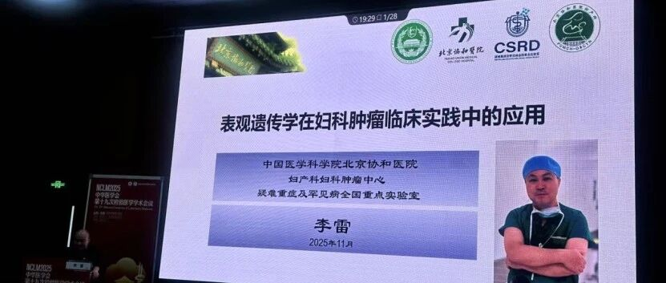
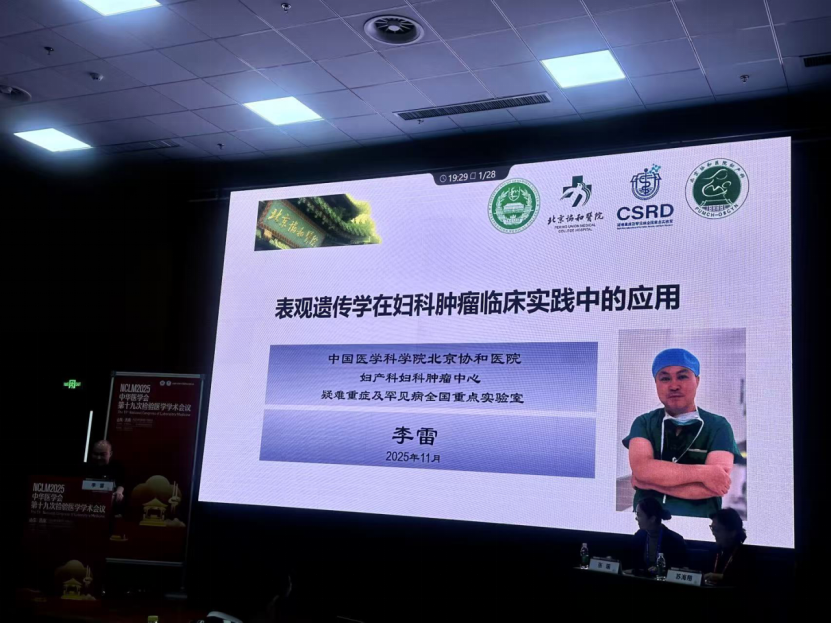
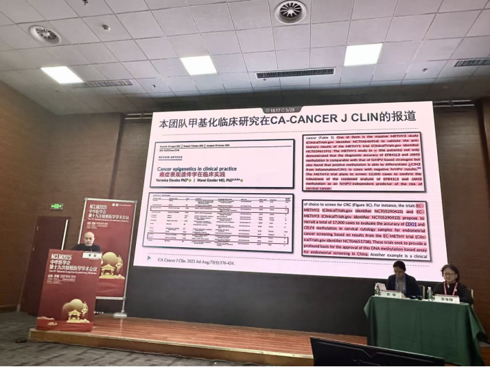

#“表观遗传学在妇科肿瘤临床实践中的应用”在第十九次全国检验医学学术会议隆重发表

_2025年11月10日 15:47_

2025 年 10 月 31 日，由中华医学会、中华医学会检验分会主办、山东省医学会承办的中华医学会第十九次全国检验医学学术会议在山东省济南市山东国际会展中心隆重召开！

近年来，以 DNA 甲基化为代表的表观遗传学技术取得系列突破。至 2025 年 11 月截止，中国国家药品监督管理局领先全世界已批准 DNA 甲基化试剂盒三类医疗器械证 41 项，正推动肿瘤筛查进入“可预、可防”的新阶段。因此，大会特设立“甲基化在肿瘤早筛早诊中的应用”1 和 2 学术专场，汇聚国内顶尖专家，共同探讨表观遗传学技术在肿瘤防治领域的创新与转化。

大会特邀中国医学科学院北京协和医院妇产科李雷教授在大会上进行专题发言，系统阐述了表观遗传学在妇科肿瘤临床实践中的创新应用。

值得关注的是,国际顶级肿瘤学期刊《CA: A Cancer Journal for Clinicians》（IF: 286.13）发表的综述文章《癌症表观遗传学在临床实践》阐述了北京协和医院团队在妇科肿瘤甲基化检测领域取得系列突破, 其研发的宫颈癌 PAX1/JAM3 双基因甲基化检测技术与子宫内膜癌 CDO1/CELF4 双基因甲基化检测技术通过全国大规模临床研究验证，涵盖全国数万例病例，并已通过国家药品监督管理局三类医疗器械审批，证实其通过无创检测方式可实现妇科肿瘤的早期诊断。

卵巢癌被认为是妇女致死率最高的生殖道癌症, 基于循环肿瘤 DNA 甲基化的液体活检技术，北京协和医院团队也取得了重要进展, 为卵巢癌的早期诊断提供了无创新途径。团队开发的CISOVA 检测产品灵敏度达 84.7%,特异性达 93.0%，目前正在推进国家药监局医疗器械注册申报 ｡

李雷教授在展示现有团队学术和临床研究成果外, 对于团队未来规划时强调：“**沉住气，耐下心来，精心打磨证据链**。用 3-5 年的时间，成就第一流的临床证据。”

随着更多研究成果的转化应用，中国在妇科肿瘤早诊早治领域已从传统治疗模式逐步转向预防性医学新阶段。北京协和医院的这一创新技术有望为全球妇科肿瘤防治提供中国方案，为推动健康中国建设提供有力支撑。

**关于聚禾生物**

北京起源聚禾生物科技有限公司是以创新科技为驱动、以关注健康为宗旨的科技企业。聚禾生物是妇科肿瘤早诊领域的开拓者，以独家技术和专利保护的标志物为核心，开发了宫颈癌、子宫内膜癌、卵巢癌等妇科肿瘤早诊产品，填补了该领域的空白。

随着女性对自身健康的关注越来越密切，女性健康市场将大有可为，除妇科肿瘤早筛早诊产品线外，未来聚禾生物还将建立更多女性健康相关的产品管线，打造女性健康市场的技术创新型领先企业。
