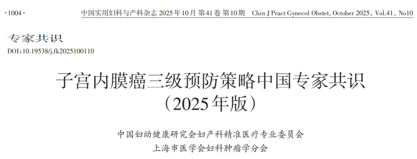
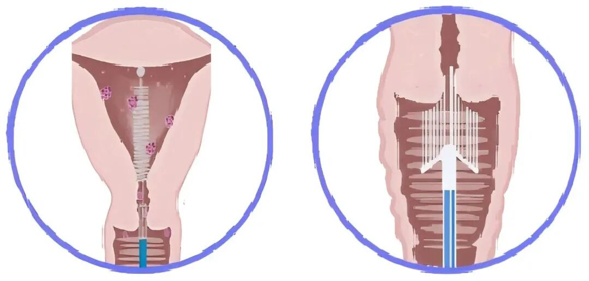

# 聚禾生物基因甲基化检测获《子宫内膜癌三级预防策略中国专家共识（2025年版）》推荐，助力子宫内膜癌早期筛查

_2025年11月21日 16:44_

近日，全球首部《子宫内膜癌三级预防策略中国专家共识（2025 年版）》正式发布。该共识由中国妇幼健康研究会妇产科精准医疗专业委员会与上海市医学会妇科肿瘤学分会共同制定，首次系统构建了适用于中国人群的子宫内膜癌三级防控体系。其中，北京起源聚禾生物科技有限公司研发的“人 CDO1 和 CELF4 基因甲基化检测试剂盒”被纳入共识,推荐作为子宫内膜癌的”**早期筛查**”手段，标志着我国在子宫内膜癌无创筛查方面迈出重要一步。

该人**CDO1**和**CELF4**基因甲基化检测试剂盒已于早前获得国家药品监督管理局（NMPA）批准上市，用于体外定性检测 **人宫颈脱落细胞** DNA 中 CDO1 和 CELF4 基因的甲基化水平。本共识突出优势在于采样方式灵活多样，除传统的宫腔刷、宫颈刷外，还可采用阴道棉条或尿液样本进行检测，大大提升了筛查的可及性与受检者的接受度。临床研究显示，该检测在诊断子宫内膜癌方面灵敏度达 87.0%–94.51%,特异度为 86.0%–95.5%, 表现优于现有常规筛查方法。

**一、共识首建三级预防框架，明确六大筛查路径**

本共识首次系统提出了涵盖“预防 - 筛查 - 治疗康复”全过程的子宫内膜癌三级预防策略。在关键的二级预防（即早期筛查与诊断）部分，共识前瞻性地明确了六种筛查方法，为全球提供了新范式，具体包括：

1. 妇科彩色超声检查

2. 子宫内膜细胞学检查

3. 子宫内膜微量组织学检查

4. 子宫内膜脱落细胞基因甲基化检测

5. 子宫颈脱落细胞学检查（宫腔来源）

6. 盆腔影像学检查（如适用）

共识建议，筛查应聚焦于高危人群，包括 45 岁以上女性、肥胖或代谢综合征患者、出现绝经后出血或异常排液症状者，以及有林奇综合征或相关家族史的女性。

**筛查路径建议结合病史问诊、经阴道超声（TVS）与基因甲基化检测进行综合判断，从而更精准地决策是否需要进一步进行侵入性检查（如组织活检或宫腔镜）**

**二、推动筛查普及，具重要临床与公共卫生价值**

该共识的推出及甲基化检测技术的应用，具有多重积极意义：

- **提升早诊率：** 对早期病变灵敏度高，有助于实现早发现、早治疗。

- **优化诊疗流程：** 在分子与影像结果提示低风险时，可减少不必要的诊刮或宫腔镜检查，降低医疗负担与患者不适。

- **扩大筛查覆盖面：** 便捷的采样方式特别有利于在基层医疗机构和资源相对匮乏地区推广，提升整体筛查可及性。

- **实现个体化管理：** 结合多种检测结果，可建立更精细的风险分层与随访方案。

**三、专家观点：规范应用是关键，**需注意检测合规性

此共识为中国子宫内膜癌的防治开启了新篇章。为保障这一新筛查模式的规范应用，特别提醒临床机构，须选用已获 NMPA 批准的检测试剂盒，并严格遵循其说明书所载明的【预期用途】。当前获批试剂盒的适用样本通常为"宫颈脱落细胞样本"（可检测宫腔来源脱落细胞至宫颈）或 "宫腔脱落细胞样本"（需进行宫腔采样）。若临床实践中需超范围使用（如采用尿液、卫生棉条等样本），建议医疗机构建立相应的标准操作程序并系统收集临床数据，以应对监管要求并确保医疗合规。

经过 NMPA 核查后，可以使用这两种样本采样方法作为子宫内膜癌甲基化检测。

**关于聚禾生物**

北京起源聚禾生物科技有限公司是以创新科技为驱动、以关注健康为宗旨的科技企业。聚禾生物是妇科肿瘤早诊领域的开拓者，以独家技术和专利保护的标志物为核心，开发了宫颈癌、子宫内膜癌、卵巢癌等妇科肿瘤早诊产品，填补了该领域的空白。

随着女性对自身健康的关注越来越密切，女性健康市场将大有可为，除妇科肿瘤早筛早诊产品线外，未来聚禾生物还将建立更多女性健康相关的产品管线，打造女性健康市场的技术创新型领先企业。
