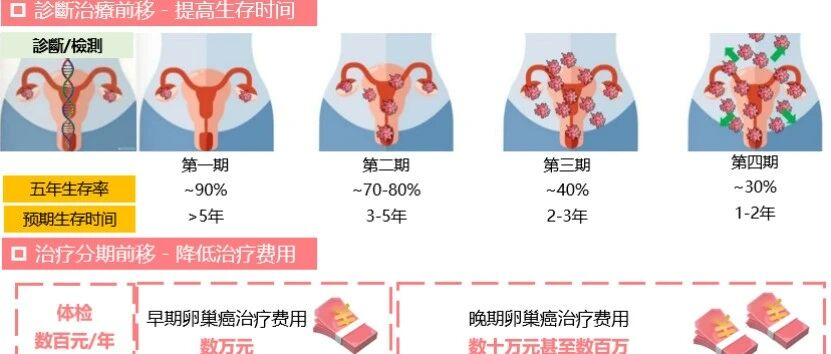

# 禾薇益®临床解读（系列二）：多中心临床试验证据

_2025年12月11日 16:31_

> 在系列一文章中[ 禾薇益®临床解读（系列一）：破局卵巢癌早诊困境](https://mp.weixin.qq.com/s/K48pmAXx34ooLfflrwAW_w)

我们介绍了禾薇益 ®（CDO1/HOXA9）基因甲基化检测试剂盒为全球首款获批的卵巢癌无创甲基化检测产品的问世背景与临床价值。本篇将聚焦于该产品的核心技术原理及其经过大规模临床验证的卓越性能数据。

卵巢癌的预期寿命损失年数（YLL）率处于较高水平，这反映出该病起病隐匿、早期诊断困难，所导致的过早死亡和健康寿命损失较为严重。在年龄分布上，40-59 岁女性的卵巢癌死亡率为该年龄段女性癌症死亡的第七位 [1]。综上，卵巢癌已成为妇科生殖系统肿瘤中死亡率最高的恶性肿瘤之一，防治形势严峻、亟待加强。对卵巢癌高危人群、症状人群和高发年龄人群进行高效早筛早诊，是实现诊断与治疗分期前移、提高生存率、降低治疗费用的关键所在。

**图 1\. 禾薇益 ® 实践卵巢癌早诊早治**

**一、技术原理：基于液体活检的精准探测**

禾薇益 ® 检测是一种基于外周血中循环游离 DNA（cfDNA）的液体活检技术。肿瘤细胞在凋亡、坏死等过程中会将其 DNA 释放入血，这些 cfDNA 携带着肿瘤特异性的表观遗传学改变 ——DNA 甲基化。禾薇益 ® 通过特异性检测 cfDNA 中 CDO1 和 HOXA9 这两个基因的甲基化水平，利用高灵敏度的 qPCR 技术进行扩增与定量，从而实现对卵巢癌的早期、无创诊断。

**二、关键临床数据：高灵敏度、高特异性，尤其擅长早期发现**

产品的核心价值源于坚实的临床证据。由**北京协和医院**牵头，联合国内多家顶级妇科肿瘤中心**复旦大学肿瘤医院、湘雅三医院、浙江大学医学院附属妇产科医院**共同完成的一项多中心临床研究，共入组 1421 例样本，全面评估了禾薇益 ® 的检测性能研究结果令人瞩目：

·**总体性能优异**：对卵巢癌的总体诊断灵敏度达**93.2%**，总体特异性达**92.8%**，显示出极高的准确性。

·**前移至 I 期卵巢癌**：对于临床最难发现的 I 期卵巢癌，其灵敏度仍高达**94.3%**，特异性为 92.8%。这一数据显著超越了传统方法（如 CA125 在早期癌中灵敏度仅约 50%），意味着该检测有望将诊断窗口大幅前移，真正实现早期发现。

·**覆盖广泛的癌种**：不仅对最常见的浆液性癌有效，对于透明细胞癌、黏液性癌等非浆液性癌亚型，同样保持高于 91% 的灵敏度与特异性，避免了传统标志物在某些亚型中不表达的漏诊风险。

·**性能稳定**：检测结果不受女性绝经状态或月经周期影响，保证了在不同生理状态下检测的稳定性。

**图 2\. 禾薇益 ® 卵巢癌分类与不同基线呈现更优检测效能**

研究表明，与传统影像学和血清标志物 (CA125) 检测方法相比，禾薇益 ® 可避免约 30-40% 的漏诊率，为卵巢癌的早期筛查与鉴别诊断提供了性能更优的新选择。

禾薇益 ® 基因甲基化检测通过创新技术解决了卵巢癌早期诊断的难题，专家共识阐明其基于液体活检的无创优势、优异的早期检测性能（特别是对 I 期癌的高灵敏度）以及广泛的临床适用性，使其有望成为妇科肿瘤早期筛查与辅助诊断体系中的重要工具 [2]。其获批和简便用法使其成为妇科肿瘤早诊的领先工具。建议高风险女性或出现相关症状者咨询医生，进行禾微益无创检测。

**参考文献**

[1] Qi J, et al. National and subnational trends in cancer burden in China, 2005-20: an analysis of national mortality surveillance data. Lancet Public Health. 2023 Dec;8(12):e943-e955.

Dec;8(12):e943-e955.

[2] 中国抗癌协会肿瘤标志专业委员会 . 肿瘤 DNA 甲基化标志物检测及临床应用专家共识 (2024 版 )[J]. 中国癌症防治杂志 ,2024,16(2):129-142.

**关于聚禾生物**

北京起源聚禾生物科技有限公司是以创新科技为驱动、以关注健康为宗旨的科技企业。聚禾生物是妇科肿瘤早诊领域的开拓者，以独家技术和专利保护的标志物为核心，开发了宫颈癌、子宫内膜癌、卵巢癌等妇科肿瘤早诊产品，填补了该领域的空白。

随着女性对自身健康的关注越来越密切，女性健康市场将大有可为，除妇科肿瘤早筛早诊产品线外，未来聚禾生物还将建立更多女性健康相关的产品管线，打造女性健康市场的技术创新型领先企业。

